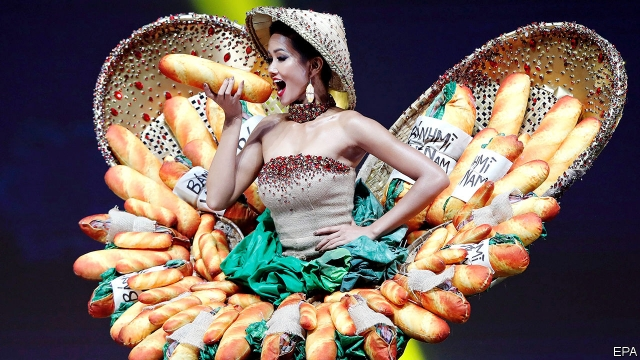

###### Pâté and prejudice

# A baguette-bedecked beauty queen bedevils bigots in Vietnam 

##### H’hen Nie is the first minority woman to become Miss Vietnam 

 

> Jan 3rd 2019 

 

“FROM NOTHING, I am here.” That was how H’hen Nie, a Vietnamese model, introduced herself in her opening speech at the Miss Universe beauty pageant on December 17th. She went on to make it into the top five in the competition, the highest rank any Vietnamese has achieved, dressing in a costume inspired by banh mi, a nationally prized sandwich typically made with pork pâté. Yet Ms Nie is an unlikely idol for Vietnam. In a country that prizes long, flowing hair and pale complexions, she is relatively dark-skinned and rocks a pixie-like bob. When she won the Miss Vietnam contest last year, she was the first woman from an ethnic minority to do so. 

Ms Nie is from the Rade, one of the tribes from the central highlands collectively labelled Montagnards, or mountain folk, by French colonists. Two decades of fast economic growth have brought greater prosperity to most Vietnamese but have done little to improve opportunities for the country’s 53 official ethnic minorities. These groups, who are about 15% of the population, lag behind the majority of Vietnamese (known as Kinh) by almost all measures. Fully 45% of them are poor, compared with just 3% of Kinh. 

One barrier is language. Ms Nie did not master Vietnamese until she was a teenager. Over a third of minority people never do, limiting access to jobs and education. Discrimination makes things harder still: many see minorities as backward. Geography hurts, too. Minorities tend to live in central Vietnam’s mountainous areas, which have few roads or public services. They are less likely to migrate than their Kinh counterparts. Ms Nie, who is from the province of Dak Lak, moved to Ho Chi Minh city to attend university, a rare step. 

This remoteness hinders the government’s attempts to help minorities. Subsidies for health care are of little use because hospitals are far away. The same problem plagues efforts to boost attendance at high school, which is low among minorities but which earns big economic returns, says Tung Duc Phung of the Mekong Development Research Institute, a think-tank. Moreover, poor parents often want their children to work rather than study. 

Many experts think that the Communist Party sees minorities as a security risk. It fears that, among others, the Montagnards, who fought on the anti-communist side during the Vietnam war, are still aligned with anti-government forces. Many Montagnards suffer state surveillance and police harassment as a result. 

The government does seem to look kindly upon Ms Nie, however. Coverage of her by state-controlled media is glowing and free of the usual ethnic stereotyping. When a Hanoi-based journalist wrote racist comments about her on his Facebook page last year, the Ministry of Information and Communications obliged him to make a grovelling public apology. 

Ms Nie’s success has prompted some Vietnamese to examine their prejudices about minorities. She, meanwhile, has donated her prize money to scholarships and library-building in rural areas. That will help others go places from nothing, too. 

