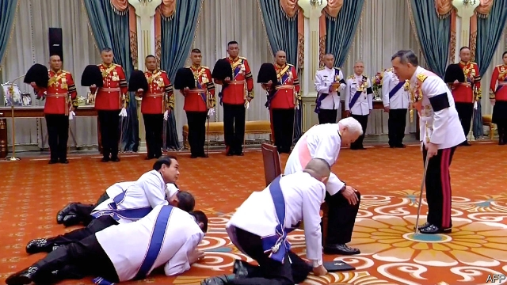

###### A royal pain

# As the army and politicians bicker, Thailand’s king amasses more power 

##### He appoints generals, patriarchs and executives, and disposes of crown property as he pleases 

 

> Jan 3rd 2019 

 

IT HAPPENED IN the dead of night, without warning. In late December security forces showed up with a crane at a crossroads in Bangkok and whisked away the monument that stood there. No one admitted to knowing who had ordered the removal, or why. Police stopped an activist from filming it. The memorial itself, which marked the defeat in 1933 of putschists hoping to turn Thailand back into a royal dictatorship, has vanished. It is the second monument to constitutional monarchy to disappear under the military junta that has run Thailand since 2014: in 2017 a plaque celebrating the abolition of absolute monarchy in 1932 was mysteriously replaced with one extolling loyalty to the king. 

The current king, Maha Vajiralongkorn, has been on the throne for two years. He has unnerved his 69m subjects from the start. When his father, King Bhumibol, died in 2016, he refused to take the throne for nine weeks—despite having waited for it for decades. The delay was intended as a mark of respect, but it was also a way of signalling to the military junta that runs the country that he was determined to make his own decisions. It was only this week that a date was set for his coronation: May 4th. King Vajiralongkorn spends most of his time abroad, in a sumptuous residence near Munich. He even insisted on tweaking the new constitution, after it had already been approved in a referendum, to make it easier to reign from a distance. 

King Bhumibol was on the throne for 70 years. Partly because of his clear devotion to the job, and partly because military regimes inculcated respect for the monarchy as a way of bolstering their own legitimacy, he was widely revered. Official adulation for the monarchy endures, but in private King Vajiralongkorn is widely reviled. His personal life is messy: he has churned through a series of consorts, disowning children and even imprisoning relatives of one jilted partner. He has firm ideas about the decorum he should be shown—the picture above shows the prime minister prostrating himself before him—but little sense of the respect he might owe anyone else: his cosseted poodle, elevated to the rank of Air Chief Marshal, used to jump up onto tables to drink from the glasses of visiting dignitaries. The tedious tasks expected of Thai monarchs, such as cutting ribbons and doling out university degrees, he palms off on his more popular sister. 

Writing about such things in Thailand is dangerous. The country’s fierce lèse-majesté law promises between three and 15 years in prison for insulting “the King, the Queen, the Heir-apparent or the Regent”. In practice, it has been used to suppress anything that could be construed as damaging to the monarchy, whether true or not, including novels that feature venal princes and academic research that casts doubt on the glorious deeds of the kings of yore. 

As his critics are cowed, the king has focused on accumulating personal power. In 2017 the government gave him full control of the Crown Property Bureau (CPB), an agency that has managed royal land and investments for decades and whose holdings are thought to be worth more than $40bn. In 2018 the CPB announced that all its assets would henceforth be considered the king’s personal property (he did, however, agree to pay taxes on them). That makes the king the biggest shareholder in Thailand’s third-biggest bank and one of its biggest industrial conglomerates, among other firms. 

With the help of the CPB the king is reshaping an area of central Bangkok adjacent to the main royal palace. The bureau declined to renew the lease of the city’s oldest horse-racing track, the Royal Turf Club, leading to its closure in September after 102 years. An 80-year-old zoo next door closed the same month. The fate of two nearby universities that are also royal tenants remains uncertain. The CPB has not revealed the purpose of the upheaval; Thais assume the king just wants an even bigger palace. 

King Vajiralongkorn has also put his stamp on the privy council, a body which has a role in naming the heir to the throne, among other things. It once contained individuals who opposed his becoming king at all. Now it is stuffed with loyal military men. The royal court is ruled with “iron discipline”, according to one local businessman. Leaks about the king’s disturbing conduct have dried up. Some former favourites have found themselves in prison. Hangers-on who traded on their royal connections have been shown the door. 

The king’s authority over religious orders has also grown. In 2016 the government granted him the power to appoint members of the Sangha Supreme Council—in effect, Thai Buddhism’s governing body—and to choose the next chief monk, known as the Supreme Patriarch. He did so in 2017, elevating a respected monk from the smaller and more conservative of Thailand’s two main Buddhist orders. 

The army, too, is receiving a royal makeover. The commander-in-chief appointed in September, Apirat Kongsompong, is the king’s man. Over the next two years he will supervise the relocation of a regiment and a battalion out of Bangkok, ostensibly to relieve crowding. Security in the city will fall instead to the elite Royal Guard Command, which is directly under the king’s control. 

Many contend that it is the king who has pushed the army to hold the oft-delayed election that has at last been called for February 24th. This is not to suggest that the king is a democrat (his actions suggest anything but). Rather, the contest is likely to lead to a weak, chaotic government, which probably suits him well. The constitution the army designed makes it hard for elected politicians to achieve a parliamentary majority. But even if the army retains power behind the scenes, it will have surrendered absolute authority. Either pro-army types or democrats would probably seek royal support to govern, strengthening the king’s position however the vote turns out. 

