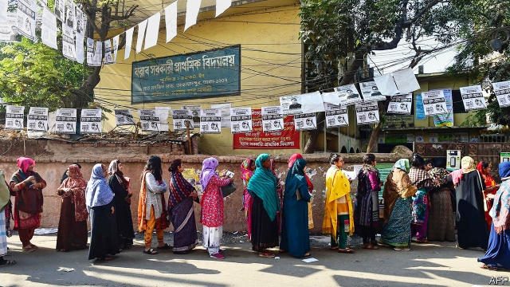

###### Leaving nothing to chance

# Biased institutions usher Bangladesh’s ruling party to a third term 

##### The Awami League probably would have won a fairer contest too 

 

> Jan 3rd 2019 

 

THE AWAMI LEAGUE is an impressive outfit. Founded in 1949, the party spearheaded the movement that won Bangladesh independence from Pakistan in 1971. It has ruled the country for 19 of the 47 years since then, including the past decade. On December 30th it won another five-year term, capturing along with smaller allies some 96% of the seats at play. That is more even than it and its allies won in 2014, when voter turnout shrivelled after their main rivals boycotted the polls, leaving the party unopposed in over half the seats. 

But does nabbing 288 out of 299 seats mean the Awami League and its leader, Sheikh Hasina Wajed, are growing ever more popular? Alas, there is no way of knowing. In this latest vote the electoral playing-field was so tilted, the voting so deeply flawed and the counting so lacking in transparency that even many of the party’s supporters doubt the result. 

That is a pity. In the judgment of opinion polls and independent observers, Sheikh Hasina’s party looked set to capture a tidy majority even without such vigorous manipulation. With its origins in the liberation struggle and its leader’s own legacy as the daughter of the hero of independence, the party has long enjoyed a base of around a third of voters. Strong and accelerating economic growth under Sheikh Hasina, big improvements in human development and a tough approach to radical Islam have boosted her popularity further at home. Her policies also earn goodwill abroad, particularly from neighbouring India. 

Few Bangladeshi intellectuals or foreign diplomats had expected or very much wanted a victory for the rival Bangladesh Nationalist Party (BNP), which has historically enjoyed a core of voters only slightly smaller than the Awami League. When last in power, from 2001-06, it had gained a reputation for cronyism and pandering to Islamists. Yet after ten years with an overwhelming parliamentary majority, the Awami League’s wholesale takeover of state institutions had stirred growing apprehension, even among admirers. Unaccountable police and prosecutors harass BNP members with arrests and lawsuits. 

A shoot-first policy with suspected drug dealers has left 400 people dead since May. Thugs from the league’s “student wing” often beat up those considered hostile. When student protests over dangerous traffic in Dhaka erupted in the summer, the government’s bullies responded brutally, as if the state itself were in danger. Soon after, the Awami League rammed through laws that sharply restrict freedom of the press. 

Such pressure raised fears that the BNP might repeat its disastrous boycott of 2014. But in October, to much surprise, it dropped demands for a neutral caretaker government to run the elections, and instead joined a broad-based electoral alliance led by Kamal Hossain, an 81-year-old constitutional lawyer, noted liberal and former Awami League foreign minister. Despite heavy intimidation and harassment during the campaign, including the shutting down of the BNP website, a ban on big BNP rallies and the claimed arrest of some 10,000 party workers, the alliance stuck. 

Local pundits and foreign diplomats began to muse about a potential “sweet spot”—a result that would leave Sheikh Hasina in charge, but with a strong enough opposition to restrain her somewhat. If the league’s majority could be kept below two-thirds, an intellectual suggested, “That might help restore democracy, or at least put us on the road to healing.” 

That road will remain untravelled. As some 40,000 polling booths across the country opened, reports soon emerged that some of the plastic ballot boxes looked suspiciously full. A tour of stations in Dhaka revealed forests of Awami League banners and posters but scarcely a twig for the BNP alliance, and not a single opposition polling agent compared with scores of league helpers at every booth. This meant there was no one to help opposition voters find their voter number, and no one to monitor the voting or counting. 

In league-dominated districts queues were short and voting was easy, with only a few ballot boxes per voting station. But in the more hotly contested Dhaka-15 district, thousands of angry men waited for hours in front of Monipur High School, or gave up in disgust as police and aggressive Awami League supporters allowed the barest trickle of voters through the single steel door giving access to the 36 ballot boxes inside. Midway through the voting, ballot stubs revealed that only 41 voters had made it to the box in one of the classrooms, out of more than 1,000 registered. 

From across the country came similar reports of opposition polling agents being threatened or beaten, of voters being barred and of booths being closed “for lunch” or because “ballots ran out”. Election-day violence left at least 19 dead. Predictably, the government-appointed election commission claimed the voting had been trouble-free, an odd group of figures labelled international observers chimed benedictions and the regional powers, China and India, sang congratulations. 

Sheikh Hasina herself dismissed reports of trouble as “some incidents where members of our party were killed by the opposition”. In her own district, the margin of victory was more than 1000:1. In several others, opposition candidates failed to garner a single vote—not even their own. 

Now that the deed is done, government ministers speak cheerfully of getting back to the business of growth and development. With the full weight of the state under absolute control, with powerful friends abroad and with the opposition crushed and demoralised, they may sleep peacefully enough for now. But as a fearful academic in Dhaka mutters: “What they don’t realise is that the biggest threat is their own unbridled power.” 

