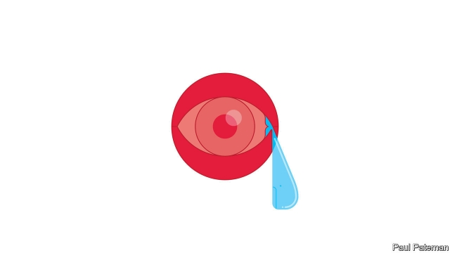

###### Banyan

# Japan withdraws from the treaty that bans hunting whales 

##### Whaling is a proud tradition, supporters say 

 

> Jan 3rd 2019 

 

WHEN WORD leaked that Japan was planning to pull out of the International Whaling Commission (IWC) this year in order to kill whales at will, the reaction was swift and fierce. Australia said it was “extremely disappointed”. Others likened Japan to a rogue state. So much for its claims to uphold international institutions and act as model global citizen. The move, critics railed, was like America pulling out of the Paris agreement on climate change. 

Yet all is not what it seems. For a start, even as Japan leaves the IWC, it has forsworn whaling in the Southern Ocean (the waters surrounding Antarctica). Nearly every austral summer since the IWC imposed a moratorium on commercial whaling in 1986, Japan has sent the Nisshin Maru and other vessels there to catch whales for “research” (after which the meat ends up in restaurants). The Sea Shepherd Conservation Society, in turn, tries to sabotage the hunt. Now, after two centuries of whaling on an industrial scale, the Southern Ocean will be a cetacean sanctuary. Sea Shepherd is claiming victory. Australia is likely to be relieved too. For it and New Zealand, it removes a thorn in the side of their relations with Japan at a time when the three countries are seeking ways to draw together in the face of a rising China. 

In truth, Japan could no longer afford to continue the Southern Ocean hunt, even if giving it up exposes the old lie of “research”. The venture is so bankrupt it has, in effect, been nationalised, propped up with hundreds of millions of dollars of subsidies. The ageing Nisshin Maru would cost a fortune to replace. Meanwhile, although whale meat remains on Japanese menus and shop shelves, its consumption continues to plummet. Gristly, greasy whale sashimi no longer appeals, it seems. Much of it ends up in schools and nursing homes, where the clientele has little choice. 

There is still a tiny but influential lobby at home, however. A few towns have ancient traditions of whaling, something the IWC took little account of. It allows various indigenous groups around the world to hunt whales for “subsistence”. The people of the Caribbean island of Bequia may go after humpbacks, even though they learnt whaling only 150 years ago, from New Englanders. The Makah tribe of north-western America had not caught a whale in 70 years when it resumed whaling in 1999. In Taiji, on Japan’s main island, memories of whaling are more recent and the tradition many centuries old. People have family names like Tomi (“lookout”). Stone monuments along the coast appease the spirits of whales, whose meat sustained the town through famines. Yet there is no dispensation from the IWC. 

So the government plans to allow whaling in Japan’s huge territorial waters. A small local fleet has survived by hunting cetaceans not covered by the IWC, such as dolphins and Baird’s beaked whale, and by conducting “research” of its own. Freed from the commission’s constraints, it might increase its catch from 50 minke whales a year to 300. 

Japan had previously sought a similar arrangement within the IWC. A decade ago a compromise seemed within reach, before pressure from unyielding conservationists caused Australia to lose its nerve and drop its support for such a scheme. Whalers and conservationists have long talked past each other. The pity now, as Peter Bridgewater, a former IWC chairman, puts it, is that Japan is giving up catching minkes from a healthy population in the Southern Ocean in return for catching unmonitored numbers from a population in the north Pacific whose health is much less certain. 

But political considerations trumped all for Shinzo Abe, Japan’s prime minister. For conservatives in his Liberal Democratic Party, whaling is a nationalist emblem (while the Nisshin Maru hails from his own home port of Shimonoseki). The nationalists are already irked by Mr Abe’s plans to let more foreigners into the country, and by the growing realisation that only a disappointing compromise is possible with Vladimir Putin over northern islands controlled by Russia since the end of the second world war. Protecting plucky Japanese whalers is a useful sop. 

With whales now placed on the altar of expediency, will they be hunted mercilessly around Japan? Not necessarily. Whaling may be coming home, but its (mostly hidden) subsidies are surely dwindling. Besides, an informed debate about whaling’s merits in a country only vaguely aware of the industry may at last emerge. Let’s hear it now, please, from Japan’s whale-watchers. 

