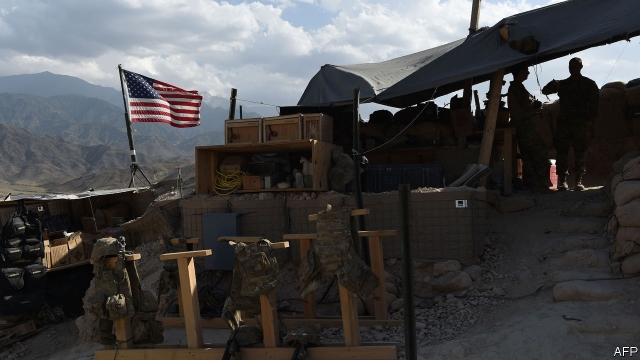

###### Just kidding

# Rumours of an American pull-out from Afghanistan appear exaggerated 

##### But they still will encourage insurgents 

 

> Jan 3rd 2019 

 

HAS HE OR hasn’t he? In late December American media reported that Donald Trump had ordered the Pentagon to begin withdrawing half of America’s troops in the country. The reports seemed credible, in so far as Mr Trump had just announced a withdrawal from Syria (see article) and had very publicly wavered about keeping any troops in Afghanistan at all in 2017, before deciding to increase their number from 8,400 to 14,000. Yet the sudden reversal had come out of the blue. The Afghan government and startled allies with troops in Afghanistan, such as Britain, said they had not been consulted and were awaiting confirmation. 

Confirmation has not been forthcoming. Instead, a White House spokesman contradicted the reports on December 28th, saying Mr Trump had not ordered a pull-out. The commander of American forces in Afghanistan also said he had not received any marching orders, as it were. Nonetheless, the rumoured wobble has again called into question the president’s commitment to the 17-year-old war in Afghanistan. 

American forces originally showed up in late 2001 to hunt for Osama bin Laden and to help the militias that had just overthrown the Taliban regime maintain security. The American presence peaked in 2010, at more than 100,000 troops. But even then, America failed to root out the insurgency led by the remnants of Taliban. 

The Afghan army has formally taken the lead in the war since 2014. The remaining American soldiers are there mainly to train Afghan ones, although Mr Trump’s mini-surge has allowed American advisers to be stationed with Afghan soldiers on the frontline, to provide more hands-on assistance. Even so, the Taliban and other insurgents are thought to have been killing perhaps 30-40 Afghan soldiers and police a day in recent months. Many analysts wonder whether the Afghan army can sustain such punishing losses in the long run, let alone the higher casualties that would presumably follow if it lost American training and air support. 

Ashraf Ghani, Afghanistan’s president, scoffs at suggestions that security would collapse after an American withdrawal. But the insurgency is spreading, according to the American government’s own reckoning: a recent oversight report found that only 55% of the country’s territory is under the authorities’ “control or influence”, and just 65% of the population. And the Afghan security services are 40,000 recruits, or 11%, below their target strength, the lowest level since 2012. 

The biggest immediate impact of the rumours of a withdrawal may be on peace talks with the Taliban. After years of trying to battle the insurgents into submission, America embraced attempts to find a political settlement in 2018. It held meetings with Taliban envoys, in the hope of initiating formal negotiations. Zalmay Khalilzad, Mr Trump’s point man on Afghanistan, told the militants that America would never abandon the Afghan government, and that peace talks were therefore the only way to end the current stalemate. The confusion of the past few weeks, however, will have left the Taliban wondering yet again if they would do better simply to wait out their weary adversary. 

