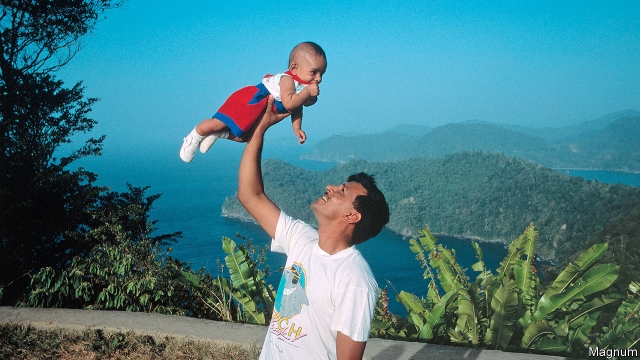

###### His brother’s keepers

# A startling novel of twins and Trinidad 

##### “Golden Child” is a promising, unflinching debut 

 

> Jan 3rd 2019 

Golden Child. By Claire Adam. SJP for Hogarth; 288 pages; $26. Faber & Faber; £14.99.  

TWINS MAKE up only a small fraction of the population but loom disproportionately large in literature. They are handy for storylines involving mistaken identity and creepy synchronicity, and offer the chance to show how people whose lives begin in the same place can take drastically different paths. A contrast between dissimilar twins is at the heart of “Golden Child”, Claire Adam’s assured and compelling first novel, which is set in rural Trinidad, where she grew up, during the 1980s. 

Unlike Viola and Sebastian in “Twelfth Night”, Peter and Paul Deyalsingh do not appear to be “An apple, cleft in two”. Not at all. Paul “tends to slink around”, while Peter “walks with a bold step”. The boys—aged 13 when the book opens—have been treated differently from the beginning. Paul was deprived of oxygen at birth; a doctor suggested to the twins’ father, Clyde, that “mental retardation” might have resulted. 

The family accepts this diagnosis as fact. And, true to expectations, as they develop Paul does not share Peter’s genius for learning. Eventually a conscientious schoolteacher, Father Kavanagh, tries to delve beneath the assumption that Paul is “slow”. Who told him he was retarded? “I don’t know,” the boy replies poignantly. “It’s just—it’s just how it is. Nobody said so, it’s just so.” 

The children’s parents take opposite approaches to the disparity between their offspring. Their mother, Joy, wants them to be kept together so that Paul, the more vulnerable, can be protected by Peter. Clyde is more concerned that Peter—his golden child—should be allowed to thrive, and to leave Trinidad for his education, without being weighed down by his slower brother. However dazzling Peter’s talent may be, Clyde’s obsessive focus on safeguarding his future at any cost bodes ill. 

Ms Adam’s depiction of Trinidad is intimate and wry. On her island, no one listens to the weather bulletins during the dry season as it takes “ten minutes just to say that tomorrow will be hot with no rain.” More darkly, while the nightly news might begin with a montage of “smiling children dressed as butterflies”, they are soon replaced by reports of “fatalities, domestic murders, missing people being dragged out of the bush in bodybags, or their charred remains found in burnt-out cars.” 

An uncle of the twins is murdered by bandits. When Paul goes missing, everyone fears the worst. Clyde is confronted with a terrible dilemma, reminiscent of “Sophie’s Choice”, which the author explores without flinching. This is a tough, original novel of remarkable poise and confidence. 

