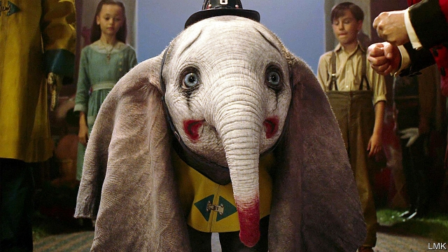

###### An old new world

# Disney goes back to the future 

##### Live-action remakes of classic cartoons are one of the most lucrative innovations in cinema 

 

> Jan 3rd 2019 

 

IN JANUARY 1991 Jeffrey Katzenberg, then chairman of Walt Disney Studios, sent a 28-page memo to his colleagues. Entitled “The World is Changing: Some Thoughts on Our Business”, it lamented that the studio had lost its way. The finances were sound—Disney had outdone its competitors at the box office the year before—but Mr Katzenberg felt the company was unduly focused on blockbusters. It should be less fixated on big budgets, big names and whizzy effects, he urged, and concentrate on developing original ideas and executing them well. “People don’t want to see what they’ve already seen,” he said. “Our job is not to count on recycled formulas, but to create and develop fresh, new stories.” 

His advice now seems quaint. Of the ten most expensive films ever made, Disney is responsible for six. In 2012 the studio hired Alan Horn as its chairman after a successful stint at Warner Brothers, where he had devoted a hefty share of the budget to a handful of “event films”, such as the Harry Potter series. If the average American only sees around five movies a year, he reasoned, they are most likely to opt for “something of high production value, be it because of the story, or the stars involved, or the special visual effects”. 

That approach can backfire. One calculation by Stephen Follows, a film consultant, implies that half of Hollywood productions with budgets over $100m lose money. When Mr Horn arrived at Disney, it was lurching towards two of the worst-ever box-office flops. “John Carter” (2012) and “The Lone Ranger” (2013), a pair of untried action stories, lost around $200m each. But since then the studio seems to have found a magic formula: extravagant remakes of animated fantasies that audiences already love. Discounting Mr Katzenberg’s dim view of blockbusters can evidently be risky, but big bets seem safer if film-makers eschew his yen for novelty, too. Or so Disney’s recent record suggests. 

“Cinderella” (2015) made $535m from a budget of $95m. “The Jungle Book” (2016) took $963m from $175m. The $300m marketing and production budget of “Beauty and the Beast” (2017), starring Emma Watson, Emma Thompson, Ewan McGregor and Ian McKellen, made it the most expensive musical ever. Within ten days of its release it was the highest-grossing film of its genre, eventually making $1.2bn in ticket sales. According to the Hollywood Reporter, Disney has been the most profitable studio for the past four years, earning more than $7bn at the global box office in 2016 and 2018. Its share price has risen by more than 150% since 2012. 

Princesses and talking animals are not the only characters to have been summoned back to the screen: audiences have been swamped by hordes of wizards, cape-wearers, dinosaurs and Jedi. But in this fairy-tale realm, Disney has an edge. Generations of children grew up on its animated backlist, and enough time has passed to retell the classics using new technology (and for fans to take children of their own). Reboots of old flicks have actually become less common in Hollywood overall, falling from 17% of top films in 2005 to 4% in 2017 (though prequels and sequels abound). But they are one of Disney’s staples. In 2019 it will add “Dumbo”, “Aladdin” and “The Lion King” to its roster of “live-action remakes”, which replace the original cartoons with filmed footage and computer-generated imagery. “Pinocchio”, “Snow White”, “James and the Giant Peach”, “Peter Pan” and “The Little Mermaid” will follow. 

A crucial step in these renovations is to tap into the films’ existing fan base by zealously monitoring online forums and quizzing focus groups. A few purist fans decry any updates, such as the redesign of Mrs Potts, an enchanted teapot, in “Beauty and the Beast”. But the typical viewer covets the big moments—the waltz in “Beauty and the Beast”, or Simba held aloft on the African plains—while being less fussy about the details. That leaves room for plot changes and character development. “We looked back a lot at what Walt Disney had done, not in terms of specifics but in terms of spirit,” explains Sean Bailey, the studio’s president of production. The original Disney identified stories that had enduring appeal and adapted them to his era, Mr Bailey says; “then he applied the very best talent and technology that he could.” 

Today that means attracting stars—Ms Watson as Belle, Donald Glover and Beyoncé as Simba and Nala, Will Smith as the Genie—and directors who reinforce each title’s strengths. Tim Burton is a good fit for a story about a persecuted circus elephant and a nefarious entertainment magnate, because Dumbo’s outsider status is “a central characteristic that also runs through all of [Mr Burton’s] work”, according to Derek Frey, the film’s producer. Guy Ritchie’s aptitude for raucous action sequences lends itself to “Aladdin”, a fable about a mischievous street urchin. 

Producers and directors can now draw on astoundingly sophisticated computer-generated effects. Except for the actor who played Mowgli, “The Jungle Book” was entirely digital; the authentically lush rainforest and convincing animals earned an Oscar. Jon Favreau, the director, will apply the same techniques to “The Lion King”. “We can put any animal next to a real one and not be able to tell the difference,” claims Richard Stammers, the visual-effects supervisor on “Dumbo”. The animators size up muscle, the wrinkles of skin and the movement of fur. Lacking an airborne elephant to copy, researchers studied the physics of large birds. For imaginary creatures such as the Beast, animators use the latest motion-capture technology, which tracks actors’ movements and facial expressions and then transposes them onto digital figures. The uncanny realism instils a sense of wonder of its own. 

These revamps are not the only way Disney is ransacking its canon. In 2018 it released “Mary Poppins Returns” and a film about Christopher Robin, a pal of Winnie-the-Pooh’s; Cruella de Vil, Rose Red (Snow White’s sister), Tinker Bell and Prince Charming are all in line for their own movies. Fears that Disney would tarnish its family heirlooms with these do-overs and spin-offs seem to have been unfounded. On Rotten Tomatoes, a review-aggregator site, audiences give “The Jungle Book” an 86% approval rating—a similar score to the original’s, as is that of the new “Cinderella”. 

Still, Mr Katzenberg’s insistence on “fresh, new stories” has not been wholly discredited. There are only so many venerable cartoons to revisit, and the exciting novelty of seeing real actors and realistic animals breathe life into fantastical yarns may fade. Franchise apathy has already struck: “Solo: A Star Wars Story” (2018) received decent reviews but failed to break even. The circle of live-action films may yet turn out to be a wheel of fortune. 

