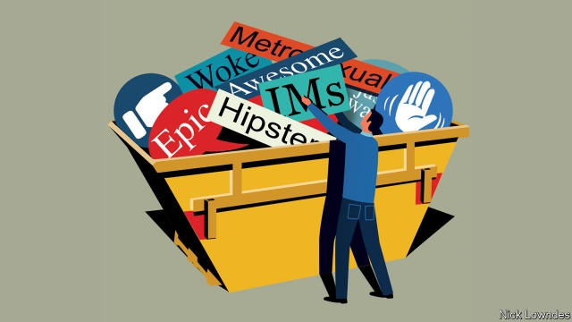

###### Johnson

# Hipsters, RIP 

##### Like technology and clothes, some words go out of fashion 

 

> Jan 3rd 2019 

 

FOR MANY people, new year’s resolutions entail a clean-out of the cupboard or the basement. All those once-useful but now clapped-out gadgets, outmoded or too-small clothes, the cables to devices long since lost, the book that, once read, will never be opened again—off they go to be recycled. 

Like households, language is tidied and renovated, but constantly rather than once a year. Just as you no longer use the chargers for discarded phones, you can safely forget a generation of earlier tech vocabulary. Nobody “instant-messages” anyone anymore; stand-alone chat services have given way to versions integrated into smartphones or platforms such as Facebook and Slack. Speaking of Facebook, you may not realise that the “Poke” and “Wave” features still exist, though hardly anyone uses them, or the attendant terms. 

But technical obsolescence need not dictate the linguistic kind. Computers remind users of their early days every time they “boot” them. Once, computers could not store their own operating systems. Since it is hard to load software (including an operating system) without already running software, the clever fixes to this problem were seen as akin to “pulling yourself up by your bootstraps”. “Boot” survived even as computers outgrew this flaw, much as the image of a floppy disk remains the visual embodiment of the “save” function. 

A common target for a clean-up is the category of “awesome” words: brilliant, amazing, epic and their like were all once best in class. They have, through endless use, become dilapidated. They commonly feature on peevers’ most-hated-words lists, but there is no real reason to bemoan their rise and fall. Like physical items, terms in frequent use (and people do often need to describe awesome and brilliant things) simply wear with repetition. They must be replaced; just as motorists need new tyres every so often, so it is with these words. 

Then there is fashion. In every cupboard are a few items which, though hardly tattered, are hopelessly unwearable, screaming “2013!” In the lexical wardrobe, think of “metrosexual”, useful for about five minutes in 2003 or thereabouts, to describe straight men who waxed, took expensive care of their hair and so on. “Metrosexual” faded not mainly because it went out of date, but rather the opposite, because of the success of the underlying concept; even though men started wearing beards and lumberjack shirts, they did so with exquisite care. In other words, every man is a metrosexual now, expected to spend time on his grooming. So there is little need for the moniker. 

In the same vein, “hipster” culture is so dominant, from bare-brick coffee-shops to cocktail bars, that there is scarcely any reason to notice it. Google searches for the label peaked in America in 2011 and worldwide in 2015. Picking on hipsters is passé: the photo-blog “Look At This Fucking Hipster” last posted in 2010. 

When does a word become unfashionable? When unfashionable people start using it, of course. In other words, well before these Google peaks—driven as they are by the uninitiated, many of them looking to learn the meaning of a trendy piece of jargon for the first time. As such searches rise, the cool kids who came up with the slang in the first place will have already moved on, preserving their avant-garde status by coining something else. 

By this rationale, several bits of recent political slang are clearly on their way out too. “Woke”, briefly popular to playfully describe someone politically enlightened and on the left, peaked in Google searches in May 2017; it seems primarily to be used sarcastically, either by woke types themselves deriding the faux-woke, or by conservatives belittling the whole woke enterprise. It is headed the same way as “social-justice warrior”, a phrase meaning roughly the same thing as “woke”, which travelled the same road from lionising self-description to gibe. It is now such a cliché, even as an insult, that it, too, is ready for the junk heap (or perhaps, in keeping with its meaning, the charity shop). 

Linguistic conservatives seem to wish language would just sit still. Even some people who are liberal-minded in politics can become more fusty over language as they get older. But hoping words would stop rising and, more to the point, falling, is as futile as wanting technology, politics or fashion to freeze. Be as conservative as you like in your own vocabulary—recycling old favourites and disdaining the latest duds—but time will nonetheless do its work. 

