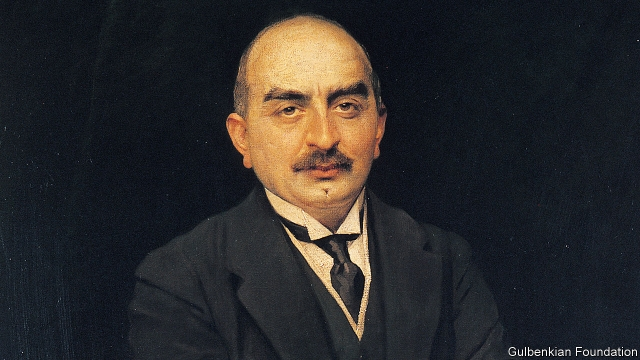

###### Fire sales

# The extraordinary life of Calouste Gulbenkian 

##### War and ethnic hatred were a distraction from the real business of oil 

 

> Jan 3rd 2019 

 

Mr Five Per Cent. By Jonathan Conlin. Profile Books. 416 pages; £25. 

THE END of the Ottoman era is generally described in one of two ways. In the first, a moribund empire that had oppressed its Christian subjects began to annihilate them. In the other version, the Christians colluded with foreigners to dismember an Islamic realm in which they had lived quite safely. The life of Calouste Gulbenkian, a tycoon and philanthropist who helped to shape today’s oil industry, offers a nuanced third perspective. 

An Armenian with deep roots in central Anatolia, Gulbenkian emerged from the heart of the Ottoman Christian world. As Jonathan Conlin shows in his meticulous biography, he epitomised one of the striking features of late Ottoman history: a final burst of economic expansion that was made possible by the capital and expertise of prominent Christians, from Greek bankers to globe-trotting Armenian traders. An easy interlocutor with European grandees, he also had an insider’s understanding of the region then called the Near East. His chameleonic empathy made him a superb broker of many-sided deals that seemed to satisfy all parties, including himself. 

Gulbenkian was born in 1869 to a father with growing oil interests in the Caucasus and Mesopotamia, attending French lycées and King’s College London. After Ottoman Armenians had suffered a wave of killing, he returned to London in 1897; soon he was building connections in the world of finance. In 1907 he helped to bring together the two companies that formed Royal Dutch Shell. 

But he plunged back into Ottoman affairs when a window opened to serve the empire. Right up to 1914, he advised the Young Turks who had seized the reins of Ottoman power as they pushed back against their European economic overlords, artfully playing one against another. Working closely with Cavid, the finance minister, Gulbenkian founded both a new National Bank of Turkey and the Turkish Petroleum Company (TPC), which had a careful balance of Western shareholders. 

The window soon snapped shut. Starting in 1915, as this book somewhat laconically notes, “between a third and a half of the world’s Armenians died on forced marches,” from “exhaustion, starvation or disease” or by the bullets of Ottoman soldiers and their Kurdish accomplices. Although Gulbenkian drafted a will which provided for the relief of Armenian orphans, his people’s tragedy does not seem to have been a preoccupation at that time; instead he was busy managing a somewhat turbulent relationship with Henri Deterding, a fellow oil magnate. He might easily have played a part in lobbying for an Armenian homeland after the Ottoman defeat, but he kept aloof. 

The first world war put an end to Turkish control over the oilfields of present-day Iraq, but not to the TPC. In 1928 the company—whose many shareholders included Gulbenkian himself—struck a deal to extract those deposits. His 5% stake made him fabulously wealthy, and a great collector of art at his Parisian residence, though Mr Conlin presents him as a man driven more by the thrill of commerce itself than by Mammon. 

During the second world war Gulbenkian was an envoy of the Iranian government to the collaborationist French regime, and was duly proclaimed an enemy alien by Britain. But his establishment friends chimed in to see that he was forgiven after 1945, although he lived the rest of his life in Lisbon (where he endowed a well-known philanthropic foundation). It might almost be said that Gulbenkian treated outbreaks of ethnic hatred and war as a kind of nuisance to be pragmatically overcome while building commercial alliances and orchestrating oil supplies. 

As well as compellingly tracing his professional dealings, Mr Conlin’s book evokes Gulbenkian’s dysfunctional family. Among the memorable revelations is that in middle age he was told by an Armenian doctor to have sex with multiple young women, advice that was followed and apparently tolerated by his long-suffering wife. Yet for all the rich detail, quite what he made of the violent collapse of the empire in which he was born remains something of a mystery. 

