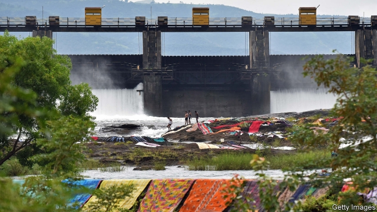

###### After the floods

# The struggle over water in India and China 

##### A thought-provoking history of South Asia through its rivers and rains 

 

> Jan 3rd 2019 

 

Unruly Waters: How Rains, Rivers, Coasts and Seas Have Shaped Asia’s History. By Sunil Amrith. Basic Books; 416 pages; $35. Allen Lane; £25. 

ON THE LAST day of 1956 Jawaharlal Nehru, first prime minister of an independent India, took Zhou Enlai, his Chinese counterpart, to visit the Bhakra dam, on the Sutlej river in the north of the country. “These are the new temples of India, where I worship,” he told his visitor. Both young governments saw managing water as a central part of their mandate. In Chinese mythology, civilisation dates from the efforts by the Emperor Yu to tame the floods 4,000 years ago. Meanwhile Indian history has been a long battle to predict, harness and exploit the monsoon—or to cope with its failure. Tens of thousands of farmers have recently taken to the streets to vent their anger at the hardship they are enduring after weaker-than-usual rains. 

As Sunil Amrith notes in his enthralling, elegantly written and, ultimately, profoundly alarming history, nowhere “has the search for water shaped or sustained as much human life as in India and China.” Between them they have perhaps 36% of the world’s population, but just 11% of its freshwater—and, in both countries it is distributed hugely unevenly. Their hydraulic priorities have differed: “India’s great need was irrigation; China’s was flood control.” But their approaches have had much in common: the massive investment of labour, capital and technology in a drive to contain and control the forces of nature. 

The dams are an obvious symbol of this. Mr Amrith concentrates mainly on India, using China for comparison and contrast. He notes that more than 40m people in India have been displaced by dam-building. In China under Mao Zedong, an estimated 22,000 large dams were constructed. And the frenzy continues. More than 400 dams are planned by China, Pakistan, Bhutan and Nepal in the Himalayas, source of Asia’s ten great rivers. 

But dams are only part of the story. Both India and China have long nurtured grandiose visions of linking and diverting rivers to mitigate the inequity of nature’s distribution. Thanks to the most expensive infrastructure project the world has ever seen, two-thirds of Beijing’s tap-water now comes from a reservoir in central China, nearly 1,500km (930 miles) away. India has dreams of “interlinking” 37 rivers through 14,000km of canals. 

And both countries have sucked ever increasing volumes of water from underground. The Green revolution in India, which, in the 1970s, transformed its ability to feed itself, relied on electric tube wells. Groundwater now accounts for 60% of India’s irrigated area; agriculture’s share of total energy use climbed from 10% in 1970 to 30% by 1995—encouraged in part by the cheap or free electricity that Indian politicians love to lavish on rural voters when elections loom. 

The inspiring element of this chronicle is simple: a huge increase in human life, health and happiness. Water management, and the agricultural production it has sustained, have irrigated China’s economic miracle. And India, after the repeated drought-induced famines inflicted by British rule, and its dependence on food aid into the 1960s, has become a big agricultural exporter. 

The alarming aspect comes in the evidence Mr Amrith marshals to suggest that past strategies have run their course, and indeed are now causing new problems. Depleted aquifers, polluted waterways and silted-up dams threaten renewed and more intense water crises—which will be exacerbated by climate change. And as water management becomes an ever more pressing concern at home, it will create tension across borders. 

Already India and Pakistan are arguing about how to interpret the treaty they signed in 1960 on sharing the waters of the Indus river. And of all the insecurities India harbours about China’s long-term aims, perhaps none is as visceral as the worry about the future of the great subcontinental rivers—the Indus and the Brahmaputra—that rise in the Chinese Himalayas. 

