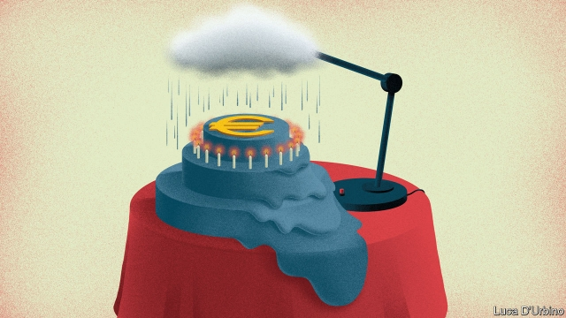
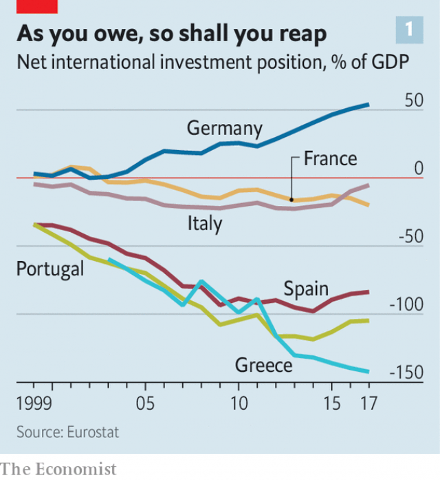
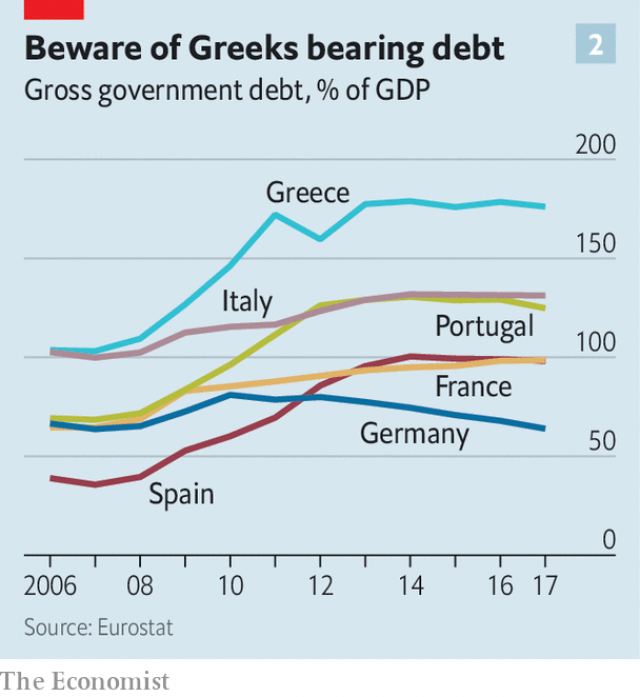
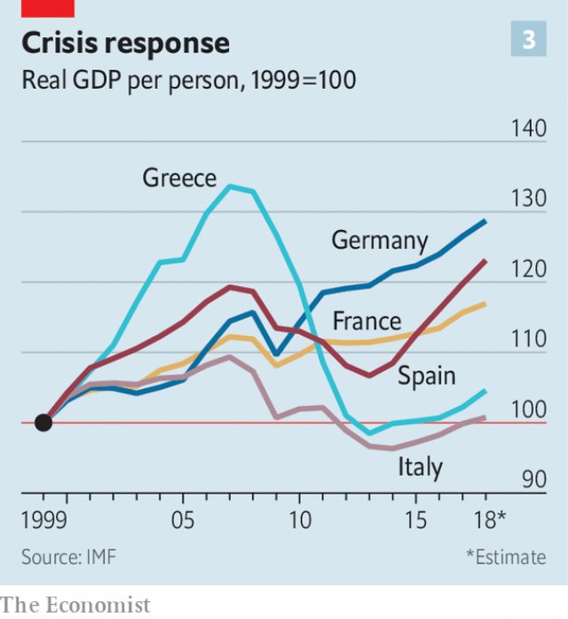
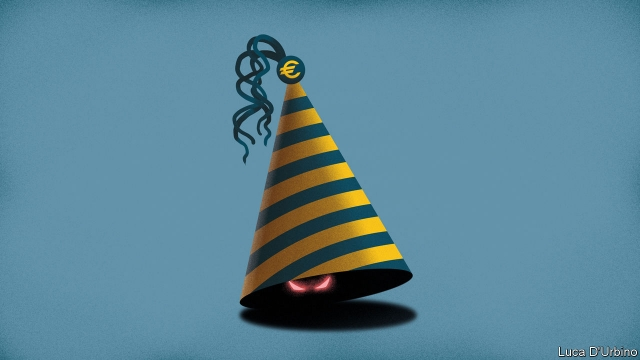

###### Incomplete union

# The euro enters its third decade in need of reform 

##### The EU’s great project may not survive another crisis 

 

> Jan 5th 2019 

 

THE EURO is a survivor. The new currency, brought into being on January 1st 1999, has defied early critics, who thought it doomed to failure. It has emerged from its turbulent teenage years intact, cheating a near-death experience, the debt crisis of 2009-12. It is now more popular than ever with the public. But fundamental tensions attended its birth. Although the euro has made it this far, they still hang over it. If Europe’s single currency is to survive a global slowdown or another crisis it will require a remodelling that politicians seem unwilling or unable to press through. 

To its supporters the bold economic experiment was the culmination of half a century of European co-operation and a crucial step towards an “ever closer union” that would unite a continent once riven by conflict. “Nations with a common currency never went to war against each other,” said Helmut Kohl, Germany’s chancellor who, together with France’s president, François Mitterrand, championed monetary union in the 1990s to cement deeper political and economic integration. 

Each member brought its own hopes and fears to the union. To the French it was a way of taming the economic might of a newly reunified Germany and the power of the Bundesbank. To the Germans, who feared they would eventually foot the bill for profligate southerners, the prize was a stable currency and an end to competitive devaluations by Italy. To the Italians, Greeks and other southerners, monetary union was a means of borrowing the inflation-fighting credibility of the Bundesbank, on which the European Central Bank (ECB) was modelled. 

The most vocal critics of the euro—many in America—saw a foolhardy plan crafted by naive politicians. The currency union would shackle together economies that were too different in structure while taking away a weapon to fight “asymmetric” downturns that hit individual members, such as a local housing bust. By giving up the ability to devalue currencies, the only way to adjust would be through painful and politically troublesome cuts to real wages. Unlike America, which also shares a monetary union, there would be no federal budget to help stabilise demand across state borders. Milton Friedman gave the euro no more than ten years before it collapsed and took the EU with it. 

Neither its staunchest advocates nor its harshest critics have proved correct. The currency area has grown to 19 countries and ranks as the world’s second-largest economy, when measured using market-exchange rates, behind only America. But the euro has only muddled through. Political will, particularly at its Franco-German core, meant that just enough was done to ensure that the euro survived the debt crisis but none of the union’s fundamental problems was solved. As it enters its third decade, the question is whether the currency can withstand the next upheaval. 

To do so will require the right economic tools to overcome the euro area’s weaknesses. These became obvious after debt crises engulfed Greece, then Ireland, Portugal and Spain. The unresolved conflicts of the past 20 years has meant too little integration and too little reform. Crucial gaps in its structure are yet to be fixed, and its ammunition is limited. At the same time, Europe is politically more divided. In many countries, mainstream leaders are succumbing to populists. Divisions have widened between the fiscally disciplined north and the south, which advocates redistribution across borders. 

The deeper cross-border integration of economies, banks and capital markets that would alleviate domestic economic difficulties has not materialised. The euro’s architects hoped that deeper integration would make the pain of real-wage adjustment easier to bear. But the external discipline of a single currency has not, as hoped, forced governments to undertake much reform to labour and product markets to improve competitiveness and so bring economies into line. Members trade more with each other. But, compared with grand expectations, the gains have been modest. Labour mobility is still low. 

Financial integration has been limited, too. In America, capital and credit flowing from the rest of the country cushion the impact of a downturn in any one state. But a single capital market has not fully developed in the euro area. According to the OECD, a rich-country club, the corporate-bond market amounts to a tenth of GDP, compared with over two-fifths in America. A study by the European Commission in 2016 found that integration of capital and labour markets helped to cushion the blow of half of asymmetric shocks in America but only a tenth in the euro area. 

What banking integration has occurred has amplified risks not spread them. Banks have done little direct lending to firms and households across euro-area borders. Lending in the 2000s was of the flighty interbank sort that could easily be withdrawn. This fed macroeconomic imbalances: net foreign liabilities in Portugal, Greece and Spain rose to 80% or more of GDP by 2008. But capital fled swiftly once the global financial crisis got under way. Foreign debts suddenly could not be rolled over and crisis erupted. 

Without deep integration, the burden of adjustment falls on member states that are already stricken. Greece was engulfed by crisis after it overspent and hid its fiscal deficits. The crisis spread to Ireland, poleaxed by reckless banks, and Spain, which suffered a property bust. Matters were made worse in an infernal loop of doom as governments struggled to borrow enough to support failing banks, while banks were beset by the tumbling value of the government debt they held. Greece, Ireland, Portugal, Spain and Cyprus needed bail-outs. In return, northern countries insisted on stringent austerity measures and onerous structural reforms. 

The euro area has become more balanced economically as a result of these measures. Gaps in competitiveness that ballooned during the first decade of the currency’s existence have since narrowed as wages have been slashed and collective-bargaining practices reformed in southern states. Almost every country—apart from France, Estonia and Spain—is now running a primary fiscal surplus (ie, before interest payments). Ireland, Portugal and Spain ran current-account deficits before the crisis, but are now running surpluses. 

 

Nevertheless, as the euro area enters its third decade it is still vulnerable to another downturn and underlying tensions are unresolved, if not sharpened. Past imbalances have left large debts that are only slowly being chipped away. Greece, Portugal and Spain have big external debts (see chart 1). Fiscal firepower is limited. Seven countries have public debt around or over 100% of GDP (see chart 2). The euro area has no budget of its own to soften the blow. The wider EU has one but it is small, at 0.9% of GDP, and is not intended to provide stimulus. 

 

As fiscal policy provided too little stimulus when it was required, the ECB bore the burden. In 2015, after much delay, it began a programme of quantitative easing. Its purchases of securities, such as government bonds, from banks eventually encouraged more lending and kick-started recovery. 

Even that took a fight. German horror of monetising debt led the ECB to set limits on the amount of a country’s debt it could own. Even so, German critics launched legal complaints that the bank was breaking EU law by monetising debt. It was only in December 2018 that the European Court of Justice ruled that the scheme was legal, thanks in part to its ownership limits. 

The bank’s ability to provide stimulus in the next downturn will be constrained. Short-term interest rates are already negative. The bank’s balance-sheet of €4.5trn ($5.1trn) is vast, and holdings of German sovereign bonds are already nearing its ownership limit of 33%. It will take years before interest rates, let alone the balance-sheet, return to normal. Should a recession strike before then, the bank will have to rethink its toolkit. Morgan Stanley, a bank, puts the ECB’s firepower at €1.5trn if it increases its ownership limit of sovereign bonds to 50% and widens its private-sector asset purchases to include bank bonds. But such a redesign could be difficult. Increasing holdings of sovereign debt would risk dividing the bank’s governing council and provoking fresh legal challenge by critics. 

In 2012 Mario Draghi, the ECB’s president, said he would do “whatever it takes” to save the euro, committing to buy unlimited amounts of government bonds if sovereigns hit trouble. But the bank’s governing council may be split when it comes to putting such a scheme into practice. Jens Weidmann, the Bundesbank’s chief and a contender to become the next leader of the ECB, has opposed it. 

Northerners still fear paying profligate southerners’ bills, either through debt monetisation or bail-outs. For the Germans and the more hawkish New Hanseatic League, a group of eight small northern members, the debt crisis highlighted the importance of a national discipline that they fear is still lacking in the south. 

 

At the same time, southerners feel they are bearing all the pain of recovery. The politics of monetary union is more febrile as a result. After eight years of eye-watering austerity, Greek GDP per person is still far below its level in 2007 in real terms (see chart 3). In 2015 Syriza, a left-wing party, came to power promising to end austerity, before spectacularly reversing course when it became clear that Greece needed a third bail-out. 

The hope that lawmakers in Italy would be forced into making growth-enhancing reforms has been dashed. The economy was limping even before currency union. Public debt is a daunting 130% of GDP. Income per head in real terms is no different than in 1999. The stagnation raises the question of whether Italy can grow within the euro area, says Jeromin Zettelmeyer, from the Peterson Institute for International Economics. And the EU has become the Italian government’s external enemy. In June 2018 a populist coalition took office seeking to overturn pension reforms and promising to increase public spending, provoking a stand-off with Brussels before Italy backed down in December. 

After the previous crisis politicians struggled to cope. Their successors are even less well-equipped—or less well-intentioned. Political developments both within the euro area and without could restrain the economic response to the next downturn and are holding back much-needed institutional reform. Emergency action was taken during the debt crisis. A sovereign bail-out fund was cobbled together, for instance. Such steps had been urged by the IMF and America’s president, Barack Obama. The Federal Reserve helped to provide dollar liquidity. Similar engagement or encouragement is unlikely while Donald Trump is in the White House. 

Political differences between the north and south mean that three institutional flaws remain unresolved. Private-sector risk sharing through banks and capital markets is insufficient, the doom loop connecting banks and sovereigns has not been fully severed, and there is no avenue for fiscal stimulus. 

Europe’s banks, like those across the Atlantic, have improved their liquidity and capital positions since the financial crisis. The total amount of bad loans, although still high in Greece and Italy, is falling. In 2012 the euro area introduced reforms to create a “banking union” in order to integrate national systems and loosen the ties between banks and sovereigns. Big banks are now supervised by a central authority. And a resolution fund is responsible for winding down failing banks, so that national governments are not as exposed to big ones that collapse. 

Lenders remain stubbornly national, however. Branches and subsidiaries that operate across borders make up only a tenth of the euro-area banking sector’s assets. Banks cannot use deposits in one country to lend in another, because national regulators do not want to be on the hook for loans to improvident foreigners. An EU-wide deposit-guarantee scheme would allay that fear, but has yet to be agreed. At a meeting of heads of state on December 14th a discussion of the scheme—first proposed in 2012—was kicked further into the long grass. Fiscal hawks insist that banks bring down non-performing loans before risks are shared across countries. 

Political differences have also prevented the doom loop from being broken fully. A side-effect of stricter rules on banks’ capital, which deems sovereign debt as riskless, is that banks have loaded up on it. Big banks in Italy, Portugal and Spain hold around 8-10% of their assets in these bonds. Jitters about the sustainability of a country’s debt could worsen banks’ balance-sheets, translating into fears about their solvency. But limits on banks’ sovereign exposures, backed by northerners, were not even discussed in December. Highly indebted Italians detest limits, fearing the loss of a steady source of demand for their debt and a rise in borrowing costs. 

Fiscal policy is another political battleground. It is meant to be a matter for member states. But to avoid imbalances building up, they are required to obey the EU’s rules, which include running fiscal deficits of less than 3%, and public debt below 60%, of GDP. That has led to clashes between the European Commission, which polices the rules and is backed by hawks, and other national governments, which want to enact stimulus or deliver on election promises. 

Some economists think that national fiscal policy alone is insufficient, particularly if countries that most need stimulus are constrained by fears of provoking bond markets. Country-level rules cannot force the miserly or the better off to spend more for the good of the currency area. In 2017 Emmanuel Macron, France’s president, proposed a euro-area budget to help stabilise demand in countries hit by an asymmetric downturn. But northern hawks see little need for such a function. For them, national public finances suffice. 

 

A heavily watered down version of Mr Macron’s budget proposal was agreed in December. But rather than drawing on new funds, it will sit within the existing EU budget and focus on convergence and competition, rather than stabilising demand. The prospects for meaningful change may seem bleak. But it could still happen, thinks Daniele Antonucci of Morgan Stanley. He reckons that investors are too pessimistic about reform and that there is a chance that the bloc will enact a euro-area budget with a stabilisation function over the next ten years. Mr Macron’s budget proposal was considered taboo only a year ago, he says. Now that a version has been agreed it leaves scope for expansion. 

If the euro’s past is a guide, change only happens during a crisis. The previous one revealed a willingness of the Franco-German core to save the euro at any cost. That willingness remains and cannot be underestimated. Laurence Boone of the OECD, who was an adviser to François Hollande, Mr Macron’s predecessor, thinks that the EU budget already contains tools, such as cohesion and investment funds, that could be enlarged and repurposed to stabilise the euro area if it hit trouble. The euro’s public popularity should help, as should the quietening of calls for leaving the euro in countries where it once seemed possible. Parties that flirted with exit, such as the Front National in France and the Northern League in Italy, now seek change from within. Britain’s agonising Brexit drama may have served as a warning. 

Other events, though, could easily conspire against immediate action. Mr Macron has been weakened. His recent concessions to gilets jaunes protesters means that France will probably violate European fiscal rules. Angela Merkel, Germany’s chancellor, who led the euro area’s emergency response during the crisis, is due to step down in 2021. Reform-minded European officials, such as Mr Draghi, depart this year. If crisis engulfs Italy, the bloc’s third-largest member, even Franco-German determination to save the euro may not be enough. Political fragmentation means there is no guarantee that the next crisis will deliver the leap in integration needed to keep the euro safe. 

The economics of currency union was always going to be hard for politicians to manage. In its first 20 years they did enough to keep the euro alive. The next 20 years will be less forgiving. A crisis will inevitably strike and if politicians do not see through reform, they may well oversee the euro’s demise. 

