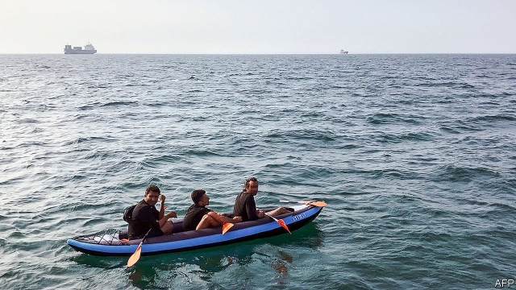

###### Not quite an armada

# An uptick in migrants crossing the Channel by boat 

##### The change of approach follows the introduction of tighter controls elsewhere 

 

> Jan 5th 2019 

 

ON A CLEAR day, they can make out the promised land. The few hundred migrants in the French port of Calais who long to come to Britain are taunted by the white cliffs of Dover, just 26 miles (42km) across the English Channel. Most days, some will try to hide in lorries bound for the tunnel beneath it. Only a handful elude the British customs checks in France. Most trudge back to their camp, a wasteland strewn with plastic bags where they fight off the cold with fires and, in one case, a Union flag woolly hat. “The border is too hard,” says Arthur Kwame, a 22-year-old from Ghana. “I wish I had wings.” 

British newspaper readers could be forgiven for assuming they now have. A tidal wave of front-page headlines since Christmas has chronicled a “migrant crisis”, with ministers said to be “all at sea”. Sajid Javid, the home secretary, broke off a safari jaunt in South Africa to mastermind the response to what he called a “major incident”. After criticism from backbench Tory MPs, he redeployed two patrol boats from the Mediterranean to the Channel and called in the navy. 

About 100 migrants have risked the precarious crossing of the busy shipping lane in dinghies since Christmas rather than attempt to break into yet another lorry. This is an increase on previous months, but absolute numbers are still small. Crossings cannot be tallied definitively but the Home Office knows of 539 migrants who tried to cross by boat in 2018, probably far fewer than the number who came by lorry. Only 312 completed the journey (the rest were caught). In contrast, 113,145 made it across the Mediterranean last year. 

Far from demonstrating lax borders, the latest cases highlight the success of initiatives to tighten controls in Calais. Between 2016 and February 2018, British officials on the continent prevented more than 80,000 “clandestine” attempts to cross the Channel. In 2017 there were 26,500 asylum applications, some 19% below the level at the height of migration in 2015. More than three times as many asylum-seekers came to Britain in 2002, a recent peak. 

Nor are many in the camp keen to pay smugglers a few thousand euros to join the flotilla. Mr Kwame had not heard it was an option until journalists began visiting. If he is given the chance, he might take it, but he is reluctant, having already been rescued from the Mediterranean. As much as migrants switching tactics, the rise in crossings by boat appears to reflect the growing proportion of Iranians in Calais. Maya Konforti, who runs a charity for migrants there, says different nationalities favour varying routes across the Channel. “Crossing by boat has always been in great part the speciality of Iranians,” she explains, though it is not clear why. Several hundred Iranians made it to Calais via Serbia between August 2017 and October 2018, after Belgrade temporarily dropped a visa requirement. Most speak English and are keen to work. 

The fuss is partly down to the deadly stakes of the migrants’ bleak calculation. Though nobody has yet drowned, it is an obvious risk, as is collision with bigger ships. But migrants also die attempting to cross through the tunnel. Politicians have done little to calm the brouhaha. Gavin Williamson, the defence secretary, quickly offered the navy’s help. Mr Javid appointed a “gold commander” to deal with the affair. Cynics note that the crisis may help Theresa May’s potential successors burnish their leadership credentials. 

Such concerns do not trouble Mr Kwame, who wants to come because he speaks English, “and besides we used to be a colony”. He has been found in lorries six times since arriving in Calais in July 2018. But he will keep trying. “I don’t need your money,” he says. “I just want to be safe.” 

