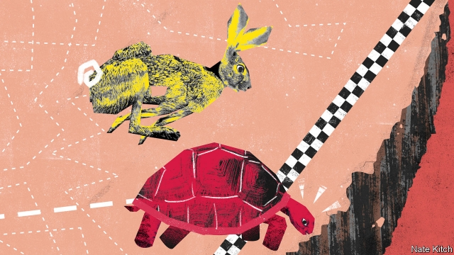

###### Bagehot

# Britain’s political landscape has been shaped by patient politicians 

##### How tortoises triumphed over the hares 

 

> Jan 3rd 2019 

 

OVER THE coming weeks the British will have plenty of chances to reflect on Harold Wilson’s dictum that “a week is a long time in politics”. As MPs debate Theresa May’s Brexit deal the future of the country will seem to hang on a tide-turning speech or a high-profile defection. But in fact high-speed politics will be a testimony to the importance of low-speed politics: the political landscape has been created by patient men who thought in terms of decades rather than weeks. 

For most of their lives Brexiteers have been dismissed by the establishment as irritating protuberances who got in the way of good government. John Major called them “bastards”. Other choice epithets include “the barmy army” and “swivel-eyed loons”. They forged on regardless, convinced that they would be judged in the light of history rather than the next day’s newspapers. 

The paradigmatic example of a patient man is Sir Bill Cash. Fellow Tories dismissed him as the biggest Euro-bore in Parliament. When he was prime minister David Cameron invented an anti-Cash device: whenever he ventured into the Commons he surrounded himself with a scrum of well-built loyalists who were instructed to keep the member for Stone at bay. But nothing deflected Sir Bill from what he calls his “Thirty Years War” to save Britain from the European super-state. He joined the select committee on European legislation in 1985 and has been a member ever since, poring over the most tedious EU publications for signs of subterfuge. He founded the first grass-roots anti-EU organisation, the European Foundation. He even trained the younger generation of Eurosceptics. William Rees-Mogg, a former editor of the Times, was a close friend and Sir Bill provided his precocious son, Jacob, with lengthy tutorials. 

The Brexiteers responded to every disappointment by redoubling their efforts. In the first decade of this century their project looked doomed. Their obsession with the EU had helped hand power to Tony Blair. Their choice for party leader—Iain Duncan Smith—turned out to be a nincompoop. Mr Cameron revived the Tory party by promising, in effect, to put them back in the asylum. But their persistence eventually paid off. They exploited a chance concatenation of circumstances—public anxiety about the surge of immigrants from eastern Europe after 2004; exhaustion with New Labour’s endless spin; the rise of UKIP—to extract a promise of a referendum. The rest, as they say, is history, and history that has been made by patient men like Sir Bill rather than short-term party managers like Mr Cameron. 

The triumph of the patient right has coincided with the triumph of the patient left. The Labour Party is now run by people who have spent not years but decades in the wilderness. Jeremy Corbyn was first elected MP for Islington North in 1983 (a year before Sir Bill made it to Parliament) but didn’t hold his first serious office until 2015 when he became leader of the opposition. Before that he spent his life as an agitator, going on demonstrations, stuffing envelopes, fraternising with activists, and sticking it to the party leadership (he defied the party whip 428 times when New Labour was in power). His closest allies are internal exiles of the same generation: John McDonnell, his shadow chancellor; Dianne Abbot, his home secretary; and, outside Parliament, Jon Lansman, the architect of Momentum, a campaign group, who made his name as Tony Benn’s fixer in the 1980s. 

The patient left were kept going by a burning faith that history would eventually move in their direction, a faith well illustrated by Mr McDonnell’s comment, during the financial crisis, that “I’ve been waiting for this for a generation.” While New Labour concluded that the lesson of Thatcherism was that they had to compromise to survive, Mr Corbyn’s group concluded the opposite, that they had to do a Thatcher in reverse and bend reality to their will. They defended their position in the party’s machinery by outboring their rivals. They were always the first people with a procedural motion and the last people to leave at night. As with the Brexiteers their patience eventually paid off. They were able to exploit another concatenation of circumstances—the financial crisis in 2008; Ed Miliband’s decision to expand the membership; the willingness of a few moderate MPs to put Mr Corbyn’s name on the ballot—to seize control of the party. 

The patient people of the right and the left are now busy propping each other up. Mr Corbyn’s refusal either to support Mrs May’s Brexit deal or to sanction another vote on EU membership makes it more likely that Britain will crash out of the EU without a deal (the default option). The Brexiteers’ obsessive pursuit of a “clean Brexit” is tearing the Conservative Party apart and making it more likely that a furious electorate will vote Labour. Over the next couple of years both groups of patient men may get what they want: a hard Brexit for the Brexiteers this March and a Corbyn-led Labour government for the left. 

What lessons should we learn from the rise of the patient tendency? The first is not to put too much hope in last minute compromises. You don’t devote your life to a waiting game only to discover the virtue of pragmatism at the eleventh hour. The Brexiteers think that the shock of a hard-Brexit will be a small price to pay for regaining the country’s freedom. Mr Corbyn thinks that chaos might well be the midwife of a glorious socialist future. 

The second lesson is that long-termism can be overrated. It is conventional to decry the tyranny of short-term thinking, a tyranny that is supposedly getting more oppressive in a world of Twitter mobs and one-click consumers. But long-termism can be coupled with monomania and utopianism. And short-termism makes for constant adjustments to an ever-changing reality. Britain’s patient tendency is doing far more harm to the country than short-termists ever did. 

