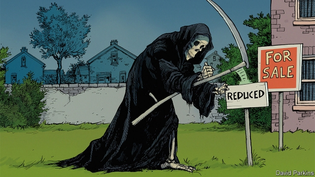
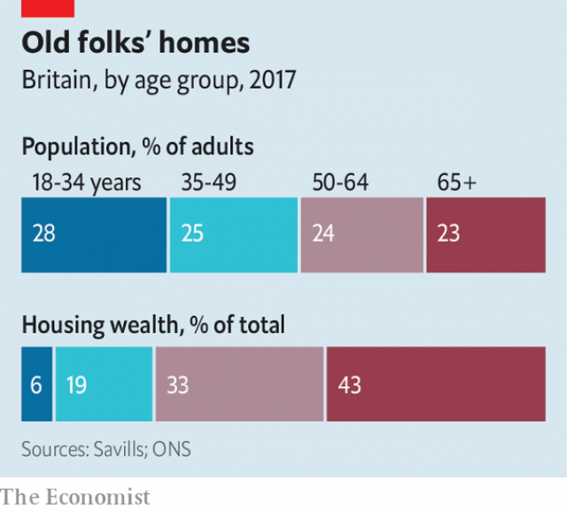

###### The silver lining

# Cheer up, millennials! It will become easier to buy a house 

##### The snag? It’s because your parents are going to die 

 

> Jan 3rd 2019 

 

MANY YOUNG Britons believe that the housing market is stacked against them. And who can blame them? In the past two decades house prices have doubled in real terms, because of both tight planning restrictions, which have limited the supply of homes, and low interest rates, which have stoked demand for them. Theresa May, the prime minister, has described the scarcity of housing as “the biggest domestic policy challenge of our generation”. But the reality is that it challenges some generations more than others. Elderly folk, who bought their houses before the boom, own a huge slice of overall housing wealth relative to their share of the population (see chart). It is a different story for youngsters. A 27-year-old living today is half as likely to be a home-owner as one living 15 years ago. 

Yet some economists spy a silver lining for millennials. The thinking goes that, within a decade or two, baby-boomers—the bumper generation born between roughly the early 1940s and early 1960s—will begin to sell up, as they first start to downsize, then move into elderly people’s accommodation and, eventually, to the great old-folks’ home in the sky. As their properties are put on the market, supply will rise, depressing prices and bringing ownership within reach for more people. This is much talked about in America, where a recent article co-authored by an economist at Fannie Mae, a government-backed mortgage provider, pointed to the “coming exodus of older homeowners”. 

 

Back-of-the-envelope calculations give an idea of the effect on house prices when boomers begin to sell up. England’s owner-occupier baby-boomers live in houses with an average of three bedrooms. If all of them downsized to homes with two bedrooms, that would free up housing equivalent to around 2.5% of the current stock, reckons Ian Mulheirn of Oxford Economics, a consultancy. Most empirical work shows that a 1% rise in the housing stock leads to a 2% fall in prices and rents, all else being equal. On that basis, a mass-downsizing would imply a cut in prices of about 5%. 

Yet so far the British boomers are in no rush to scale down. In contrast to America, Britain does not have much of a downsizing culture. By one calculation just 40% of Britons who owned their homes at age 50 will move house before they die. A paper published in 2011 by James Banks of the Institute for Fiscal Studies, a think-tank, and colleagues, provides convincing evidence that geography and climate play a big role. In America oldsters can move to sunny climes like Florida. Britain is a bit short on such places—Cornwall, lovely as it is, is not known as the “Sunshine County”—so most pensioners don’t bother. An intrepid few retire to the continent. But Brexit is likely to make that harder. 

Government policy also discourages downsizing. Stamp duty, a tax on homebuyers, makes moving expensive. As house prices have risen in the past decade, the average amount of stamp duty charged per house-purchase has risen by half in real terms (homebuyers pay around £8,000, or $10,200, in stamp duty). Meanwhile, there is little direct cost associated with remaining in a large empty nest. Council tax, an annual levy on residential property, is based on valuations from 25 years ago and falls relatively lightly on big, pricey houses. 

If downsizing is unlikely, boomers may at least sell up when they move into an old people’s home. But here, options for elderly Britons are also limited. Perhaps 3% of British over-65s are in some sort of residential care, compared with more like 5% in America. Lawrence Bowles of Savills, a property firm, points out that Britain is under-supplied with good retirement housing. More than half of the existing stock was built or last refurbished more than 30 years ago. And the design of the social-care system means that most British pensioners do not need to sell their home to pay for their treatment. In their election manifesto last year the Conservatives floated a plan to include more people’s housing wealth in the test of whether they had the means to pay for their own care. After the move was dubbed the “dementia tax” it was hastily scrapped. 

All this means that it may be only when baby-boomers start to check out in a more permanent way that lots of houses begin to change hands. The most common year of birth for the baby-boomer generation is 1947. Since their most common lifespan is around 87 years, Peak Death could occur in 2034, when Britain will see around 15% more fatalities than in 2018. It will be very sad. But for house-hunters it will be a help. By that time baby-boomer deaths will be pushing down on house prices by around 0.7% a year. 

Yet just as the housing crisis affects different generations unequally, the impact of the great baby-boomer sell-off will have an unequal effect on different groups of youngsters. The boomers will leave record amounts of wealth to their descendants. Data are poor but according to our calculations, roughly £100bn are left behind each year. Over the next 20 years the total value of bequests is expected to more than double, peaking in 2035, according to a paper by Laura Gardiner of the Resolution Foundation, a think-tank. Most of this unearned wealth will not be taxed, on current plans. By 2020 a couple will be able to pass on a house worth £1m tax-free. 

Most of the inheritance bonanza, however, will go to a relative few. Nearly half of non-homeowning millennials have no parental property wealth at all, according to Ms Gardiner’s research. The other half will be able to use their inheritance to gain greater purchase in the housing market, for themselves or their own heirs and heiresses. A class of wealthy oldsters is moving on, only to be replaced by a class of wealthy inheritors. Demography will put downward pressure on house prices. But some people have a lot more to look forward to than others. 

