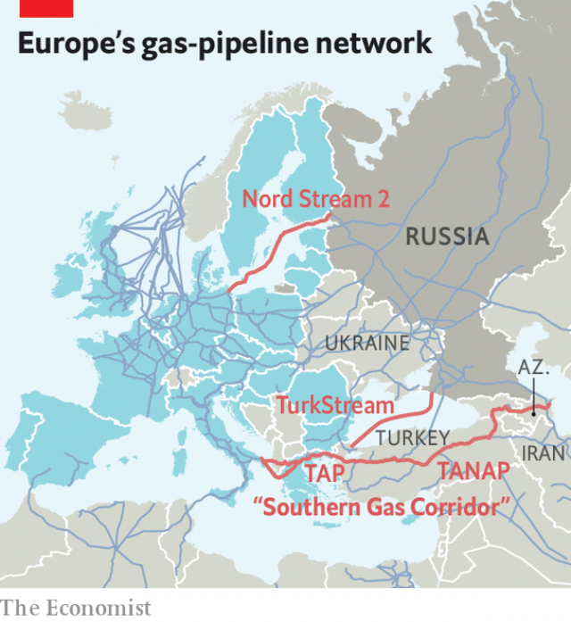

###### Pipe dreams

# A plan to reduce Europe’s dependence on Russian gas looks shaky 

##### The Southern Gas Corridor could even hand Gazprom more clout 

 

> Jan 5th 2019 

 

FOR YEARS, western European countries have worried about their access to gas, almost two-fifths of which is supplied by Russian pipes. These fears have not receded since in 2014 Russia cut off gas to Ukraine, the main thoroughfare through which its gas arrives in EU countries. Three times since 2006, rows with Russia have stopped gas flowing through Ukrainian pipelines, leaving customers down the line shivering. EU leaders have long pondered other sources, such as American LNG, but the latter is far more expensive. 

Such worries have flared again even as, in 2018, imports of Russian gas by EU countries reached a record high. On December 29th Russia rejected European demands to release 24 Ukrainian sailors detained after it seized three of its neighbour’s ships in November. Ukraine is calling for fresh sanctions on Russia, raising the risk that it might once more cut off supplies. 

Meanwhile, European politicians are also fretting about Nord Stream 2 (NS2), a planned pipeline that would carry more Russian gas under the Baltic Sea directly to Germany. On December 12th the European Parliament passed a resolution calling for the project to be cancelled, citing security reasons, but with 370km of pipes already laid it looks hard to stop. 

 

Another tack is to develop alternative conduits and supplies. On December 7th Italian authorities gave the final approval for the construction of the last leg of the Southern Gas Corridor (SGC), an EU scheme to import natural gas from the Caspian region. The project is more than three-quarters complete and workers are beginning to extend the pipeline beneath the Adriatic Sea to Italy. If all goes according to plan, a $40bn jigsaw of pipes from Azerbaijan will start supplying western Europe from 2020 (see map). But instead of increasing energy security, the SGC may do more to emphasise how hard it is for Europe to reduce its dependence on Russia. 

Planners in the European Commission had initially proposed the construction of a pipeline from Iran or Turkmenistan. But Iran is under sanctions and Turkmenistan sells most of its gas production to China, hence the shift to import from Azerbaijan. The project now involves dozens of companies, including BP, an oil major, and Socar and TPAO, the state oil companies of Azerbaijan and Turkey respectively. 

Despite the years of planning and complexity of the project, its capacity, at 16bn cubic metres per year, is about half what European planners had hoped. The SGC is set to meet just 2% of EU demand. At market prices, SGC gas is competitive in Turkey and south-east European countries but not in the more distant western European markets. Moreover, one of its developers is Lukoil, an oil firm backed by Russia. 

In its current form the SGC therefore does little to curb dependence on Russia. That is unlikely to change, for two reasons. First, in addition to NS2, Russia has devised its own plans to bring gas into southern Europe. TurkStream, a pipeline to transport Russian gas across the Black Sea to Turkey, is scheduled to become operational this year. Gazprom, Russia’s energy giant (and NS2’s sole shareholder), plans to build a second line to the EU and is negotiating its destination. That would make the EU-backed SGC even less competitive. 

Second, changes that would make the SGC more commercially viable are unlikely. Advocates of the project argue that they plan to double the volume of exports if more gas becomes available, notably from Turkmenistan. But the expansion would require new infrastructure and additional costs. A way of avoiding that would be to feed new gas from Turkmenistan into SGC through a swap deal involving transit through Iran. But renewed American sanctions on Iran preclude this option. They also hinder the development of rich gas resources in Iran, which could have otherwise been exported to the EU. 

At least one energy giant appears to take seriously the idea that the SGC could expand. But it will not reassure the EU that this firm is none other than Gazprom, whose chief executive has said it would bid for access. European rules require the SGC to open capacity expansion to the most cost-competitive supplier. In that event, Gazprom’s vast reserves and low costs would be hard to rival. A project touted as a way to diversify Europe’s gas supply might end up providing an additional route for its current, unloved, supplier. 

