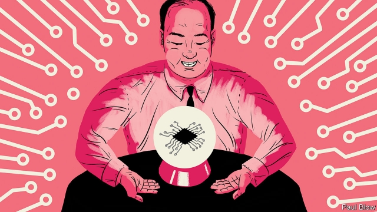
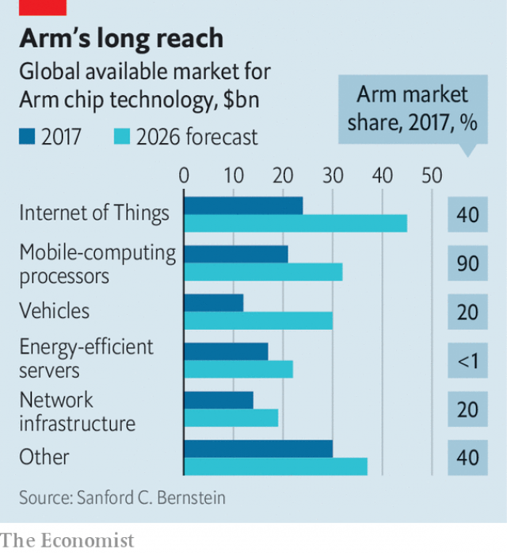

###### Armed with a crystal ball

# Masayoshi Son wants Arm’s blueprints to power all tech 

##### The British company’s pre-eminent position in chip design helps him predict tech’s future 

 

> Jan 3rd 2019 

 

ON THE OUTSKIRTS of Cambridge, where city fades to field, the headquarters of Arm Holdings, a chip-design firm, is expanding apace. Its latest new building is long and flat, with a façade adorned with a pattern of metal triangles. These represent the nanometre-sized silicon fins found on the surface of modern transistors. Once the office block is finished, the firm hopes, its unusual exterior will help inspire employees on their mission to dream up, transcribe and sell designs for the omnipresent computers of the future. 

Arm’s recipes for computer chips—it designs them but does not make any itself—are the most popular on the planet. Since it was founded in 1990, its corporate customers have sold a whopping 130bn chips based on its designs. In one sense, the business is simple. “We do drawings of engines and we sell those drawings,” says Mike Muller, one of Arm’s founders who is now its chief technology officer. 

Yet Mr Muller’s “drawings” are anything but simple. They are computer code which give Arm’s customers a blueprint for the construction of microprocessors, information-processing machines so complex that firms are happy for Arm to shoulder the burden of their fundamental design. Those clients—consumer-hardware giants such as Apple and Huawei; chip companies such as Broadcom and Qualcomm—pay Arm one-off licence fees to access the design code, add to it what they will, then pay royalties on every product they ship containing it. Apple’s popular A-series mobile processors, for example, are built in this way. 

This model also gives Arm and its newish owner, SoftBank, a Japanese internet and telecoms conglomerate, a way of peering into the future of tech. Masayoshi Son, SoftBank’s founder, has repeatedly called the firm his “crystal ball”. 

Arm’s model boasts both high margins and rapid growth; between 2008 and 2017 the number of Arm-processor based chips sold globally notched up a compound annual growth rate of 21%. Even so, few owners of phones, televisions, watches, voice assistants and other devices have heard of Arm, despite the fact that their gizmos are stuffed with its intellectual property. 

After years spent building a dominant position in the smartphone market, Arm has its sights on new territory. SoftBank, which took Arm private in 2016 for £24.3bn ($32bn), has instructed the company to lower its profits to around zero and instead reinvest in order to expand into other technology markets. The deal was the largest acquisition that Mr Son has made, and also one of his priciest (at a 43% premium to Arm’s market value). 

Mr Son has boasted that Arm could become more valuable than Google, by selling intellectual property (IP) into a world in which there could be as many as 1,000 internet-connected devices—from smart traffic sensors to utility meters to personal health trackers and so on—for every person on Earth. His switch to a focus on revenue growth, not profit, is well under way. In 2015 Arm raked in a profit of £539m on revenues a shade above £1bn; in 2017 profits were down to £325m on revenues of £1.3bn. 

Money ploughed back into the firm has mainly gone into hiring staff. Arm has brought in 1,800 people in the two years since the acquisition, increasing its headcount by half; when your products are intangible, brainpower is the primary ingredient required to make more. Arm estimates that designing an advanced central processing unit from scratch takes it 300 man-years. SoftBank also signed legal contracts promising to increase headcount in Cambridge as part of winning permission to buy Britain’s biggest tech company. 

 

Arm is betting that more and more of the processors it licenses in the coming years will be destined for cars, a market in which it presently has a share of 20% (see chart). It got its start in 1996 as “in-car” electronics grew unwieldy. Car manufacturers started asking for multiple control circuits to be bundled into one chip, in order to save space and eliminate weight and complexity. Arm designed a processor which did just that. As a result, the vast majority of cars sold globally already have at least some Arm IP in them, managing things like electric windows or dashboard displays. 

The promise of self-driving cars is pushing the automotive industry to pack more technology into its vehicles more rapidly than ever before. While fully autonomous cars will not be widespread for at least a decade, pursuing the dream is fuelling high investment in automotive computation designed to handle an array of tasks less redolent of science fiction. Chips are needed to handle automated driver-assistance features such as lane-keeping that are becoming standard on new cars, for example. In-car screens which display information and entertainment will become more common, and require information processing; electric drivetrains require computation to manage battery levels and optimise their performance. “This is the most change that cars have seen since the advent of microcontrollers in the late 70s early 80s,” says Lakshmi Mandyam, who runs Arm’s automotive business. 

When autonomous cars do arrive in the mass market, Arm anticipates a payday. It estimates that they will require ten times more computational power than an advanced smartphone does, meaning the market could give Arm the possibility of collecting ten times the royalties for each autonomous car that is built using its IP. While there will always be fewer vehicles on the roads than smartphones in pockets, the extra silicon required means that Arm estimates that cars will become as big a market as phones (which account for 60% of its annual revenues). 

Another promising area is network equipment, the connective tissue of the internet. As the cost of storing and processing data has plummeted over the past two decades, the cost of managing all the resulting traffic has rocketed. Arm is betting that the world will need more machines that are designed to shuttle data around efficiently, and to keep networks secure as they do so. The company’s share of the infrastructure market has increased from 5% in 2011 to 20%. 

Where Arm is weakest is in data centres, a market that is practically owned by Intel, which fabricates chips as well as designing them. It has a less than 1% share and wants to catch up. In November Amazon announced that it had built a new custom chip for its data centres using Arm’s server IP, a useful handhold in the market. The handful of gigantic firms that dominate cloud computing like the idea of designing their own custom hardware based on Arm licences, because it allows them to buy fewer expensive package deals from Intel. 

A hitch in Arm’s plans could be that open-source processor designs, which are free of charge for any business to use, become a viable alternative to its own. A family of such designs, called RISC-V, are starting to show promise. Widespread adoption would spell trouble for Arm. Other problems could emerge if Mr Son’s plans succeed and Arm IP becomes an essential component for the vast majority of computation everywhere. This might tempt the firm to raise its prices, prompting a backlash from customers. 

The more cash Mr Son pumps into Arm, the higher the stakes. Its revenues are far from Mr Son’s hopes of Google-like heights—the search giant’s top line is a hundred times the size of Arm’s. SoftBank has hinted that it might relist Arm after ramping up its ideas factory. That would presumably generate a return for Mr Son’s $93bn Vision Fund, an investment vehicle through which he is pumping cash into an array of “frontier” technologies. SoftBank has almost finished transferring a quarter of Arm’s shares into the fund. 

Beyond its own profitability, Arm has another attraction for Mr Son—its ability to help prophesy tech’s future. Arm typically takes eight years for a new design to go from idea to machine code that can be shipped to licencees. To keep its design pipeline full of viable new ideas, the firm must constantly forecast the computer industry’s direction. To do so it uses its close, ongoing relationships with big customers. It is in constant discussion with firms that make cars, televisions, fitness trackers, drones and other products. As well as Apple, one of its biggest clients, it talks to credit-card companies such as MasterCard as well as to content distribution networks like Netflix and Disney. All are anticipating their computing requirements many years hence and need Arm’s help to build them. 

This has turned Arm into a sort of information clearing-house for future computing applications—hence Mr Son’s crystal-ball analogy. True, it cannot give SoftBank, or his Vision Fund, specific investment advice or proprietary information. But Arm can and does tell Mr Son about the interesting new postcodes of the future, ones that might warrant investment. 

Some of those new areas are especially eye-catching. Eric Hennenhoefer, who runs Arm’s research division in Cambridge, says that the firm is working on designs for chips which can harvest the energy they need to run from the environment around them, instead of requiring some built-in power source. Why? When his team looked into the subject, they worked out that there is not enough lithium on the planet to build batteries for the trillions of computers with which Mr Son expects to paint the world in the coming decades. 

So if his vision is to come to pass, many processors would have to get by without batteries. This might be done by harvesting energy from motion or from low-level background radiation, concepts that for now exist only in academic circles. Inside their new building, gazing out at green hills from nooks designed to aid contemplation, Arm employees are already attempting to design them. 

