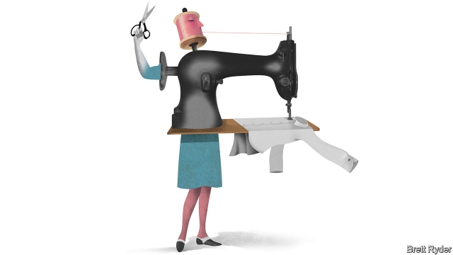

###### Schumpeter

# Robots will help Chinese firms cope with wages and the trade war 

##### Lessons from the rag trade 

 

> Jan 3rd 2019 

 

FEW ITEMS of clothing convey seriousness quite like the white-collar shirt. It took the exuberance out of the Elizabethan ruff and put the starch into Victorian Britain. It defined a sense of upward mobility, whether for bank clerks, Japanese salarymen or anyone keen to push around paper and professional underlings. 

But few white shirts are sold as earnestly as those at the PYE stores in China. You half expect the shop assistants to whip out a slide rule rather than a tape measure. The name PYE, the brand enthuses, “combines the Chinese character for flair with its homonym, the mathematical constant π.” Its white shirts are named, unfashionably, after mathematicians; Euclid and Newton for ones with a Western collar, Zu and Liu for Mao-like Mandarin ones. 

Esquel, owner of PYE and a big shirtmaker for Hugo Boss, Tommy Hilfiger and other global brands, is not just serious about its shirts. It is also concerned with the upward mobility of its 56,000-odd employees, half of whom work in factories in China. Unusually for the textile and apparel industry, it is keen to raise their pay and productivity via mechanisation. As a private firm, it can do so with long-term thinking that borders on Confucianism. But it also has a hard-headed determination to adapt in the face of a tighter domestic labour market and a trade war with America. Other Chinese manufacturers are doing the same, meaning that these twin threats could, counter-intuitively, make them stronger. 

The garment trade is not where you usually find stories of business success that are also inspiring, especially in cut-throat China. The supply chain is brutal. The work is repetitive; piece work makes it all the more soul-sapping. It is relatively hard to automate soft materials like textiles; making Esquel’s shirts involves up to 65 fiddly sub-processes, such as stitching sleeves and cuffs. As soon as labour costs rise, textile and garment factories tend to fly away, seeking cheaper fingers to work to the bone, be they in Bangladesh or Ethiopia. Esquel plans instead to keep lots of its work in China. 

Textiles is not the only Chinese manufacturing industry to face rising wages, high turnover of workers and an ageing population; electronics does too, for instance. In some cases, such difficulties are exacerbated by the trade war; Japanese firms have reportedly shifted production of devices for cars, such as radios, from China to Mexico where they can evade tariffs. 

Yet even if American tariffs rise further, many Chinese companies are betting heavily on automation to remain competitive. In 2017 China’s installations of industrial robots rose by 59% to 138,000, more than in America and Europe combined. While downplaying its controversial “Made in China 2025” industrial policy, to soothe the fears of the Trump administration, the Chinese government is happy to throw money at existing manufacturing industries in order to help them tool up. That will help keep the robot revolution running. 

Walk through Esquel’s biggest factory in Foshan in the Pearl River Delta and it is clear that even here the robots are coming. The hundreds of workers sitting, heads down, in pink caps are a sight to behold. They are also outnumbered by machines. On some lines, robotic arms swish, trimming collar bottoms and pressing plackets. The devices do fiddly jobs like making sure that tiny pearl-coloured buttons for Banana Republic have the word Banana on the top. Israeli cameras, adapted from military devices, use artificial intelligence to scan for flaws in the fabric, automating one of the most mind-numbing of jobs. 

Some workers have been displaced but productivity has improved, keeping the firm’s profits stable despite a tripling since 2006 of its average monthly wage in China, to 4,500 yuan ($650). At first workers reacted to the machines rather as English Luddites eyed automated looms. But now they help design them. Esquel managers joke that they do so out of laziness—they want to make their jobs easier. Take “Sister Yan”, a matron in black dress and sensible shoes, who started on the factory floor aged 21. She worried about the shoddy quality of many of the hand-stitched garments, and helped the firm’s engineers to design mechanisms to do the job better. Now she is a senior manager, and with “Brother Ming”, the chief engineer, shares credit for several industrial patents. Tian Ye, an Esquel executive, quips that the increasingly tech-savvy seamstresses are no longer strictly blue-collar workers but nor are they yet white-collar ones either. Instead, he says, they are “checked or striped”. 

Automation is also expected to help Esquel in the trade stand-off with America. Despite the frictions, Marjorie Yang, Esquel’s chairman, is in effect doubling down on China. She touts a 2bn yuan investment in a new factory in Guilin, a picturesque region, including a yarn-spinning division so high-tech that visitors are not allowed to walk the floors. So far Esquel’s products have been spared American tariffs. American clients are nervous, so if need be the firm could shift some production to its factories outside China, such as in Mauritius, while moving other lines back home. 

Two factors are likely to encourage manufacturers in China to remain loyal to their home market. The first is its sheer size. Willy Shih of the Harvard Business School says this enables them to practice and refine their production processes on a scale that allows them to keep cutting costs. The other is the skill of the robots themselves. He says there is so much “embedded knowledge” in today’s machine tools that China can quickly start creating products that may have taken a generation to develop previously, such as cars with top-of-the-range automatic transmissions. 

It is worth remembering this amid the fears about a trade-war-related slowdown in China’s factory activity. If Esquel is any guide, Chinese firms may use the opportunity to become even more efficient, rather than wilting in the face of adversity. In the long run, that would make China’s economy as a whole more resilient. 

