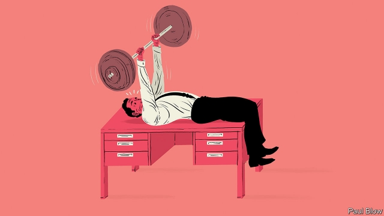

###### Bartleby

# The spy who hired me 

##### When employer health programmes go too far 

 

> Jan 5th 2019 

 

THE NEW YEAR is the moment when people vow to improve their fitness. They join gyms, swear off alcohol and adopt detox diets. These resolutions usually do not last beyond January. 

But some employers try to help their workers stick to their goals by offering “wellness” programmes. One of the longest-running examples began in 1979 at Johnson & Johnson (J&J), an American health-care company. The plan promotes weight loss, smoking cessation and efforts to reduce blood pressure. The firm claims it reduced medical costs by $400 an employee per year, and resulted in fewer workers suffering from heart disease or high blood pressure. 

Yet an examination of the data by Martin Cherniack of the University of Connecticut* found that in 2005-08, a sharp jump in alcohol use, depression and stress among J&J employees occurred. This coincided with a period when the firm had a target of lifting productivity by 9% a year. So the employees may have been leaner and fitter, but it is possible that workplace pressure to produce more meant greater stress. 

All this suggests that employee well-being is a rather more complex topic than can be tackled by a programme devoted to exercise and healthy living. A study by RAND Europe, a research institute, found that obvious bad habits such as smoking and high alcohol use were in fact not associated with lower productivity, while obese workers were no more likely to take time off than anyone else. The biggest productivity problems were associated with lack of sleep, financial concerns and mental-health issues—factors that may well be directly linked to work-related stress. 

It seems reasonable for companies to expect some level of economic return on any wellness programme that they provide. But the trade-off should not be too blatant. Making employees fitter so you can work them a lot harder seems rather like drilling your infantry on an assault course before sending them to face the machine guns. A better impact on morale (and thus productivity) might occur if workers felt that their managers had a genuine interest in their welfare. 

Any health programme that tries to alter workers’ behaviour at home also raises privacy issues. There is a long tradition of employers taking an overly paternalistic attitude towards their staff. Titus Salt, a Victorian philanthropist, built a model village for his workers but banned alcohol from the village, smoking on the pathways and “loud behaviour”. Henry Ford, the car maker, had a “sociology department” that would make unscheduled calls on workers to monitor their lifestyles; those who failed to make the grade were paid lower wages. 

The modern equivalent of those practices revolves around technology. Some companies persuade their workers to wear a Fitbit or other device to monitor things such as their level of exercise, heart rate and sleep patterns. BP America introduced Fitbits in 2013. Those who reach certain goals, such as walking 1m steps a year, qualify for extra health benefits. 

In a health system dependent on private insurance, there may be a case for giving workers such incentives, provided take-up is voluntary. There is a parallel with car insurance, where vehicle owners pay lower premiums if they are willing to have their driving monitored. 

But there is less excuse in a country like Britain, which has a public health service. Nevertheless, research published in 2017 showed there had been a 37% leap in the share of British workers who had been offered a wearable device by their employer. Many people, however, will regard these as a spy on their wrists, transmitting information back to the boss. A PwC survey in 2016 found that 38% of British employees did not trust their firms to use the data collected in a way that workers would benefit. 

At least you can take a Fitbit off (and some workers have reportedly strapped them to their dogs to boost their activity scores). A few firms, such as Mindshare, a media agency in Sweden, and Three Square Market, a tech firm in Wisconsin, have already moved on to the next stage: implanting a chip under a worker’s skin. Employees gain a way to open doors and pay for meals in the canteen, but what do they lose in return? There is nothing wrong with employers offering a bit of fitness coaching. But nobody wants their boss to turn into a stalker. 

* The Productivity Dilemma in Workplace Health Promotion, Scientific World Journal, 2015 

