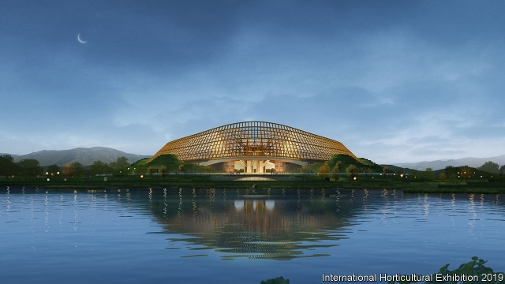
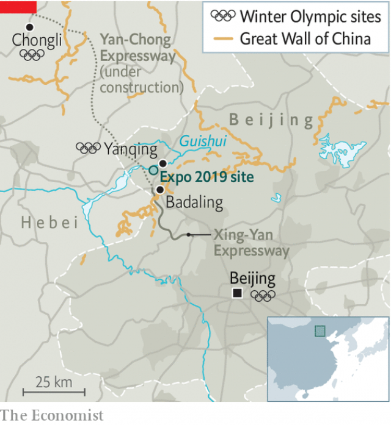
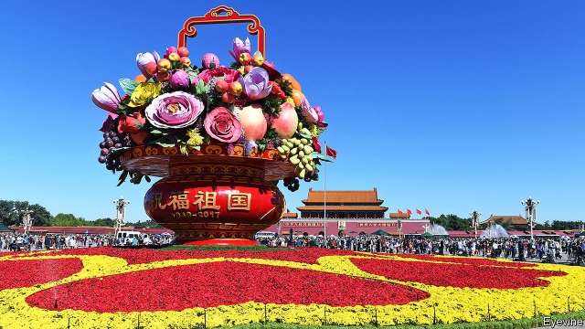

###### Growing might

# China plans the biggest garden show ever 

##### Celebrating one-party rule with a display of flower power 

 

> Jan 3rd 2019 

 

BEYOND THE Great Wall and the chain of rugged hills through which it snakes, workers are putting the finishing touches to a colossal edifice. The beams of its roof are curved, with golden tiles reminiscent of those that adorn the Forbidden City, 70km to the south-east. The building itself curves, too, in a shape that its architects say resembles a ruyi—a traditional Chinese talisman (pictured is an artist’s impression). They say it invokes a longing for fulfilment of the “Chinese dream”. That is a cherished slogan of China’s leader, Xi Jinping, whose wish is that China should emerge as a global giant. As a state news agency puts it, the building conveys the “imposing manner of a great power”. 

The China Pavilion, as the structure is called, is for an international flower festival in Yanqing, a satellite town of the capital. The show will open on April 29th and last for more than five months. It will be the biggest expo of any kind that China has staged under the aegis of the Paris-based Bureau International des Expositions since the Shanghai World Expo in 2010. It will be the biggest horticultural one ever held anywhere. And it will be the centrepiece of the largest political celebration in China in a decade: the 70th anniversary of the founding of the Communist state. The big day itself will be on October 1st, as the flower show enters its final week. 

The choreography of the coming year will convey Mr Xi’s dream to perfection. In April, on a date to be announced, foreign leaders will gather in Beijing to discuss the president’s Belt and Road Initiative—a scheme involving billions of dollars of Chinese loans to, and investment in, infrastructure projects around the world. A senior Chinese diplomat has said it will be “the most important diplomatic event” in China this year. The clout that countries wield with economic largesse is sometimes described as “hard power”. More power of an even harder kind is likely to be shown off on October 1st when, if tradition is upheld, the country’s armed might will be paraded through central Beijing: tanks, jets, nuclear missiles and thousands of troops shouting “hello chairman” to their commander-in-chief, Mr Xi. 

The flower expo will be the soft-power filling between these events and involve many times more people—16m visitors are expected, organisers say. Officials were keen to ensure that a record number of countries and international organisations would put on displays at the expo. They have succeeded: at least 110 have signed up. 

 

Many people in the capital are unaware of the scale of what will soon unfold. The site in Yanqing is on the outer periphery of Beijing municipality, far beyond its urban core (see map). The Great Wall at Badaling is Yanqing’s biggest attraction. For now, tourists have little reason to head beyond it to the district’s main town, near to which, on requisitioned farmland, the expo will be held. It will be the biggest international festival in Beijing since it staged the Olympic games in 2008. 

On the riverside spot thousands of workers have built a 960-hectare park, half as big again as the one made for the Olympics, which was previously the city’s record-setter. The expo will fill the new park, with its enclosed area covering more than half of it. 

It will be of huge political importance. This is reflected in the heavyweight line-up of its organising committee. It includes some of the country’s most powerful officials. Two of them are members of the ruling Politburo: Hu Chunhua, who is a deputy prime minister, and Cai Qi, who is the party chief of Beijing and a protégé of Mr Xi (Mr Cai calls the expo a “glorious political task” handed to the city by the central leadership). Also on the team are 18 deputy heads of ministries (including those in charge of China’s police and spies) and Jiang Zehui, a first cousin and adoptive sister of Jiang Zemin, a former president. 

Organisers have been told to let their work be guided by “Xi Jinping Thought”. They have clearly followed orders. The event will be suffused with symbolic references to Mr Xi’s favourite topics, from pursuing the “Chinese dream” to creating a “beautiful China”. The expo’s official theme, “Live green, live better”, echoes his calls for a better environment. That the festival is taking place in a city so acutely short of water appears not to worry officials. A diversion scheme that brings water from the distant Yangzi river basin began supplementing the city’s supply in 2014. This has freed up a reservoir near the expo site to ensure the plants stay moist. 

To ease the flow of visitors, the city has been on an infrastructure spending spree. There are already two motorways, the G6 and the G7, that lead to Yanqing (visitors to the Great Wall often use them). But they are frequently congested. On January 1st a new expressway, more than 40km long, was opened. It connects the northern suburbs of the capital with Yanqing. Planning documents for the new road, called the Xing-Yan, make it clear that the expo has been one of the main reasons for building it to this schedule. It has cost more than 13bn yuan (nearly $2bn) and involved boring a 5.9km tunnel beneath the Great Wall—about half the length of the one beneath Mont Blanc and the longest in Beijing’s road network. It has also been controversial: some environmentalists say the route threatens an ecologically sensitive area. 

Officials say the new road will also be of help for the Winter Olympics in 2022, part of which will be held in Yanqing and another part in the neighbouring province of Hebei. But extending the motorway into Hebei has created a problem: the route cuts along one edge of the new park. To avoid spoiling the view, planners decided to build a 2km tunnel beneath the park and under the Guishui river, which flows through it. (For all the green-themed rhetoric of the expo, fossil-fuelled cars will play a big role. Ten car parks with a total of 22,000 spaces have been built for those who prefer to drive there.) 

The view is crucial. Near the China Pavilion workers have built a hill, on the top of which they are erecting a huge four-storey pavilion in ancient architectural style. It has involved a team of nearly 300 craftsmen skilled in traditional techniques. It will provide visitors with a vantage point from which to survey the expo site and the hills 10km away on which the Great Wall can be dimly discerned. That is important: organisers like to call the event “the horticultural expo at the foot of the Great Wall”, aiming for a soft-power multiplier effect. The view from the pavilion provides proof of this link—on a good day. Smog sometimes renders even the hills invisible, let alone the wall. 

 

But above all, it is the flowers that the party hopes will make its soft-power point. It loves them as a political tool. To mark the anniversary of Communist rule, Tiananmen Square is adorned every year with huge floral arrangements. The centrepiece in 2018 was in the form of a basket-shaped object with petals radiating from its base—17 metres high and 50 metres across—an assemblage of potted plants with, as always, a message (see picture). State media said they symbolised the Chinese people’s unity with the party with “Comrade Xi Jinping as the core”. 

International horticultural shows are normally less to do with the national origins of plant species, and more about showing them off and sharing expertise in cultivating them. Beijing’s show will be different. One of its aims will be to highlight the global impact of Chinese flora. Visitors will be reminded that everything from tea and rice to many of the plants that are grown in Western gardens have Chinese origins. In April state television will begin showing a ten-part series called “Chinese plants that have changed the world”. 

Officials worry that some Chinese may not be in a mood for celebration as the economy slows and mutterings grow about Mr Xi’s leadership. During the expo there will be sensitive dates that dissidents will be eager to mark. The first will occur just a few days after the show opens: the 100th anniversary on May 4th of a student movement that led to calls for “Mr Science” and “Mr Democracy” to be welcomed in China. The party officially marks May 4th as youth day, but it fears appropriation of it by disaffected youngsters. The movement’s 70th anniversary in 1989 gave huge impetus to the pro-democracy unrest that engulfed the country that year. On June 4th it will be the 30th anniversary of the crushing of those protests. Police will be on full alert. Stirrings of activism on some university campuses have already spooked them. A handful of students at Peking University staged a rare on-campus protest on December 28th against official interference in their Marxist student society. 

Around the expo site itself, some people are grumbling. Building the venue and the new infrastructure has involved relocating hundreds, possibly thousands, of people. In Yanqing the authorities have used the expo and the games as a reason to knock down slums. A handful of residents who have refused to move vent anger at local officials for offering what they regard as derisory sums in compensation. “Bandits,” fumes one woman. “This is all just an excuse to get money in their pockets,” says a 75-year-old retiree. 

In downtown Beijing, residents have other reasons to seethe. Since November 2017, when 19 migrant workers were killed in a fire in the south of the city, the authorities have been using the pretext of fire safety to accelerate efforts to push migrants out of the city by closing places where they work and the ramshackle housing in which they live. As a result, many of Beijing’s markets have been shut down. Ironically, they include those selling cut flowers. 

Chairman Mao briefly encouraged dissent with the immortal words “Let a hundred flowers bloom, let a hundred schools of thought contend”—before imprisoning or persecuting hundreds of thousands of those who took him at his word. No one, however, is likely to misinterpret the party’s signals in a year that will be florescent with symbolism. As the party often reminds officials around the country, unrest should be nipped in the bud. 

