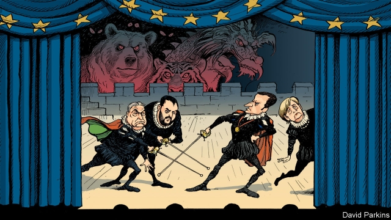

###### Charlemagne

# Political theatrics threaten to distract Europe in 2019 

##### But alarming megatrends abound 

 

> Jan 3rd 2019 

 

WHEN HISTORIANS look back on 2019 in Europe, what will they say? Many will doubtless discern a turning-point. Not only is Britain leaving the EU, but in May voters in the remaining 27 member states will elect a new European Parliament and end the majority that the two big-tent political groups—the Christian democrats and social democrats—have enjoyed in the European institutions for decades. Expect to hear lots about fragmentation and the twilight of the old establishment. Other electoral events will reinforce the narrative. An increasingly nativist Denmark goes to the polls in the spring; Poland faces a divisive general election by November; and in September the hard-right Alternative for Germany party looks likely to advance in four eastern German states. 

The year ahead is thus a stage on which a grand political drama will play out. There will be a clash of ideas. A defensive Europe of Christian nation states will set itself against a post-modern and increasingly integrated Europe open to immigration and globalisation. Big, theatrical personalities will swagger around that stage and slug it out. Viktor Orban, Hungary’s prime minister, and Matteo Salvini, Italy’s interior minister, will bait Emmanuel Macron, France’s president—who has said that the duo are right to “see me as their main opponent”—and Angela Merkel, Germany’s outgoing chancellor. Mr Macron and to a lesser extent Mrs Merkel will engage Mr Orban and Mr Salvini in swordfights over cultural totems such as the role of Islam in European society, as well as policy quandaries such as migration, the rule of law and the future of European integration. The media will lap it all up. 

None of it, however, will be as clear-cut as it looks. Mr Macron’s federalist vision for Europe has, for now at least, succumbed to German reservations born of domestic woes. Mrs Merkel and Mr Orban sit in the same group in the European Parliament and Manfred Weber, her party’s candidate for the European Commission presidency, has a record of indulgence towards the Hungarian autocrat. Mr Salvini’s bark is worse than his bite: he knows the limits of his mostly middle-class electorate’s appetite for European bomb-throwing. And for all the talk of a grand nationalist-populist front, its putative protagonists are at odds on fundamental questions such as the distribution of migrants between countries. In any case, much of the rhetoric from both sides is symbolic and for domestic consumption. Witness the ongoing spat between Mr Macron and Mr Salvini about the loan to France of paintings by Leonardo da Vinci (an Italian whose works should stay in Italy, says Mr Salvini). Witness, too, the recent pettifogging political battle in Germany over whether a migration minister was right to leave the word “Christmas” off her Christmas card. 

The plain truth is that European politics will muddle on in 2019. Populists will make gains at elections and continue to insinuate themselves into the mainstream. But established political families will continue to wield great power. Neither side will win a decisive victory. 

And while Europe’s political class obsesses about its own partly confected and wholly inconclusive battles, things will be happening that merit attention and will not get enough of it. The continent will reach all sorts of real turning-points in 2019. India will probably overtake both Britain and France to become the world’s fifth largest economy. The stand-off between America and China, combined with China’s growing and none-too-subtle influence in Europe, may force Europeans to consider awkward trade-offs between co-operation and confrontation with Beijing. President Donald Trump’s withdrawal of troops from the Middle East will challenge them to put up more of their own forces. 

They may yet face a similar quandary in the Sea of Azov, off Crimea, where Russia is trying to close Ukrainian ports and prompting Kiev to look westward for support—at the same time as Moscow builds up its troops and missiles in Kaliningrad, its enclave between Poland and Lithuania. Europe’s willingness to fill the gap vacated by a revisionist America could also be tested in the western Balkans, where a swelling mood of revolt in Serbia and contentious land-swaps between countries that spilled blood over land in recent memory could augur a return to instability and violence. 

At home, the picture is barely happier. The continent is not reforming its welfare states fast enough to keep pace with its ageing societies. In central Europe in particular hysteria about migrants overlooks a much graver threat to “Christian nation states”: slow death by emigration and low birth rates. Indeed, for all the hot air about migration, Europe is not having anything like a serious debate about its border policies and relations with its near abroad in an age of climate change, a rising Africa and unprecedented movements of people. 

To deal with all of this, it needs a strong economic foundation. But the end of the European Central Bank’s monetary stimulus, combined with signs that the European economy is slowing, raise big questions about the future of the euro that too few are taking seriously, especially in Germany (see briefing). Debate about the EU’s long-term budget, which must be agreed on in the next 18 months or so, remains dismally short of strategic thinking about what issues the EU should be prioritising in the 2020s. Meanwhile the continent is falling behind America and China in the race for new artificial intelligence technologies. 

If these subjects are too little discussed over the coming year, thoughtful Europeans might take solace from the fact that America—its news cycle driven by the presidential Twitter account—is hardly better. Yet America can better afford it. Europe’s periphery is more threatening. Its demography and industrial prowess are more fragile. Its exposure to megatrends is consequently greater. A continent that fusses about Christmas cards instead of grappling with what really matters risks paying a high price. 

