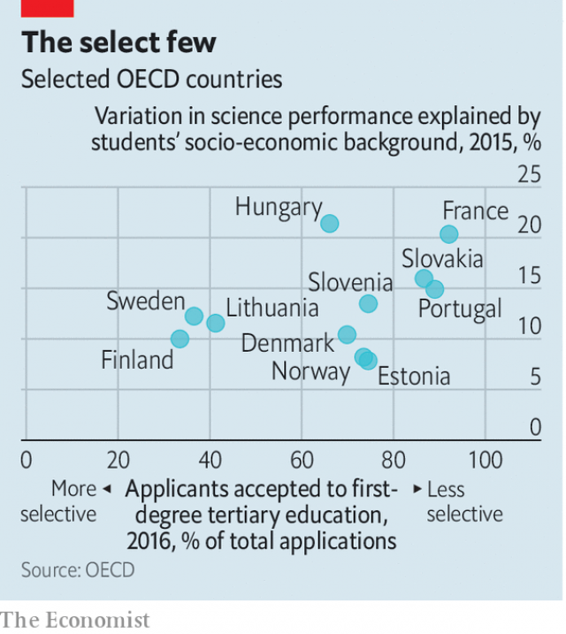

###### How straight is the gate?

# Selective universities appear not to increase inequality 

##### So the evidence from France and Finland suggests 

> Jan 5th 2019 

 

AMONG THE gilets jaunes on French streets last month were students protesting against the way the government is changing the university admissions system from one that admits pretty much everybody to one in which there is a modicum of selectivity. Objectors complain that the changes are inegalitarian. But figures from the OECD, a rich-country club, show that some of the most equal countries in Europe have the most selective systems, and vice versa. 

Finland’s tertiary education system is one of the most selective in Europe. Only a third of those who apply get in. Yet Finland also has one of the highest levels of intergenerational mobility in Europe, whether measured by educational outcomes or by the difference between parents’ and children’s social class. Finland’s tertiary education system enjoys an unusual degree of autonomy: most of its universities are independent of the state. 

France’s university system, by contrast, has been run as an arm of the state since Napoleon decreed that it should be so in 1808, and it is one of Europe’s least selective systems. University entrance is regarded as a right; students can sign up for courses in subjects they know nothing of. Last year’s reforms, which allow universities to require students to take remedial classes if deemed necessary, will make little difference to that. 

Yet despite France’s inclusive tertiary system, the country performs poorly in terms of intergenerational mobility, whether measured by educational outcomes or professional class. That may be partly because only 40% of students in France graduate within the expected period for their course, which is wasteful of resources and rough on morale. Drop-out rates tend to be higher among disadvantaged students. 

Finland’s approach to universities also pays off in terms of quality. It tops the Universitas 21 index, which ranks 50 countries by quality of university, controlled for GDP per head. France comes in at 19, below Greece and China. 

