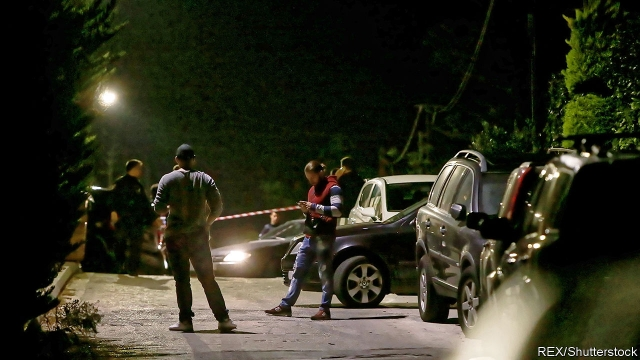

###### Piranhas from Tirana

# The “Albanian mafia” are not really a mafia 

##### They are every bit as violent but far less organised 

 

> Jan 3rd 2019 

 

JOHN MACRIS was leaving his house in the seaside Athenian suburb of Voula on October 31st last year when a man ran towards his car firing a handgun. Mr Macris, a Greek-Australian gangster, threw himself out of the car in a desperate attempt to flee his attacker, but the gunman pursued him and shot him dead. 

Some weeks earlier in New York, Sylvester Zottola, an alleged member of the Bonanno crime family, was in his car at a McDonalds drive-through when he too was shot and killed. And when Raúl Tamudo, a retired international football player, returned to his home in Barcelona on August 12th, he found someone had broken in and stolen his watch collection, worth more than €100,000 ($115,500). 

Police said they suspected the burglar was a member of “the Albanian mafia”. Greek and American counterparts also blamed Albanians for perpetrating and ordering respectively the killings of Mr Macris and Mr Zottola. 

The three crimes were among many that point to the growing prominence in the international underworld of ethnic Albanian gangsters. Asked to rank organised-crime groups by the danger they pose in Europe, a senior official at the EU’s law enforcement agency, Europol, put Albanian mobsters ahead even of their Russian counterparts. British police have said their activities are primarily responsible for a recent upsurge in human trafficking. Groups of Albanians and Kosovars in Britain are also claimed to have murdered and tortured their way to control of much of the cocaine trade there. 

But, says Jana Arsovska, who teaches at the City University of New York and has followed the doings of Albanian criminals for more than 15 years, the “Albanian mafia” is a myth. The showy wealth and extreme violence of criminals hailing from Albania and Kosovo does not mean they belong to a structured organisation with common rituals like Sicily’s Cosa Nostra or the yakuza syndicates in Japan. “We see many organisations that work independently of each other,” says Ms Arsovska. “They speak Albanian, but that does not mean they are connected to organisations back in Albania, and they are never exclusively ethnically Albanian.” 

Several reasons help to explain why organised crime was able to put down strong roots in Albania after the fall of communism: the disbanding in 1991 of the country’s security service, the Sigurimi, which left around 10,000 agents with skills well-suited to organised crime jobless; the collapse six years after that of various Albanian pyramid schemes that robbed many people of their savings and prompted the looting of more than 550,000 small arms from military armouries, and the emergence in Albania and Kosovo during the Balkan wars of strong links between criminals, politicians and guerrilla fighters (with some players filling all three roles). By the late 1990s northern Albania especially, where clan loyalties had always been important, had become a violent, lawless place, riven by murderous feuds. 

Yet, while individual mobsters have emigrated, there is little evidence that gangs formed in the Balkans have expanded internationally like Cosa Nostra or another Italian mafia, the ’Ndrangheta. Many ethnic Albanian offenders in Europe turned to crime after emigrating. Brutal, ruthless and showy, they are nonetheless much less sophisticated than true mafiosi. There are few signs of their forming alliances with local politicians to safeguard their activities or laundering their profits other than into Balkan real estate. And the very recklessness that makes them so frightening also makes them vulnerable to straightforward policing. 

Ms Arsovska cites the example from New York of the Rudaj organisation. By the 1990s it was so powerful that some called it the city’s “sixth crime family”. The others, of Italian origin, remain in business. The Rudaj crew are all in jail. 

