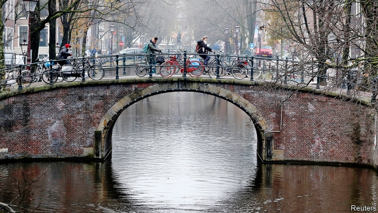

###### Climate change

# Will Europe’s Green parties be the new leaders of the political left? 

##### Or have they reached the limits to growth? 

 

> Jan 3rd 2019 

 

LONG KNOWN for its bicycles, Amsterdam is taking recycling to a whole new level. Last year it began extracting used toilet paper from sewage plants and mixing it into asphalt, which helps reduce the noise from cars. The city is cutting down on cars, too: its “auto-avoidant city” strategy will make many streets one-way and raise parking tariffs to €7.50 ($8.25) per hour. Its coal-fired power plant is shutting down, and the city plans to eliminate gas heating in homes by 2040, replacing it with electric heat pumps and centralised neighbourhood hot-water systems. A green-roof subsidy programme encourages owners to cover buildings with turf and moss. 

This is what it looks like when a Green party takes power. For decades Amsterdam was a bulwark of the Dutch Labour Party. But the city’s demography long ago shifted away from factory workers and towards multicultural yuppies, and last March the GreenLeft party came first in the municipal election. Femke Halsema, the mayor and a former leader of GreenLeft, has refused to enforce a national ban on burkas in her city’s public buildings. The city has even removed the giant “i amsterdam” letters on which tourists used to pose: a GreenLeft council member had complained that the slogan was too individualistic. 

Amsterdam is a harbinger of a wider European trend. Since last April, GreenLeft has been the most popular party on the Dutch left. Germany’s Greens reached the same milestone in October, overtaking the once-mighty Social Democrats (SPD). Belgium’s two Green parties (one French-speaking, one Flemish) are polling at high levels. In Luxembourg a coalition including the Greens took power in November and promptly abolished fares on public transport. 

Many Greens see this as a historic chance to take over the leadership of the European left, supplanting the social-democratic parties that held that role for a century. “I think they’re gone. They’re parties of the past,” says Jesse Klaver, GreenLeft’s leader. The centre-left, he argues, betrayed its ideals by embracing austerity during the financial crisis. The future will be dominated by issues like climate change, migration and inequality, where the Greens represent a clearer alternative to the right. 

The German and Dutch Greens owe part of their success to the vicissitudes of politics. In both countries centre-left parties entered grand coalitions with centre-right ones during the financial crisis, making themselves targets for anti-establishment voters. And both countries’ Greens have charismatic young leaders: Mr Klaver in the Netherlands, the duo of Annalena Baerbock and Robert Habeck in Germany. 

But political scientists say there is also a logic to the Greens’ rise, one that mirrors that of right-wing populist groups. “Right now there is a high polarisation around globalisation versus nationality, which favours both the Greens and the radical right,” says Emilie van Haute of the Université Libre in Brussels. Where left and right were once divided along economic lines, she sees a new cleavage over “post-materialist values” such as cultural identity and the environment. That explains results like Bavaria’s regional election in October, where both the Alternative for Germany and the Greens made big gains. 

The next big test will come at the European Parliament elections in May. The Green-European Free Alliance (Greens-EFA) group is among the smaller groups in the parliament, with just 50 out of 751 seats. But the election looks likely to shrink the overall share of the three largest ones: the centre-right EPP, the centre-left S&D and the liberal ALDE. Greens-EFA might just end up as kingmakers, with far more influence than in the past. 

Still, beyond Germany, the Netherlands and Belgium, there is little sign of a Green wave. Green parties in the Nordic countries still lag far behind the established social-democratic ones. In central and eastern Europe, the educated urban voters who might support Greens in the west tend to back other parties. In Poland and Hungary, where populist nationalists are in power, urban liberals generally support the mainstream centrist opposition. In Romania and Bulgaria they can back anti-corruption outfits like the Save Romania Union or the Yes, Bulgaria! party. The Green-EFA strategy is to recruit such anti-corruption parties, says Bas Eickhout, a Dutch GreenLeft MEP and one of the group’s two lead candidates in the election. (Like Germany’s own Greens, the European-level group has two co-leaders, one of each sex.) 

In southern Europe economic hardship has made the Greens’ post-materialist values a handicap. In 1989, 11.5% of Italians listed environmental protection as an important issue, nearly as many as in Britain. But by 2008, after two decades of stagnation, that had fallen to 2.4%, well below most of northern Europe. What environmental concern there is in Italy, such as opposition to infrastructure projects, has mostly been captured by the populist Five Star Movement. 

Meanwhile, France’s main Green party, Europe Ecologie-Les Verts (EELV), has been hobbled by feuds and by a first-past-the-post electoral system. The EELV had its greatest success at the European election of 2009, winning 16% of the vote. But it was hurt by its collaboration with the unpopular government of François Hollande, and has struggled to find charismatic leaders to replace earlier ones such as Daniel Cohn-Bendit. Over the past two years President Emmanuel Macron’s new party, La République en Marche, has sucked up the energy of the urban, educated voters to whom the Greens might hope to appeal. 

It is also in France that the latest challenge to the Greens has emerged: the gilets jaunes (yellow jackets) movement. The protests began in opposition to a fuel tax introduced by Mr Macron’s government to meet the goals of the Paris climate agreement. Their explosive spread highlighted the problem that people do not like paying for expensive green policies, as opposed to small-bore ones, out of their own pockets. 

Mr Eickhout thinks Mr Macron’s mistake was to introduce a carbon tax without using the revenues to aid those on the whom it falls hardest. To tackle such problems, Green parties have broadened their platforms far beyond environmental issues. In Germany Mr Habeck has proposed a social-security guarantee, similar to a basic income, to convince working-class voters that the party is not only for tree-huggers. In the Netherlands Mr Klaver has made tax avoidance by multinational corporations one of his signature issues. 

But there is tough competition on many of these issues. Working-class voters may be more attracted to economic hard-left groups such as Unsubmissive France, or to populist-right parties. Tax-justice and rule-of-law enthusiasts may gravitate to liberal parties like the Netherlands’ D66. 

Indeed, no Green party has consistently stayed above 20% support in polls. That makes their ambition to lead Europe’s left seem like a long shot. But Mark Blyth, a professor of European politics at Brown University, argues that with social-democratic parties collapsing, European leftists have little choice. “The left is weak or dead, unless they jump on the youth and enthusiasm that the Greens attract,” he says. 

