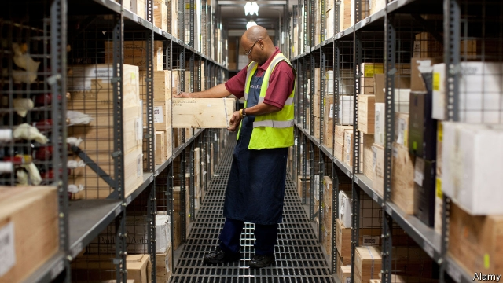

###### Smoking barrels

# Amateur buyers of fine Burgundy fear a speculative bubble 

##### Investors are looking beyond Bordeaux 

 

> Jan 3rd 2019 

 

EVERY YEAR Berry Bros & Rudd, Britain’s oldest wine merchant, issues a pocket-sized price list. Reading old copies makes amateurs of quality quaff want to time-travel. In 1909 a case of 12 bottles of Domaine de la Romanée-Conti 1891, Burgundy’s most famous Grand Cru, cost 180 shillings (about £1,000, or $1,300, in today’s money). In its historic London store, which opened in 1698, a single 18-year-old bottle of similar quality now sells for £25,000. 

Fine wine is expensive to store, and its rarity and high transaction costs make it—oddly enough—an illiquid asset. Even so, its appreciation with age and perceived ability to diversify portfolios have made it popular with investors over the past two decades. The value of wine exchanged yearly between consumers, connoisseurs and collectors—the secondary market—has quadrupled to $4bn since 2000, says Justin Gibbs of Liv-ex, a wine-trading platform. He reckons that just 15% of those buying wine on his website are doing so to drink it. The rest see it as a store of value. 

Fine wines are traded privately, at auctions or through exchanges like Liv-ex, where members bid for listed crus. The equivalent of an initial public offering comes when estates release their latest vintages. The wine world also has asset managers, which buy and sell hundreds of cases on behalf of clients in the hope of turning a profit. Britain is a big trading hub, notably because it offers the ability to store wine free of customs and VAT provided it is kept in one of the few taxman-approved warehouses. Many professional buyers thus hold their stock under the same huge vaults. Updating records is sometimes all it takes to transfer ownership. 

Investing in wine has long meant buying Bordeaux. But that is changing: the French region now accounts for 60% of secondary transactions, down from 95% in 2011. The new picks have star appeal. Bordeaux prices have done well in the past three years, rising by a third. But the value of fine Burgundy has more than doubled, according to the Liv-ex 1000 index. 

One reason is that greater price transparency has boosted buyers’ confidence. Fine wines, which do not generate cash flows, cannot be valued using financial metrics such as price-to-earnings ratios. But exchanges and websites like Wine Searcher, which gathers merchant quotes from around the world, provide reference points. Apps that collect reviews from critics and consumers also help; so do gadgets to improve traceability (though fakes remain a problem). Some of this cash finds its way to new terroirs. 

Investors are becoming more sophisticated, too. Chinese buyers, whose thirst for Bordeaux kept prices afloat through the financial crisis, fled the region after 2012, when a crackdown on corruption meant demand for luxury goods dried up. Many have since turned to Burgundy. Most wine-investment funds, which in the 2000s managed €350m ($396m), almost all of it invested in Bordeaux, went bust when the market tanked. Such outfits have since re-formed, trying harder to diversify. 

Recent currency shifts have made top crus a relative bargain. Burgundy was already cheaper than Bordeaux, and a dollar rally after 2015 has put the region on American and Asian buyers’ radars (the Hong Kong dollar is pegged to the greenback). Italian, Californian and other French regions have also become fashionable, says Philip Staveley of Amphora, a wine-portfolio manager. But the best Burgundy is produced in tiny volumes. Chateau Margaux, a Bordeaux star, puts out 11,000 cases a year; Domaine de la Romanée-Conti makes 450. That amplifies price movements. 

Experts fear a bubble. “Everyone tells us it’s getting absurd,” says Philippe Masset, a wine scholar. Younger vintages have become pricier than older ones—the wine equivalent of a yield-curve inversion. The Burgundy region gained 8% in November, while all others plateaued. Whether that lasts may depend on the value-for-money of the vintage released this month. But for now, investors see the glass half-full. 

