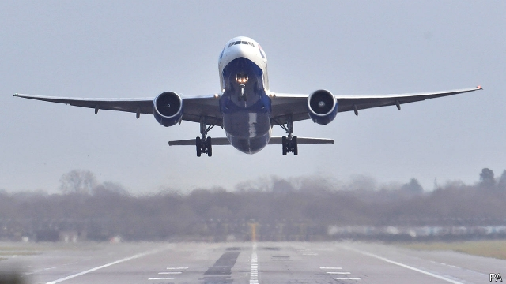

###### Barbarians at the departure gate

# Investors’ appetite for transport infrastructure remains undiminished 

##### Vinci’s purchase of Gatwick airport is the latest in a series of deals 

 

> Jan 3rd 2019 

 

STARTING ON December 19th, as Gatwick airport prepared to disclose a change of ownership, suspected drone sightings forced it to close its runway for a total of 36 hours. Passengers were delayed; so was the announcement. Only a week later could Britain’s second-busiest hub reveal it had been sold to Vinci, a French transport group, in a deal valuing it at £8.3bn ($10.5bn). The previous owners, including Global Infrastructure Partners (GIP), an American fund manager, will keep 49.99%. 

The acquisition cements Vinci’s position as the world’s largest private airport-operator, with Gatwick the biggest of the 46 it runs. It is also a reminder of how fast the industry has been privatised: over 50% of European airports have some private participation, up from 22% in 2010. Nearly half of winning bidders since 2008 have been financial investors, according to Mergermarket, a research group. Returns have been juicy. GIP bought Gatwick for £1.5bn in 2009; it and its co-investors have made twice that by selling half of the airport, and earned £1.5bn in dividends in the interim. 

Infrastructure, such as bridges, telecom masts and utilities, typically enjoys monopoly positions and produces predictable long-term cash flows. Since the financial crisis, many sovereign-bond yields have been close to zero, tempting insurers and pension funds to switch to infrastructure assets. Airports have added appeal. On top of airline fees, most make profits from car-parking and retail. And passenger numbers typically rise 5-10% each year, says Vincent Levita of InfraVia, a fund manager. 

So prices are, naturally, stiff. Since 2014 most large deals have valued hubs at over 15 times EBITDA (a measure of company profits). GIP sold London City Airport to Canadian pension funds for 28 times EBITDA in 2016. At 20 times EBITDA, Gatwick’s pricing is a tad more conservative. That may reflect uncertainty linked to Brexit. But it also hints at caution as central banks tighten. 

At its simplest, an airport’s valuation is the sum of its future cash flows discounted by the cost of money. When interest rates increase, that cost rises and the valuation falls. But the effect is limited, since airports’ regulated cash flows are generally indexed to inflation, and their commercial income is correlated with GDP growth. Both inflation and growth tend to be higher when monetary policy is being tightened. 

Another problem of higher rates is that airports tend to have a lot of debt. But airport owners have learnt from the pre-crisis years, when hubs often traded at more than 25 times EBITDA. They now raise longer-term debt and mix maturities, says Bruno Candès of InfraVia. 

If government bond yields rise, infrastructure will seem less appealing by comparison. But a lot of capital has already been earmarked for the sector, ensuring that investors will continue to fight over the limited number of airports for sale. According to Infrastructure Investor, an industry publication, infrastructure funds could attract $100bn in 2019, up from a record $80bn in 2018. A blip in traffic growth could cause over-optimistic buyers to post disappointing returns, says Mathias Burghardt of Ardian, a fund manager. But prices are unlikely to suffer a hard landing. 

