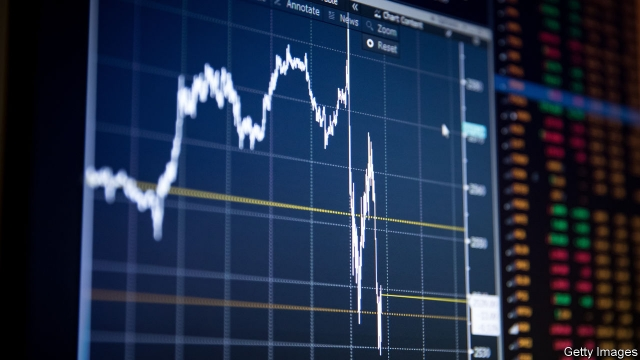
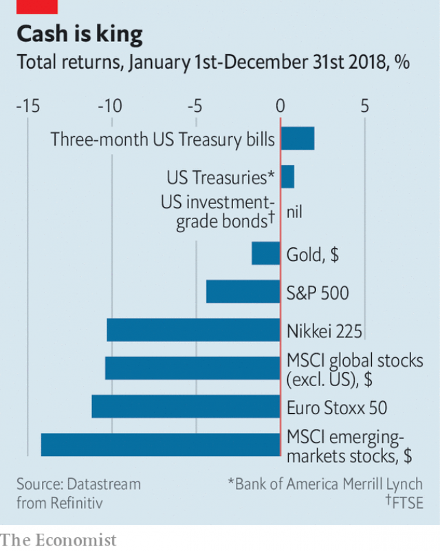

###### Buttonwood

# Returns on stocks in 2018 were down across the board 

##### For long-term investors that is good news 

 

> Jan 5th 2019 

 

ONE DAY in 1985 P. J. O’Rourke, an American humourist, invited a few friends to his home to take ecstasy. He wrote about the experience for Rolling Stone. For a veteran of the Age of Aquarius, the side-effects of recreational drugs—the frequent toilet trips; the grimy feeling on the skin; the fitful sleep later on—were familiar. It was all rather underwhelming. “Drugs are a one-man birthday party,” he explained. “You don’t get any presents you didn’t bring.” 

Those who make a living navigating financial markets might understandably be reaching for the happy pills, or at least a couple of painkillers. For them, 2018 was a rotten year. Stockmarket losses were spread widely across the globe (see chart). The total return—capital gains or losses plus dividends—from the S&P 500 index of leading American shares was negative for the first time in a decade. Other markets were worse, notably China’s, where the Shanghai index fell by a quarter. Safe assets eclipsed risky assets. Treasury bonds outperformed stocks. There were worse places to be than in gold, and few better than in cash. 

 

The source of much of the red ink is concern about the world economy. China’s economy is weaker; there are growing fears of a recession in America this year. Yet the truly far-sighted investor can see through such ups and downs. Indeed for people with a long-term saving goal, such as retirement or children’s college fees, there is an upside to falling stock prices. Over the business cycle, stockmarket returns are also like Mr O’Rourke’s one-person birthday party. Bad returns today imply better returns in the future and vice versa. For those looking to build their stockholdings through recessions and recoveries, falling asset prices are good news. 

That is not everyone. If your job is to manage other people’s money, you have probably just had a terrible 12 months. It is not just that fund-management fees are typically a fixed proportion of asset values and so lower prices mean lower earnings (though there is that). There is also the sense of futility. Such professionals give a lot of thought to asset allocation—how much should go into stocks or bonds; how much in America or elsewhere. For all that effort, vanishingly few allocations did better than your grandmother’s bank account. Others will have suffered, too. The declines in stocks imply a smaller pension pot for those about to retire. Wherever investment income is needed to meet current expenses, belts must be tightened. 

Yet those who are still building up their wealth will benefit from lower asset prices. Take housing, for instance. A fall in house prices hurts those who are “long” property, those who own more housing than they will personally need over their lifetime. Call such people “landlords”. But it also helps those people—call them “tenants”—who hope either to buy a property or to trade up to a bigger one in future. Falling house prices make it easier for them to reach their goal. 

A similar logic applies to stockmarkets. Just as a home is a stream of future housing services, a stock is a stream of future dividends. Lower stock prices may be bad for stockmarket “landlords”, but they are good for stockmarket “tenants”. Warren Buffett has written that those who plan to be net buyers of stocks in the future should rejoice when stocks fall. An investor of this kind who cheers rising stock prices is like “a commuter who rejoices after the price of gas increases, simply because his tank contains a day’s supply”. 

Fears of recession are not the only reason for falling stock prices. Part of the recent decline is down to prospects, such as Brexit or growing protectionism, that will do permanent damage to the global economy, and thus to company profits and stockmarket returns. Yet even in this regard there is something to be said for a correction in asset prices. When excessive optimism is built into asset prices, wasteful investment often follows. Think of the homes built in out-of-the-way places in America, Spain and Ireland to satisfy speculative demand during the global housing boom of the noughties. 

Investors, like those who use ecstasy or alcohol, face a choice. They can feel good now or later. Genuinely long-term investors will always choose later. They want to buy stocks as cheaply as possible and when they get a higher premium for owning risky assets. Recessions are an inevitable part of the risks investors face. As with hangovers, they feel interminable. But eventually they clear. 

