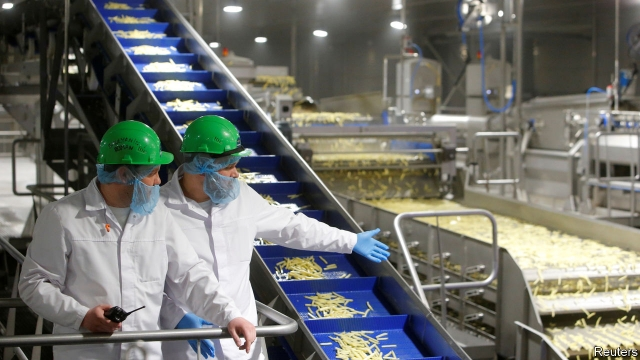

###### Going it alone

# The Trump administration is weakening the global trading system 

##### Multilateralism seems to be giving way to preferential trade deals 

 

> Jan 3rd 2019 

 

“SEEING POSSIBILITIES in potatoes” is the upbeat slogan of Lamb Weston Potato Products, Inc., an American exporter. But new trade deals mean that its foreign competitors have fewer obstacles blocking their view. One is the Comprehensive and Progressive Agreement for Trans-Pacific Partnership (CPTPP), which came into effect on December 30th. Negotiated as the TPP between 12 countries and agreed between 11, after President Donald Trump pulled America out, the deal will phase out tariffs on frozen potato chips and mashed potato, benefiting Lamb Weston’s Canadian rivals. And another trade deal, between the European Union and Japan, to be implemented on February 1st, will do the same for its European ones. 

The coming year is shaping up to be one of preferential trade deals, where two or a group of countries agree on their own trading rules. As well as CPTPP and the EU-Japan deal, America is aiming to strike several: with Japan, the EU and China. Will they act as stepping stones towards broad trade liberalisation—or, on the contrary, distort trade and divide the world into competing trade regions? And what will be the impact on the multilateral system overseen by the World Trade Organisation (WTO)? 

Economists have long argued about the impact of preferential trade deals. For purists, it would be best if all trade took place under the WTO’s “most-favoured nation” (MFN) principle, which means that a tariff cut offered to one member must be offered to all, thus putting all exporters on an equal footing. Others—self-described pragmatists—fear that reliance on the MFN principle would cause gridlock. If some countries are happy with the status quo, others might be reluctant to cut tariffs for fear of granting rivals a free ride. China, for example, could refuse to reform while benefiting from lower American and European duties. 

Better, the pragmatists think, to strike smaller deals between like-minded members. That could spur laggards onwards: Brent Baglien, Lamb Weston’s vice-president of government affairs, urged the United States Trade Representative (USTR), America’s top trade official, to seek a deal with Japan that would eliminate its 8.5% tariff on American imported potatoes. “Once the US loses an export customer, it is extremely hard, if not impossible, to get it back,” he warned. 

In the post-war period American governments tended to side with the purists. But according to Anne Krueger of Johns Hopkins University, writing in the Journal of Economic Perspectives, by 1982 gridlock in multilateral talks meant it switched to a twin-track approach, simultaneously pushing for multilateral deals and negotiating preferential ones. Chief among these was the North American Free Trade Agreement, which came into force in 1994 and is due to be replaced by the United States-Mexico-Canada agreement (USMCA). 

The approach spread. Nearly 300 preferential trade deals are now recorded by the WTO. Many go beyond tariff-cutting to include rules on state-owned enterprises, intellectual property and trade in services. Having grown into an integrated trading area, the EU became an enthusiastic proponent, striking many reciprocal deals, including with Canada, Mexico and Singapore. In June it started talks with Australia. 

As such deals proliferated, economists studied their impact. One fear had been that they might divert custom from more efficient producers in third countries. But a paper by Aaditya Mattoo, Alen Mulabdic and Michele Ruta of the World Bank, published in 2017, found that shallow deals do little to reduce trade with third countries, and deep ones tend to increase it. This, they think, is because rules on competition policy, subsidies and standards are hard to apply in a discriminatory way. 

But there is also reason to fear that preferential deals weaken the impetus towards comprehensive liberalisation. Nuno Limão of the University of Maryland, and others, have found that America and the EU offered less tariff liberalisation in multilateral talks in product areas where they had already granted preferential tariffs in bilateral deals. 

Though previous American administrations were sometimes frustrated with the WTO, they viewed it as the foundation of the trading system. Preferential deals were an instrument of diplomacy. TPP was intended to create a template for a trading system that might eventually include China, and perhaps give reform-minded Chinese policymakers something to aim for. 

Mr Trump’s trade agenda could hardly be more different. His “America First” rhetoric, threats of tariffs on allies and of withdrawal from the WTO, and policies of blocking appointments to the WTO’s court and using tariffs as a national-security tool, are inimical to an even-handed system that all can support. Even if these policies turn out to be temporary, the uncertainty they cause may be permanent. 

Some of the USMCA’s provisions go beyond even those of the TPP, for example its rules on the movement of data across borders. And the USTR’s objectives for talks with Japan, published on December 21st, are similar to those in the USMCA. But the fear is that, having all but abandoned the aim of broad trade liberalisation, America may prioritise quick, shallow deals rather than deeper ones that would strengthen global trade governance. 

The complex “rules of origin” that feature in preferential deals are also worrying. These specify the minimum share of a product that must originate in the parties to a deal if it is to qualify for reduced duties. They thus allow trade negotiators to shape supply chains and manage production. And one study found that compliance costs amounted to 3-5% of the final product price, offsetting the deal’s benefits. The Trump administration has sought to use such rules to reshape car production in North America, tightening them by several notches in the USMCA. As well as restricting trade, rather than liberalising it, they will make it tricky to agree more permissive rules of origin for cars in future trade deals. 

It will soon become clear how ambitious America wants to be. A deal with China that limited industrial subsidies, long a bugbear of other countries, could yet be baked into the multilateral system. One with Japan could set some useful standards and precedents. Mr Trump may decide to blow up the multilateral system and impose tariffs on America’s allies. Even if he does not, success on his terms could cause long-lasting damage. 

