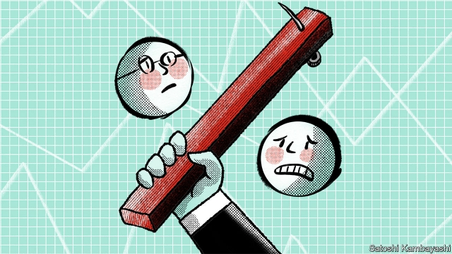
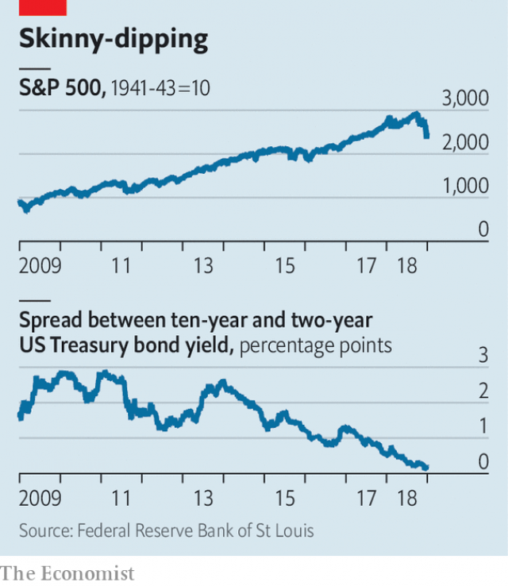

###### Whoosh

# What the market turmoil means for 2019 

##### Fears that the Fed will tighten too much are among the reasons the stockmarket has fallen 

 

> Jan 5th 2019 

 

AFTER A ROTTEN October and limp November, the S&P 500 tumbled in value by 15% between November 30th and December 24th. Despite an astonishing bounce of 5% the day after Christmas, the index finished the year 6% below where it started (see chart). The first trading day of 2019 extended the market wobble, with stocks closing down in Asia and gyrating in Europe. After markets closed in America, Apple warned that a sharp slowdown in China’s economy, and weak sales in other emerging markets, meant revenues in the fourth quarter would undershoot expectations by up to 10%. Coming a day after news that China’s manufacturing sector contracted in December, that spooked investors globally. S&P 500 futures dipped before Wall Street re-opened on January 3rd. 

 

That investors have become more risk-averse can also be seen in the bond markets. The high-yield spread, or excess interest rate over government debt, paid by companies with a poor credit rating has been rising. Meanwhile the yield on the ten-year Treasury bond has dropped from 2.98% to 2.63% over the past month, as investors have rushed to the safety of government paper. What is more the yield curve—the difference between yields for short- and long-dated government debt—is almost flat. The market’s response to signs of slowing growth is itself a cause of jangling nerves. Economists at J.P. Morgan have developed a model based only on the historical predictive power of the stockmarket, credit spreads and the yield curve; that implies the probability of a recession in America in 2019 is as high as 91%. 

There are other reasons for investors to be skittish. The effect of President Donald Trump’s stimulus package, which came into force a year ago, is likely to fade soon. There are further signs of economic slowdowns in China and Europe. Tariffs, and the threat of further trade disputes, have probably deterred investment. Profit forecasts have been scaled back. According to Factset, a research firm, at the end of September analysts expected earnings to grow by 10.4% on average for companies in the S&P 500 in 2019. Now they reckon the figure will be 7.9%. 

Missteps by the American administration have added to the sense of unease. The government shutdown may presage further political battles to come. A startlingly incompetent attempt on December 23rd by Steven Mnuchin, the treasury secretary, to calm market jitters by saying that banks have “ample liquidity” made things worse (bank liquidity had been nowhere among investors’ worries until he mentioned it). And reports that Mr Trump was considering firing Jerome Powell, the chairman of the Federal Reserve, raised questions about the administration’s competence to manage any downturn. 

Perhaps the main concerns, though, are provoked by the Fed itself. On December 19th its Open Markets Committee (FOMC) delivered its fourth interest-rate increase of 2018, even though financial conditions have tightened to become less supportive of growth. Mr Powell also said he did not see an imminent change to the Fed’s policy of running down its balance-sheet “on automatic pilot”. 

That added to fears that monetary policy will tighten beyond what the economy can bear. Of the forecasters surveyed by the Wolters Kluwer Blue Chip Financial Forecasts, 46% reckon the Fed’s landing point for interest rates will be above their estimate of the long-run neutral Fed funds rate (a level at which the bank is trying neither to boost nor to slow activity). Only 10% thought it would be below. The median expectation of members of the FOMC for the number of interest-rate hikes in 2019 has fallen from three to two. The futures market suggests investors expect none at all. 

The reason monetary policymakers seem so blasé compared with investors is that, setting aside the financial indicators flashing amber, America’s economy appears to be doing well. The labour market went from strength to strength in 2018, and most indicators of consumer confidence remain at ten-year highs. A different model built by J.P. Morgan analysts, this time based on short-term economic indicators such as car sales, building permits and the unemployment rate, put the probability of recession in 2019 much lower, at 26%. 

There are several ways this disconnect between market jitters and robust economic indicators could disappear. The direct effect of stock-owners feeling poorer could cut spending. The plunging stockmarket could hit consumer and business confidence, crimping spending and investment. Predictions of recession based on markets and financial indicators could influence economic behaviour and thus become self-fulfilling. 

Judging by the past couple of decades, if stockmarket turmoil persists the Fed will respond by lowering its forecasts for growth. That would feed into a looser policy stance. After announcing the rate rise on December 19th, Mr Powell reminded listeners that “some volatility” is unlikely to leave a mark on the economy, but also that the Fed had already lowered its forecast for growth and inflation “a little bit”. 

Fortunately for the Fed, inflation remains subdued, having come in at or below expectations in recent months. That gives the Fed’s policymakers room to be lenient, meaning they can avoid the premature tightening they have often been criticised for. Investors may sense something the Fed does not. Playing it safe will give it time to correct course if needed. 

There is a chance that the stockmarket will rouse itself from its slump in coming weeks. But even if it does, the Fed has re-emphasised its “data-dependent” approach to interest rates. That is central-banker speak for “less predictable”. The coming year is likely to be bumpier than investors have become accustomed to. 

