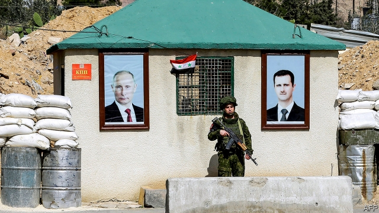

###### Over to you, Vlad

# The fate of Syria is now in Russia’s hands 

##### But Vladimir Putin is struggling to sort out its future 

 

> Jan 3rd 2019 

 

IN THE PAST four years American troops have helped crush Islamic State (IS) in Syria. But President Donald Trump has had enough and he is bringing them home. All 2,000 are expected to be out in the next few months. The abrupt withdrawal has startled America’s allies in the region, notably Syria’s Kurds, and risks allowing the jihadists to regroup. It also cedes the eastern part of Syria, rich in oil, gas and arable land, to the government and its Iranian and Russian allies. 

As America pulls back from Syria, Russia grows more entrenched. It intervened decisively in 2015, saving Bashar al-Assad. With its help, the heinous dictator has won Syria’s civil war after nearly eight blood-soaked years. The authoritarian rulers of the Gulf, who loathe Mr Assad, are conceding his victory by restoring diplomatic ties. 

Having proved that it will stick with even its most monstrous allies, Russia is now seen by many as the region’s indispensable power. It alone is still talking to all of those with a stake in Syria, including Iran, Israel and Turkey. But if Russia wants to consolidate its success, and even supplant America, it must show that it can win a lasting peace after the terrible war. 

So far, it is failing that responsibility. Rather than stitching Syria back together, Russia has let Mr Assad continue to tear it apart. It has helped him bomb his opponents into submission and given cover for his use of poison gas. Syria’s ruler has long seemed intent on altering the country’s sectarian mix by striking Sunni towns, where the rebellion against him once gathered strength, while encouraging Shias, Christians and Alawites (his own sect) to take over property abandoned by those who fled the onslaught. Now he is making it hard for the 6m Syrians who escaped abroad to come home. Hundreds if not thousands of Syrians returning from Lebanon, mostly Sunnis, have been blocked. 

Russia says Mr Assad’s heavy hand is needed to keep Syria stable. That is mistaken. Although savagery helped Mr Assad survive, it prevents Syria’s revival. It has pushed bitter Sunnis into the arms of extremists. Inequality, corruption and divisive rule originally fuelled the rebellion and nurtured the jihadist insurgency. For as long as they remain government policy, Syria will never be properly secure. 

For this to change Syria must begin to rebuild its institutions and infrastructure. What reconstruction has taken place has mostly benefited Mr Assad’s cronies. Power and wealth must be shared more broadly. Decentralisation and federalism would help persuade Sunnis (who form the country’s majority) and other groups that they have a voice. Mr Assad shows no sign of adopting such notions; he feels vindicated, and wants to continue the war until he recovers all his territories. Russia can and should twist his arm; after all, his survival depends on Russian air power. 

Russia should also do more to ensure that new conflicts do not erupt in Syria. In the north the Kurds, abandoned by America, have turned to Mr Assad for protection from Turkey, which calls them terrorists. Turkish troops already control a swathe of northern Syria. Russia might act as a buffer between the parties, especially in the combustible city of Manbij. It could also do more in the south to restrain Iran, which is trying to deepen its footprint in Syria—and risking a new war, with Israel. Russia knows well that several big powers fighting so close to each other carries risks for all parties. Last September a Russian spy plane was shot down by Syrian air-defence batteries. Their intended target was Israeli bombers. 

President Vladimir Putin, who casts himself as the master of Syria’s fate, will struggle to sort out its future so long as he allows Mr Assad to rule wildly. Peace talks have flopped, in large part because of Mr Assad’s intransigence. Russia cannot simply walk away without losing its newly won regional clout. Sometimes it has seemed as if Mr Putin avoided a costly quagmire in Syria. In fact, the danger still looms. 

