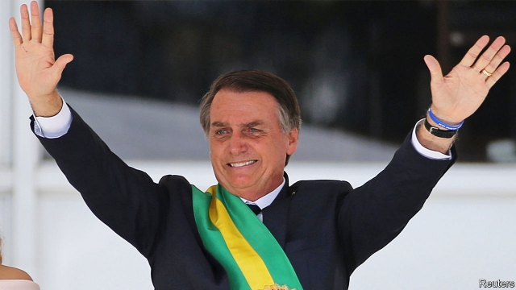

###### The good, the bad and the scary

# The radical agenda of Brazil’s new president 

##### He has a chance to transform his country but he may do it grave harm 

 

> Jan 3rd 2019 

 

“HOPE, FINALLY, defeated fear,” declared Luiz Inácio Lula da Silva upon becoming Brazil’s president 16 years ago. Many Brazilians greeted the election of Lula, a left-wing former trade-union leader who vowed to uplift the poor, with optimism bordering on ecstasy. The government led by his Workers’ Party at first brought prosperity, but its 13 years in power ended in a nightmare of economic depression and corruption. Dilma Rousseff, Lula’s chosen successor, was impeached in 2016. Lula himself is serving a 12-year jail sentence for graft. 

The fear and rage this caused has ushered into power Jair Bolsonaro, who took office on January 1st. He will be a different sort of president: fiercely socially conservative, a fan of Brazil’s military dictatorship of 1964-85, confrontational where most predecessors were conciliatory. And yet Brazilians greet him with something of the hope that welcomed Lula. Three-quarters say they like what they have seen since his election. 

On many counts these hopes look misplaced. Mr Bolsonaro had an undistinguished record during seven terms in congress. He often belittles women, has praised the old military regime’s torturers and goads the police to kill more criminal suspects. His new ministers for foreign affairs, education, the environment and human rights all look likely to do more harm than good. Yet in some areas, he espouses sensible ideas. In particular, if he means what he says about the economy and can put his policies into practice, he could end up lifting Brazil’s fortunes. Brazilians are entitled to hope. A cyclical upturn, which has already begun, will help him (see article). 

A former army captain, Mr Bolsonaro is not instinctively an economic liberal. However, he has entrusted economic policy to a genuine believer in free markets. Paulo Guedes, a former banker with a doctorate from the University of Chicago, wants to lighten many of the burdens that have weighed down the economy. Since 1980 GDP growth has averaged just 2.6%, far below that of many other emerging-market economies. Mr Guedes wants to deregulate, simplify the enterprise-crushing tax code, privatise state-owned firms and slash the enormous budget deficit, which was an estimated 7% of GDP last year. 

He recognises that the most important reform is to slash pension costs which, at 12% of GDP, are roughly the same size in Brazil as they are in richer, older countries and on course to become staggeringly larger. The changes will be painful. They include raising the effective retirement age (Mr Bolsonaro began collecting a military pension when he was 33) and changing the rule for adjusting the minimum wage, to which pensions are linked. Without this, the government has little hope of containing its growing public debt or complying with a constitutional amendment that freezes spending in real terms. An ambitious reform, by contrast, could keep inflation and interest rates low, hastening Brazil’s recovery and accelerating long-term growth. 

Mr Bolsonaro’s other opportunity is to lock in gains Brazil has made in fighting corruption. The scandals that so enraged voters were brought to light mainly by police, prosecutors and judges, especially those in charge of the Lava Jato (Car Wash) investigations of the past four years. Mr Bolsonaro appointed the most prominent corruption-fighting judge, Sérgio Moro, to lead an expanded justice ministry, which will fight crime of all sorts. Mr Moro was the first judge to find Lula guilty. In joining the Bolsonaro team, he opened himself to the charge that he had a political agenda all along. His answer is that the fight against crime and corruption needs better laws alongside the energised judiciary. The new justice minister must now prove that he means it. 

If Mr Bolsonaro succeeds in reforming the economy and cleaning up Brazil, he could unleash his country’s long-squandered potential. Nothing would give The Economist more pleasure. But to do so he must end his career as a provocateur and become a statesman. He must give up having only a selective respect for the law. And he must stop being lukewarm on pension reform, his government’s most important policy, and give it his full-throated support. Mr Bolsonaro has yet to show that he can tell voters bad news—such as that their pensions are unaffordable—or that he can work with congress. Unless he learns quickly, Brazilians will be disappointed again. 

