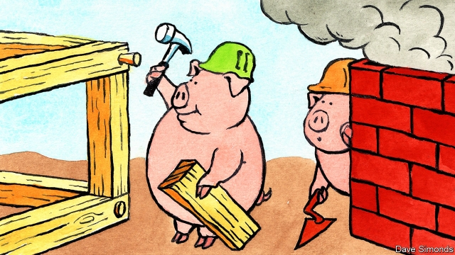

###### The house made of wood

# Why more buildings should be made of wood 

##### It is better for the planet, and safer than you think 

 

> Jan 3rd 2019 

 

THE SECOND little pig was unlucky. He built his house from sticks. It was blown away by a huffing, puffing wolf, which promptly gobbled him up. His brother, by contrast, built a wolf-proof house from bricks. The fairy tale could have been written by a flack for the construction industry, which strongly favours brick, concrete and steel. However, in the real world it would help reduce pollution and slow global warming if more builders copied the wood-loving second pig. 

In 2015 world leaders meeting in Paris agreed to move towards zero net greenhouse-gas emissions in the second half of this century. That is a tall order, and the building industry makes it even taller. Cement-making alone produces 6% of the world’s carbon emissions. Steel, half of which goes into buildings, accounts for another 8%. If you factor in all of the energy that goes into lighting, heating and cooling homes and offices, the world’s buildings start to look like a giant environmental problem. 

Governments in the rich world are now trying to promote greener behaviour by obliging developers to build new projects to “zero carbon” standards (see article). From January 1st 2019 all new public-sector buildings in the European Union must be built to “nearly zero-energy” standards. All other types of buildings will follow in January 2021. Governments in eight further countries are being lobbied to introduce a similar policy. 

These standards are less green than they seem. Wind turbines and solar panels on top of buildings look good but are much less productive than wind and solar farms. And the standards only count the emissions from running a building, not those belched out when it was made. Those are thought to account for between 30% and 60% of the total over a structure’s lifetime. 

Buildings can become greener. They can use more recycled steel and can be prefabricated in off-site factories, greatly reducing lorry journeys. But no other building material has environmental credentials as exciting and overlooked as wood. 

The energy required to produce a laminated wooden beam is one-sixth of that required for a steel one of comparable strength. As trees take carbon out of the atmosphere when growing, wooden buildings contribute to negative emissions by storing the stuff. When a mature tree is cut down, a new one can be planted to replace it, capturing more carbon. After buildings are demolished, old beams and panels are easy to recycle into new structures. And for retrofitting older buildings to be more energy efficient, wood is a good insulator. A softwood window frame provides nearly 400 times as much insulation as a plain steel one of the same thickness and over a thousand times as much as an aluminium equivalent. 

A race is on to build the world’s tallest fully wooden skyscraper. But such edifices are still uncommon. Industry fragmentation, vicious competition for contracts and low profit margins mean that most building firms have little money to invest in greener construction methods beyond what regulation dictates. 

Governments can help nudge the industry to use more wood, particularly in the public sector—the construction industry’s biggest client. That would help wood-building specialists achieve greater scale and lower costs. Zero-carbon building regulations should be altered to take account of the emissions that are embodied in materials. This would favour wood as well as innovative ways of producing other materials. 

Construction codes could be tweaked to make building with wood easier. Here the direction of travel is wrong. Britain, for instance, is banning the use of timber on the outside of tall buildings after 72 people died in a tower fire in London in 2017. That is a nonsense. Grenfell Tower was covered in aluminium and plastic, not wood. Modern cross-laminated timber panels perform better in fire tests than steel ones do. 

Carpentry alone will not bring the environmental cost of the world’s buildings into line. But using wood can do much more than is appreciated. The second little pig was not wrong, just before his time. 

