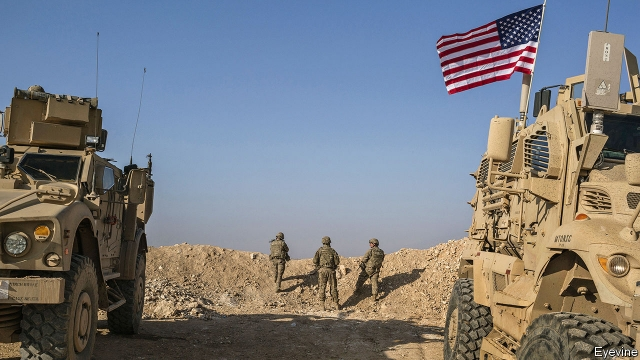
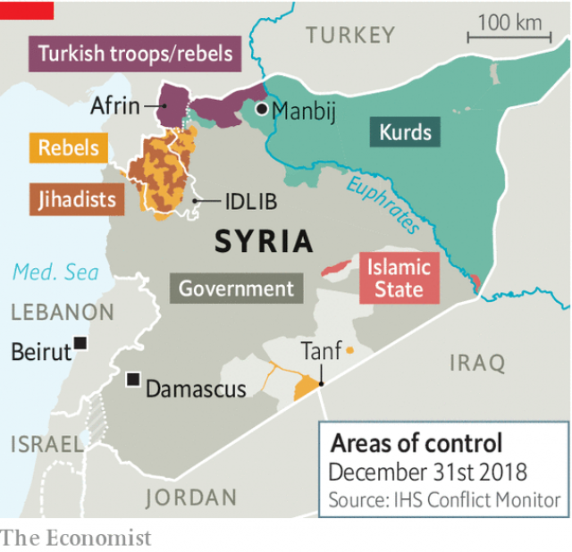

###### Dumped by Trump

# After America leaves Syria, what next? 

##### The new geopolitics of the Middle East 

 

> Jan 3rd 2019 

 

IT DID NOT take long for America’s decision to withdraw from Syria to be felt across the Middle East. The Syrian regime, along with its Russian and Iranian allies, rejoiced. Arab states hurried to make up with Syria’s leader, Bashar al-Assad. The Arab League will soon debate his return to the fold. America’s Kurdish allies, crying betrayal, urged him to help fend off a looming Turkish invasion. Israel scrambled to contain the damage. 

With a single tweet on December 19th—“We have defeated ISIS in Syria, my only reason for being there”—President Donald Trump has sent the region’s geopolitics spinning like an old mechanical airport display. It announces big changes: an American exit, a triumph for Iran and Russia, the return of Syria and the repositioning of everybody else. 

Mr Trump’s decision to pull out America’s 2,000-odd troops from eastern Syria astonished friend and foe alike, none more than his own envoys to the region. Granted, in April last year he declared that American forces would soon leave. But in September his administration announced that, in fact, they would remain indefinitely to ensure the lasting defeat of Islamic State (IS), the departure of Iranian and other foreign forces and the creation of an internationally acceptable government. On the eve of Mr Trump’s about-turn, James Jeffrey, his special envoy for Syria, scoffed at the idea that Mr Assad might simply wait for America to give up: “I think if that’s his strategy, he’s going to have to wait a very long time.” Brett McGurk, the American envoy for the war against IS, resigned within days. 

As one Arab minister notes wearily: “The decision was a total surprise. But not the fact that America changed policy. This is the fifth or sixth shift in America’s position in Syria.” Might Mr Trump change his mind again? On December 30th Lindsey Graham, a Republican senator, seemed to convince Mr Trump to slow down the withdrawal, to take place over four months rather than one. Israel and Jordan were lobbying for American forces to remain in some areas, particularly Tanf in the south. 

Mr Trump casts himself as the antithesis of Barack Obama. He ripped up his predecessor’s nuclear deal with Iran and reimposed sanctions on its clerical regime, embraced Saudi Arabia and recognised Jerusalem as Israel’s capital. Whereas Mr Obama hesitated to take military action against Mr Assad for using chemical weapons in 2013, Mr Trump fired volleys of cruise missiles at Syrian bases. 

 

Yet Mr Trump may be more like Mr Obama than he would admit, especially in his desire to reduce America’s involvement in the Middle East, where presidents have suffered many failures and few successes. Regarding Syria, Mr Trump says explicitly what Mr Obama’s reluctance to engage implied: America has no vital interests there. “There is much continuity between Trump and Obama: the US does not have the answers to the complicated problems of the Middle East, and is not willing to fight a major war to try to solve them,” says Philip Gordon of the Council on Foreign Relations, a think-tank, who had been in charge of Middle East policy in Mr Obama’s White House. He argues, though, that the American operation in Syria is relatively small and cheap, and that Mr Trump’s impetuous manner has caused much damage. 

To many in Washington, Mr Trump is thus throwing away America’s cards for no benefit. It controls the oil wells that produce 95% of Syria’s oil and much of its gas; the waters of the Euphrates; prime agricultural land; and five large military bases. 

The immediate losers are Syria’s Kurds, whose dream of creating an autonomous region in Syria looks imperilled. Their fighters, the People’s Protection Units (YPG), have proven to be the most capable allies in America’s fight against IS, pushing the jihadists back from the Turkish border to the Iraqi frontier. America’s presence, in turn, helped shield the YPG from attack by Turkey, which regards them as one and the same as its own Kurdish separatist insurgents, the Kurdistan Workers’ Party (PKK). 

Turkish forces last year overran the Kurdish enclave of Afrin west of the Euphrates; the Turks have threatened to do the same imminently east of the river, where the Americans are mostly deployed. Mr Trump’s withdrawal announcement came after he spoke to Turkey’s president, Recep Tayyip Erdogan. Whether Mr Trump feared a clash between American and Turkish troops, or accepted Mr Erdogan’s promise to reduce the remaining IS enclaves, is unclear. A possible sale of American-made Patriot missiles may have helped their understanding. But Mr Erdogan’s priority will be to push away Kurdish fighters on Turkey’s border, not to fight IS, which still has thousands of fighters farther to the south. That may give the jihadists an opportunity to re-emerge, as they did after Mr Obama’s withdrawal from Iraq in 2011. 

The biggest winner is undoubtedly Mr Assad. In a war that has killed some 500,000 people and displaced about 13m, Mr Assad seemed on the brink of defeat in 2015. But through brutal tactics—and with the help of Russia in the air, and Iran and Shia militias on the ground—he has regained most of his country’s heartland. He seems determined to keep fighting until he has recovered all his territory. 

The YPG has lost no time in calling on Syrian forces to enter the district of Manbij to deter Turkey. Mr Erdogan will, in any case, have to calibrate any action against the Kurds. Russia and Iran may resist any attempt by Turkey to help its hotch-potch of Sunni Arab allies (jihadists linked to al-Qaeda are also mixed in with them) extend their fief and control the border. “Turkey will have to be careful about the other side’s red lines,” says Oytun Orhan, of ORSAM, a think-tank in Ankara. Failure to do so could precipitate a Syrian offensive in Idlib, the last bastion of the anti-Assad opposition. 

Sunni Arab states are shifting from supporting the Sunni rebels to reconciliation with Mr Assad. On December 16th Sudan’s president, Omar al-Bashir, became the first Arab head of state to visit Damascus since the Arab spring in 2011. On December 27th the United Arab Emirates re-opened its embassy in Damascus. A meeting of Arab leaders in Beirut later this month is expected to discuss inviting Mr Assad to a summit in Tunisia in March. Although Saudi Arabia remains wary, Syrian officials see hope in the replacement of the hawkish Saudi foreign minister, Adel al-Jubeir, by the milder Ibrahim al-Assaf. 

As with their re-engagement in Iraq, Gulf Arabs hope that diplomatic ties will over time give Syria reason to reduce its dependence on Iran—even though Mr Assad will forever remain indebted to it for his survival. If nothing else, Arabs are dismayed that the fate of Arab Syria is being determined mainly by non-Arab powers—Russia, Iran and Turkey. 

Iran, for its part, is urging Iraqi forces to help fill the vacuum left by America in Syria. Iraq’s prime minister, Adel Abdul Mahdi, has offered unspecified support; Iraqi planes have already been striking at IS pockets in Syria. If America leaves Syria entirely, Iran will more easily be able to establish a land bridge to Lebanon, supplementing the air bridge now in operation, to supply its powerful ally, Hizbullah. 

Having thus saved Mr Assad and enabled his rehabilitation, Russia is supplanting America as the region’s power-broker. Russia may have acted as the air force of the “Shia axis”, yet it has strong ties with all the main actors, including Israel and Gulf states. Its readiness to stand by even its most repulsive allies makes it seem, to Sunni Arab leaders, more reliable than America. Saudi Arabia has worked closely with Russia to co-ordinate oil output. No one could miss the exuberant high-five in November between Mr Putin and Muhammad bin Salman, the Saudi crown prince who is accused of ordering the murder of a journalist, Jamal Khashoggi. 

Israel, too, has long courted Russia. Its prime minister, Binyamin Netanyahu, has repeatedly met Mr Putin in the hope of prising him away from Iran, or at least ensuring that Israel can act against Iran and its allies. Mr Trump promised that “we are going to take great care of Israel.” He then alarmed it saying the Iranians could “frankly do whatever they want” in Syria. 

