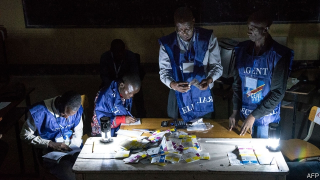

###### Who will win the count?

# Congo has a shambolic, unfair election, two years late 

##### The vote was marred by widespread bias and intimidation 

 

> Jan 3rd 2019 

 

STANDING ON A chair in a shabby classroom, a technician peels the plastic off the end of a cable with his teeth and attaches it to some exposed wires that dangle around a light bulb. “Soon the machine will work again,” he says cheerfully to a queue of voters, most of whom have waited for more than five hours. 

Across Kinshasa, the Democratic Republic of Congo’s capital, hundreds of voting machines did not work on polling day, December 30th. The electronic tablets, nicknamed machines à voler (stealing machines), did little to redeem their dodgy reputation. A lot of voters, unfamiliar with touchscreen technology, struggled to use them. Officials from the electoral commission, widely believed to be in President Joseph Kabila’s pocket, offered unsolicited help. Observers feared they were nudging people to vote for the president’s chosen successor, Emmanuel Ramazani Shadary. 

The following day, as tallies (some fake and some real) circulated, Congolese authorities switched off the internet to “maintain public order”. It may not be reconnected much before January 6th, when provisional results are due. 

Opinion polls in such a vast and disorderly place as Congo must be treated sceptically. Nonetheless, the ones before the election showed that the main opposition candidates were far more popular than Mr Shadary. Martin Fayulu, a successful former oil executive, promised better governance and less corruption. Félix Tshisekedi, the son of a dead democracy activist, vowed rather improbably to raise average incomes nearly tenfold. 

Mr Shadary, by contrast, is seen as offering more of the same. In a country where nearly everyone is poor, rebels rape and rob with impunity and officials are mostly predatory, that is hardly appealing. 

Still, Mr Shadary has advantages that the other candidates lack. In one polling station in Kinshasa, where the opposition is strong, your correspondent saw a limping old lady failing to fend off the “assistance” of an election official. In another, the head of the station forgot the password for the machines and had not managed to turn any of them on by 2pm, complained Vital Kamerhe, a member of the opposition. Some polling stations in the district of Limete (Mr Tshisekedi’s home and heartland) opened four hours late. 

Voting was barred in two eastern regions where the president is widely detested. The reasons given were semi-plausible: insecurity caused by marauding rebels and an outbreak of the deadly Ebola virus. But still, opposition supporters smelled a rat. In one excluded city, Beni, residents queued outside makeshift polling stations and staged a mock vote in protest. 

Power in Congo has never changed hands peacefully via the ballot box. Its former leaders were either shot or forced to flee. Mr Kabila, who has been in power since 2001, has tried hard to derail the democratic process. An election he won in 2011 was widely seen as a sham. After his supposedly final term expired in 2016, he refused to step down, citing the difficulty of organising an election in such a chaotic country. His police shot and killed people taking part in pro-democracy rallies. He clung to office unconstitutionally for another two years. And when mounting international pressure forced him to call an election, he blocked his two biggest rivals (Moïse Katumbi and Jean-Pierre Bemba, a tycoon and a warlord) from standing. 

Intimidation was rife. The police shot at Mr Fayulu’s supporters when he hosted rallies. After three people were killed, his campaign march in the capital was banned. In some eastern provinces the army put a boot on the scale. “Soldiers were in the polling stations to make the people vote for Shadary,” one observer from a youth group said, adding: “They were telling people that if they did not choose him, they would be stopped and beaten.” 

Now observers worry how voters will react when the results are announced. Many fear that Mr Shadary will fraudulently be declared the winner. If he loses, those in charge may find some pretext to invalidate the election. In either case, protesters will no doubt take to the streets. Risk consultants are busy warning clients to leave the country. Residents of Kinshasa are stocking up on food, ready to hunker down if needed. Congo is waiting. 

