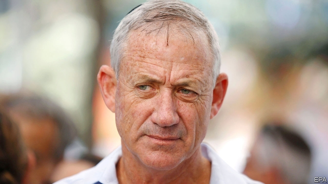

###### Too many challengers

# Israel’s opposition could defeat Binyamin Netanyahu—if they united 

##### But nobody wants to be number two 

 

> Jan 3rd 2019 

 

ACCORDING TO POLLS, most Israelis do not want Binyamin Netanyahu, their prime minister, to serve another term. Many are fed up with the corruption allegations that have been swirling around him for months. He may soon be indicted on charges of bribery and breach of trust. Yet Mr Netanyahu’s Likud party is still on track to win the next election, which he has called for April 9th (seven months earlier than originally scheduled), in part to head off the charges. 

Mr Netanyahu can boast of peace and prosperity on his watch, but if he remains prime minister it will be in large part because the opposition is hopelessly divided. Since the election was announced on December 24th, five new opposition parties have been formed. They join an already crowded field. The new party leaders include disaffected ministers, two former army commanders and a rabble-rousing activist. All speak of replacing Mr Netanyahu. Not one of them has a real shot. 

Under Mr Netanyahu, Likud has never received more than a quarter of the national vote. Yet it has dominated Israeli politics with the help of smaller nationalist and religious parties. Moderates, meanwhile, spread their votes more evenly and widely. In this election they can choose between no fewer than six vaguely centrist parties, none of which gets more than 13% in the polls. Were they running as one they would probably gather 40% of the vote, overtaking Likud. But none of the party leaders is prepared to serve as number two. 

That is the case even though the leaders seem to have few discernible differences over policy—or much of an agenda at all. They offer no new solutions to Israel’s intractable conflict with the Palestinians. The most popular new party, Israel Resilience, is led by Benny Gantz (pictured), a decorated former general. He has so far refused interview requests, saying his party’s aim is “to strengthen the state of Israel as a Jewish and democratic state in the spirit of the Zionist vision”. Other party leaders offer similar bromides on the need for unity and re-ordering national priorities. 

The Labour Party has long dominated Israeli politics, espousing a socialist ideology. In recent years, though, it has tacked towards the centre and formed an alliance with Hatnuah, another centrist party, re-branding themselves the “Zionist Union”. On January 1st the allies split. Labour, which has had a series of lacklustre leaders, has lost most of its support. It has not led a government since 2001 and now attracts under 10% of the vote, according to polls. 

The other centrist parties are younger and built around ambitious leaders, such as Moshe Kahlon, the finance minister, who heads the Kulanu party, and Orly Levi-Abekasis, a three-term Knesset member, who leads the Gesher party. They hope to create their own power base. Many of Mr Netanyahu’s opponents seem to be waiting, not for the election, but for the legal system to bring him down. In the coming months the attorney-general is expected to hold pre-trial hearings over whether to charge the prime minister. 

Mr Netanyahu says he will not step down if indicted. An election victory would give him some political cover to stay on. But his opponents believe this is the beginning of the end of his time in office, which in July would surpass the record set by David Ben-Gurion, Israel’s first prime minister. Some on the right spy an opportunity. On December 29th Naftali Bennett and Ayelet Shaked, the education and justice ministers, announced the formation of a new party, called the New Right, which will field religious and secular candidates. Mr Bennett, at least, thinks that Mr Netanyahu’s job is up for grabs. 

