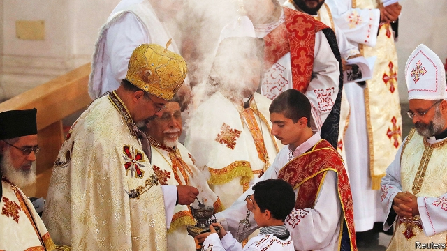

###### Blue Christmas

# On January 7th, Egypt’s Copts celebrate a sad Christmas 

##### The largest Christian community in the Arab world faces bombs, bullets and neglect 

 

> Jan 3rd 2019 

 

SOMETIMES, THE simplest of gestures carries weight. In 2015 Abdel-Fattah al-Sisi became the first president of Egypt to attend a Christmas mass. He has done so each year since, and will probably do so again on January 7th, the date on which Egypt’s Coptic Christians celebrate the birth of Jesus. The long-persecuted Copts are glad that the Muslim president of their mostly Muslim homeland offers them this token of respect. But Mr Sisi has done little else to improve their plight. 

The Copts are the largest Christian community in the Arab world, numbering about 10m. Successive governments have ignored laws promising them equality. Copts are frozen out of senior government jobs, particularly in the security services. Textbooks gloss over the history of the church, one of the oldest branches of Christianity. After Mr Sisi’s coup against Muhammad Morsi, Egypt’s first elected president, in 2013, Copts suffered vicious attacks by Mr Morsi’s Islamist supporters. 

Even the Copts’ right to worship is circumscribed. For most of its modern history Egypt restricted church-building under decrees written by the Ottomans and the short-lived monarchy of 1922-53. Security services had to approve new houses of worship. Permission was rarely granted. In 2011, the last year for which data are available, there was one church for every 2,780 Christians. Per person, Muslims had about four times as many mosques, which are not subject to onerous restrictions. 

In 2016, to great fanfare, Mr Sisi’s government passed a law to replace these antiquated regulations. It established a formal process for requesting construction permits and a committee to review them. If governors wish to refuse a new church, they must provide a written explanation within four months. But the law has done little to ease the burden, in part because the intelligence services still have an outsized role in the process. Since the law was passed just eight permits have been issued for new churches, a slower pace than before 2016. 

The 2,500 Copts in Kom el-Raheb, 200km south of Cairo, must drive 40 minutes to the nearest church. Since 2001 they have sought permission to open one in their village. In December they celebrated mass in a building owned by the archdiocese, which they hope will soon receive a licence. Muslim villagers attacked them, pelting their homes with stones. Police rarely bother to investigate such cases. Instead they round up both Christian and Muslim villagers until local leaders agree to a “reconciliation session”. After one such meeting in Kom el-Raheb, Copts agreed to suspend further prayers. 

The state views churches as a security issue—because terrorists attack them and the police fail to stop the attacks. Seven Copts were shot dead near a Minya monastery in November, on the same road where 28 Copts were killed the previous year. The jihadists of Islamic State claimed responsibility for both attacks. In December a policeman shot two men outside a church in Minya. The victims were not militants. They were local Copts, a father and son who had a dispute with the cop over a parking space. Even where Mr Sisi’s government has deployed more church guards, their presence may not be a comfort. 

