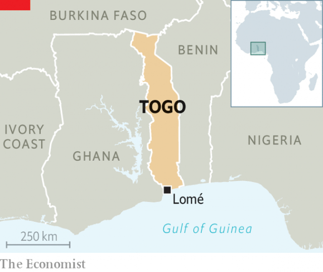

###### Knocking Gnassingbé

# Togo’s president suffers an electoral setback 

##### Despite an opposition boycott, his party still lost seats 

 

> Jan 3rd 2019 

 

IT IS NO mean feat for a ruling party to lose seats in an election boycotted by 14 opposition parties. Yet such is the depth of unhappiness with Faure Gnassingbé, the president of Togo, that his party’s majority shrank in parliamentary elections on December 20th, even though almost no one was standing against it. 

The opposition coalition shunned the vote, accusing the government of rigging the voters’ register. It also complained that the police and army shot at protesters. On a video circulated on social media in December, a uniformed man in a pickup truck drove up to demonstrators and pointed a rifle at them. The gunman’s face was not visible, and no shots were seen fired on the video. But activists claimed that two people (one a 12-year-old) were shot dead by soldiers that day. 

 

Provisional results showed the ruling Union pour la République losing three of its 62 seats. The loss may be crucial. Mr Gnassingbé (pictured), who has run the country since 2005 following the death of his father (who had been in charge for 38 years) wants to be allowed to run again in 2020. Under pressure to stand down, he proposed a constitutional amendment that would limit presidents to only two terms, but insisted that the count should only start at the next election. That could allow him to remain in power until 2030. 

A referendum on his constitutional amendment was meant to be held on December 16th. But it was called off after a wave of opposition protests by activists demanding that the two-term limit be applied retroactively, which would bar Mr Gnassingbé from running again. 

Without a referendum Mr Gnassingbé may try to push his constitutional amendments through parliament. But to do so he would need to muster the support of allied parties to get a four-fifths majority (or 73 of 91 votes). If the changes are rammed through parliament, or if another referendum is called, the result would probably be more protests. Politically speaking, no one expects to hear Faure’s requiem soon. 

