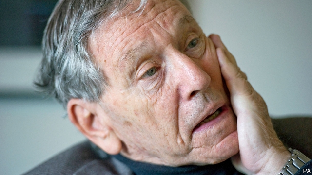

###### A torn Israeli

# Obituary: Amos Oz died on December 28th 

##### A celebrated Israeli writer of novels and essays, died on December 28th, aged 79 

 

> Jan 3rd 2019 

 

WHEN HIS father had to choose a primary school, Amos Oz had two alternatives within walking distance of the family home in 1940s Jerusalem— a religious institution and one belonging to a socialist-Zionist workers’ union. A staunchly secular librarian and right-wing nationalist, Mr Oz’s father chose to send the boy to the religious school, reckoning the important thing was that young Amos did not become a Bolshevik. Socialism was spreading like wildfire, he thought, but religion was on the wane and would soon disappear from the land. 

That proved short-sighted, both on a national and a personal level. In the new state of Israel, the socialists would dominate for the first three decades but then gradually lose their dominance. Whereas religion endured. As for young Amos, shaken by his mother’s depression-driven suicide, he would rebel against his father, leaving Jerusalem at 14 to become a member of a kibbutz, a socialist-Zionist collective agricultural community. Haunted, he would try to use his life there to recreate himself, even changing his name from the Ashkenazi Klausner, to “Oz”, a short, stark Hebrew word meaning strength and courage. Years later he said it was the only thing he lacked. 

At the kibbutz he had the status of a yeled chutz—an outside child, striving to belong, but also constantly observing from without. He tried to conform with the austere mores, working in the fields and, at 18, serving in a tough combat unit while writing at night. Fortunately for him, the kibbutz movement also saw the need for ideologues. He was appointed a teacher and allowed to study philosophy and literature, back in Jerusalem at the Hebrew University. His early work, like him, was split by the challenges of the Utopian experiment of the kibbutz he tried so hard to be a part of and the ancient phobia of Jerusalem that he never escaped. 

His first collection of short stories, “Where the Jackals Howl” (1965), and his first novel, “Elsewhere, Perhaps” (1966), dealt with kibbutz life. But instead of describing his fellow young kibbutzniks as having found peace and satisfaction tilling the land, he wrote of their “sadness of distance”, how “their hearts go out to other places that are not specific, but are far.” His own heart returned to his birthplace. The novel that made his name, “My Michael” (1968), was about the tortured fantasies of an anguished young woman, married to a mediocre academic and struggling to raise her young son in 1950s Jerusalem. 

“My Michael” established him as Israel’s foremost young writer and over the years was translated into more than 30 languages. Only in 2002, when his epic memoir, “A Tale of Love and Darkness”, was published, did it become clear that all along he had been writing about his own parents. Yet literary success and confronting his own personal demons was never enough for him; he publicly wrestled with Israel’s internal furies throughout his writing career, struggling to realise, in his work, as in his life, the brave new Jewish state. 

In 1967 he was drafted during the six-day war to serve as a speechwriter for Israel’s victorious generals. He believed in the war as a justified action of defence against hostile Arab neighbours, but soon after, as Israel began to grapple with the realities of a military occupation of millions of Palestinians in the West Bank and Gaza, he was one of the first to give warning to his fellow citizens. “We were not born to be a nation of masters,” he wrote in a column in Davar, the ruling Socialist Party’s newspaper. Ten years later, Likud came to power. Except for brief periods, Israel has been ruled ever since by a coalition of right-wing and religious nationalists bent on remaining masters of the land. 

Success as a fiction writer did not curb his burning need to be a political polemicist as well. He became one of the leading lights of Israel’s peace camp, a confidant of politicians including prime minister and president Shimon Peres. At the same time he tried repeatedly to engage with the Jewish settlers in the West Bank and others in Israeli society with whom he had bitter differences. Much of his international renown was owing to his 19 novels and short-story collections, but for many Israelis, the accounts of his journeys across the land and his meetings with its inhabitants were of even greater importance. “In the Land of Israel”, a collection of his journalistic essays from the early 1980s, focusing on conversations with Israelis and Palestinians, became a pivotal documentary on life in Israel and the West Bank, mapping out the fault-lines that divided the different groups living in a contested land. 

As the Israeli occupation of Palestinians continued unresolved, Mr Oz increasingly found himself harshly criticising his country at home, while defending it abroad—as did other liberal Israelis with prominent voices. On his 75th birthday in Tel Aviv, he warned of the presence of “Hebrew neo-Nazis” in Israel. However, he supported Israel’s recent wars in Lebanon and Gaza as necessary acts of defence against “the dark shadows of Iran, Syria and fanatic Islam” and argued Israel’s case with a historical comparison he had made in his memoir: “Out there, in the world, all the walls were covered with graffiti: ‘Yids, go back to Palestine’, so we came back to Palestine, and now the world at large shouts at us: ‘Yids, get out of Palestine.’” 

His last novel, “Judas” (2014), marked his literary return to Jerusalem, to those young doomed academics, like his parents in Israel’s early years, struggling to make sense of Jewish history and of their own present. The characters tear themselves apart over questions of loyalty and treachery to each other, their nation and their ideals. 

Like the Judas of his book, he never found peace. He had left the divided city 60 years earlier, but was never fully at home in the kibbutz. In 1985 he moved to the desert town of Arad, but lived his last years in liberal, secular Tel Aviv. He continued to write, publishing collections of essays on Jewish literature, fanaticism and love. In one of his last interviews, two months before his death, he called himself simply “an involved citizen who writes a lot”. 

