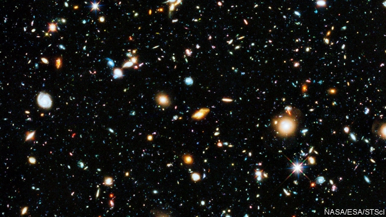
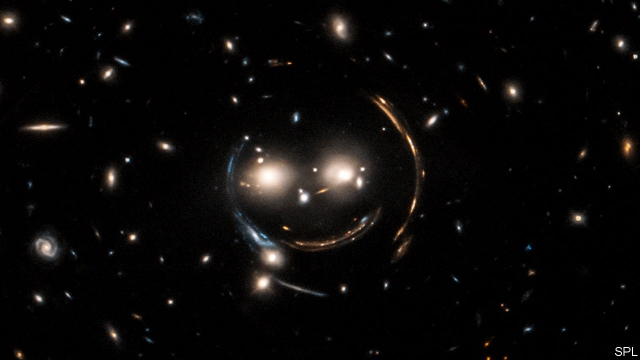
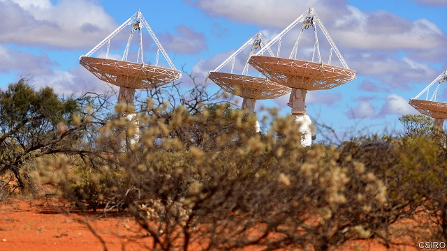

###### The grand horoscope

# New instruments will study the universe’s most mysterious component 

##### That will illuminate both its past and its future 

 

> Jan 3rd 2019 

 

LIKE A BLIND prophet, the observatory perched atop Cerro Pachón in the Chilean Andes ponders the heavens. Eyeless for now, the Large Synoptic Survey Telescope (LSST) will from 2022 turn into the biggest digital camera on Earth. Taking 3,200 megapixel snaps with an exposure time of 15 seconds, to capture an area 40 times the size of the full moon, the LSST will map almost the entire southern hemisphere once every three or four nights for a decade. The picture so generated will assess how matter (in the form of stars and galaxies) is distributed, shedding light on the clash of forces that have brought the universe to its current state, and thus scrying its future. 

The LSST is one of a string of ground and space-based experiments that will soon help physicists understand a celestial tug-of-war. One side of the contest, gravity, is described by Albert Einstein’s general theory of relativity. The attractive effects of gravity on matter thrown apart by the Big Bang would be expected to slow the universe’s expansion over the course of time. In 1998, though, astronomers discovered that the opposite was true—the universe is now expanding at a faster clip than before. 

That could be explained if gravity is opposed by an as-yet-unidentified, invisible form of energy permeating space. For this explanation to work, the amount of such “dark energy”, as it was dubbed by Michael Turner, a cosmologist at the University of Chicago, would have to increase as the universe expanded. The extra energy would fuel cosmic expansion in much the same way that a balloon inflates if the air inside it is warmed. What this energy might be—or even whether it exists at all—is moot. The LSST and its brethren may be able to provide some clarity. 

The simplest version of the explanation is that the density of dark energy is the same everywhere in space and time. As the expansion of the universe creates more space, more dark energy is also created. But not more matter, and therefore not more gravity. At some point in the past, therefore, the “push” caused by the growth of dark energy overcame the gravitational pull of all the cosmos’s matter, and the universe’s expansion began to accelerate. 

Handily, adding a single term, known as the cosmological constant, to the equations which describe general relativity extends that theory in a way which embraces this state of affairs. On their own, those equations do indeed suggest a universe that is either expanding or contracting. The idea of a cosmological constant—a force working in opposition to gravity—was dreamed up by Einstein as a way to reconcile relativity with the then-prevalent belief that the universe was actually static. Observations made in the 1920s, though, showed that the equations’ prediction of a dynamic universe was correct and the cosmological constant was quietly dropped. 

In recent years, however, the constant has been revived. Physicists have realised that it offers a solution to the dark-energy conundrum. Even the unadorned equations of relativity do not predict that the universe’s expansion is accelerating. But adding the constant and setting it to an appropriate value does give a solution that fits the observed expansion. 

The value in question is that every cubic metre of space holds (by Einstein’s famous equation of mass-energy equivalence E=mc{+2}), about 10{+−}{+2}{+4} grams of dark energy—the equivalent of a couple of protons. This may not sound much but, because dark energy occupies every corner of the universe, it actually accounts for around 70% of the mass-energy of the universe, compared with the 5% contributed by what human beings think of as normal matter (basically, the stuff from which atoms are made). The remaining 25% is dark matter, a hypothetical substance that is detectable only by its gravitational effects, and which has proved almost as elusive as dark energy. 

This theorising is all very well. But it offers few hints about what dark energy might actually be. One possibility is that it results from the interactions of the short-lived virtual particles which, according to quantum physics, constantly appear even in empty space. The drawback is that calculations of the magnitude of this “vacuum energy” give a figure at least 10{+6}{+0} times greater than the expected value of the cosmological constant. 

The absurdity of this mismatch, called the “vacuum catastrophe” or, more candidly, “the worst theoretical prediction in the history of physics”, has led physicists to toy with other ideas. One is “quintessence”, which posits an all-pervasive field sloshing around in space. The energy of the field varies with time and, in some models, in space as well. This property of variation distinguishes quintessence from vacuum energy, and permits models of quintessence to be tuned to explain another riddle: why the expansion of the universe began to accelerate late enough in its history to let matter coalesce into galaxies first. Various flavours of quintessence theory exist, with exotic names such as k-essence and phantom energy, depending on which physical parameters are tweaked. 

A third approach to explaining the universe’s accelerating expansion is to fiddle with general relativity itself, by changing the inverse-square law of gravity. This law, central to both Newton’s and Einstein’s descriptions of the force, is that the gravitational attraction between two bodies is inversely proportional to the square of the distance between them. The required deviation from the inverse-square law would be small, explaining why it has not been detected experimentally, but would, nevertheless, be sufficient, over cosmic distances, to have the required effect. 

The details of such “modified-gravity” theories differ. Some versions, from the arcane world of string theory (a highly speculative attempt to create a theory of everything), allow gravity to propagate in a fifth dimension, additional to the four familiar dimensions of space and time. In general, however, modified-gravity theories require some sort of novel field that modifies gravity’s effect. In these models, the source of the energy needed to produce the observed expansion of the universe is this modifying field, rather than quintessence or the cosmological constant. 

Astronomers whose careers are devoted to making observations tend to be sniffy about such highfalutin departures from well-understood physics as gravity-modifying fields and quintessence. Many theorists, though, are similarly uncomfortable with the idea of “solving” the problem of the accelerating expansion simply by adding the cosmological constant to Einstein’s equations. Without knowledge of the nature of the space-filling energy the constant represents, they point out, it is merely a “fudge factor” added to bring theory and observation into alignment. 

Camille Bonvin of the University of Geneva is one such uncomfortable theorist. She calculates the predictions of many different theories and designs tests that would, with the requisite astronomical observations, permit her to rule in or rule out whole classes of different theories. 

What has become increasingly clear in the past few years, she says, is that more precise measurements of the universe’s expansion rate alone are not enough to distinguish between the possibilities. Astronomers must also collect more data on the large-scale structure of the universe. Modified-gravity theories, for example, have different predictions about how matter will clump together than do theories which require no such modification. By measuring the actual dispersion of matter, visible as the fine tracery of stars and galaxies in the night sky, it should be possible to distinguish between competing explanations. Dr Bonvin and her fellow theorists are therefore hungry for data. And the next two decades promise a deluge. 

Armed with its mighty camera, the LSST will produce the most detailed survey of the sky yet made. This map will allow the dark-energy problem to be attacked in four different ways. 

First, the telescope is expected to discover about 1m type 1a supernovae, 100 times more than the number known today. These stellar explosions are one of a few cosmic yardsticks, known as “standard candles”, that are available to astronomers. Twenty years ago they provided the first strong evidence of the universe’s accelerating expansion. 

A type 1a supernova is a binary star in which a small, dense object called a white dwarf pulls material from a larger companion. Eventually, the extra mass the dwarf has accreted triggers a runaway fusion reaction in its core, resulting in a huge detonation. Because this reaction occurs when the white dwarf’s mass has reached 1.4 times that of the sun, the intrinsic brightness of all type 1a supernovae is the same. Comparing this intrinsic brightness with a supernova’s brightness as perceived on Earth thus permits the distance to that outburst to be calculated. 

Moreover, the velocities of light-emitting objects relative to Earth can be obtained from their red-shift. This is a measure of how much the wavelength of their light has been stretched (and therefore made redder) by the Doppler effect, a consequence of the speed with which they are moving away from Earth as the universe expands. As light from more distant supernovae must have begun its journey earlier, the relationship between distance and velocity reveals how the universe’s expansion has changed over time. 

The LSST’s second approach to measuring this expansion will be to use a phenomenon called baryon acoustic oscillations. These oscillations are a feature of the early universe that can be discerned in the sky today. They date from 380,000 years after the Big Bang—the moment when matter, then in the form of a hot soup of electrons, protons and neutrons, cooled sufficiently to form the first atoms. That transition allowed light that had been bouncing around within the soup of particles to escape, and the resulting flash has, some 13.4bn years later, been red-shifted until it is in the microwave region of the spectrum. 

The consequence of all this is a phenomenon called the cosmic microwave background (CMB), which was detected in 1964 and was early evidence in favour of the Big Bang theory of the origin of the universe. Since its discovery, the CMB, and the tiny fluctuations of intensity within it, have been measured with increasing accuracy—most recently by Planck, a space telescope launched in 2009 by the European Space Agency (ESA). Those fluctuations correspond to variations in the density of the soup at the moment the photons escaped. These variations, accentuated by gravity as matter cooled and coalesced, are now reflected in the distribution of galaxies in the cosmos. 

The upshot is that galaxies are separated, on average, by a distance that was once related directly to the ancestral fluctuations in the CMB, but which has increased as the universe has expanded. Its value today is about 500m light-years. By measuring the average-separation distance for galaxies near and far (and therefore of different ages, the farthest away being seen when they were youngest) it is therefore possible to track that expansion over time. 

The third approach available to those using the LSST to investigate accelerating cosmic expansion is called gravitational lensing. This relies on the fact that, as predicted by general relativity, a massive body causes the fabric of spacetime to curve, which deflects the path of light passing close by that body. In the case of “strong” gravitational lensing, an object such as a supernova or a type of exploding galaxy called a quasar, located behind the lensing body (usually a galaxy), is bright enough, and the lens is massive enough, to cause a visible effect. The light from the object behind the lens may be bent into arcs or rings, or split to produce several images of that object (see picture). 

 

Strong gravitational lenses are, however, rare. Most of the time the effects of gravitational lensing are not so clear-cut. Such “weak” gravitational lensing can, though, be inferred by collecting data from many galaxies (the LSST will study billions) and measuring how their shapes are distorted on average by the effects of any intervening mass. As lensing is sensitive to dark matter as well as the ordinary, visible stuff, this technique will let the LSST map the “true” structure of the universe in ways pertinent to choosing between explanations for accelerating cosmic expansion. 

The LSST’s fourth approach to the cosmic-expansion question will be through observations of clusters of galaxies. By looking at closer, and therefore younger, clusters and comparing them with more distant, older ones, the telescope will permit physicists to study how these behemoths evolved. As galaxy clusters are the largest bodies in the universe that are held together by gravity, they provide a natural way to measure any departures from the behaviour predicted by general relativity. 

Powerful though the LSST will be, it has its limits. The approach it employs is known technically as a photometric survey. This involves recording only light that passes through one of a number of coloured filters (six in the LSST’s case), limiting the accuracy with which the red-shifts of galaxies can be determined. To back this up requires a spectroscopic survey, which splits up unfiltered light into its component frequencies, permitting red-shifts to be measured across a bigger swathe of the spectrum. 

Another new instrument, the Dark Energy Spectroscopic Instrument (DESI), which is mounted on the Mayall telescope at Kitt Peak National Observatory, in Arizona, will do this on an unprecedented scale. DESI will collect its first images in the autumn of 2019, and is expected to begin its five-year survey early the following year. The 5,000 optical fibres of which it is made can each be manipulated robotically. Each can therefore be trained on a different astronomical target. Light from the fibres is sent to one of ten identical spectrographs. These are sensitive to wavelengths that include the visible spectrum and also a part of the infrared. 

The process will be programmed by choreographing the fibres to capture light from about 35m galaxies over the course of the survey. DESI’s predecessor, the Baryon Oscillation Spectroscopic Survey (BOSS), looked at a mere 1.5m. Its 1,000 fibre optic cables had to be plugged into holes by hand and rearranged several times every night. The automation and improvements in instrumentation involved in DESI mean it will be able to do in 30 clear nights what BOSS took five years to achieve. 

Results from BOSS, using the red-shifts of galaxies of two different ages (3.5bn years and 5.7bn years) and of quasars 11bn years old, so far suggest a rate of expansion in keeping, to within a percentage point or so, with the cosmological-constant hypothesis. To rule out more exotic models, however, will require similar measurements from more times in the past. This is what all the red-shifts DESI measures should provide. 

The DESI survey will measure the universe’s expansion rate in 300m-year increments, from about 11.5bn years ago until today. Astronomers will use these data to build a picture of how the universe’s large-scale structure—the networks of galaxies that DESI will chart—has changed. That will reveal whether gravity is being modified in ways that are out of kilter with Einstein’s theories. 

 

Results from DESI and the LSST will be supplemented by Euclid, a space telescope being built by ESA that should be launched in 2022. During a mission lasting more than six years, Euclid will measure the weak-lensing effects of 1.5bn galaxies, and the red-shifts of 25m galaxies up to 10bn light-years away. Without the fluctuations imparted by Earth’s atmosphere, and other sources of noise that ground-based telescopes must contend with, Euclid’s results should improve the accuracy of estimates of the universe’s expansion rate ten-fold. 

Further in the future will come the Square Kilometre Array (SKA), a huge radio-telescope project based in South Africa and Australia which has its headquarters at the Jodrell Bank Observatory in Britain. As its name suggests, the SKA will consist of thousands of dishes and small antennae that have a total collecting area of a square kilometre. At each site these will be spread over tens of kilometres, to take advantage of a technique called interferometry, in which an array of dishes working together can simulate a single larger telescope with an aperture equivalent to the separation between the farthest members of the array. 

SKA1, the first phase of the project, will include 200 dishes in South Africa and 130,000 small antennae in Australia. It should be ready by the mid-2020s. SKA2 will expand the network to create the largest scientific instrument on Earth, but quibbles over the price tag may yet scupper the project. If the money is found, it might start work a decade or so after SKA1. 

The SKA will address the question of the universe’s expansion by mapping the distribution of hydrogen atoms in the cosmos. The distribution of hydrogen is expected to correspond to the distribution of matter of all kinds, so mapping hydrogen is another approach to studying the universe’s structure. The SKA will also search for the gravitational lensing of radio sources (as opposed to the optical ones the LSST plans to look at). 

With all these data, astronomers will open a window on the universe’s past. That should improve predictions about its future. The possibilities are grim. In some versions of quintessence, the energy in the quintessential field increases exponentially, resulting in a “Big Rip” that tears apart atoms, subatomic particles and eventually the fabric of spacetime itself. In most projections, though, the end is more whimper than bang. For anyone still around on Earth to look, the universe’s accelerating expansion will mean distant stars and galaxies wink out one by one, their light red-shifted to invisibility, to leave just a smattering of illumination from the Milky Way and its nearest neighbours, the only beacons shining in a sea of darkness. 

