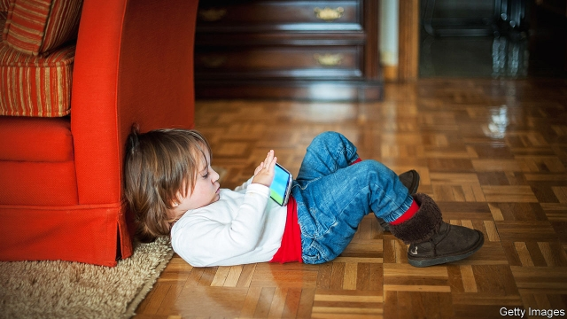
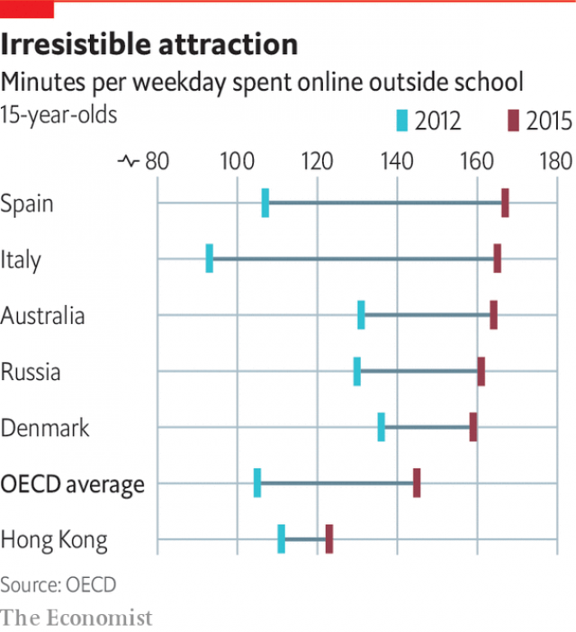

###### Digital media

# How children interact with digital media 

##### Parents may loathe them, but they are here to stay 

 

> Jan 3rd 2019 

 

“TURN OFF media, turn on life”, urges the promotional video from South Korea’s Nori Media Education Centre for the Prevention of Internet Addiction, an organisation funded by a mixture of private and public money. Its manager, Kwon Jang-hee, is passionate about protecting children from the ill effects of the internet, and above all of smartphones, which he considers most damaging of all because of their omnipresence. Parents do not understand how dangerous the internet is, he says, pointing to a study by Seoul National University that detected similarities between the brain activity of cocaine addicts and computer-games enthusiasts. If he had his way, youngsters would have to wait for their smartphones until they had graduated from high school. 

In one of the world’s most highly connected societies there is little chance that he will get his wish, but plenty of South Korean parents agree that their children are overdosing on screens. A recent government survey on smartphone and internet addiction put the share of three- to nine-year-olds at high risk of addiction at 1.2% and that of teenagers at 3.5%. That may not seem a lot, but when it happens the effects can be devastating. Some of these children are on their phones for at least eight hours a day and lose interest in offline life. Having tried and failed to wean them from their devices, their desperate parents turn to the government, which offers various kinds of counselling, therapy and, in extreme cases, remedial boot camps. 

Hong Hyun-joo, who works on the boot-camp programme for the regional government of Gyeonggi, South Korea’s most populous province, says the kids undergoing the treatment are usually aged 14-16, with about the same number of boys and girls. They hand in their smartphones when they arrive at the boot camp and spend 12 days living in dormitories, eating regular meals and engaging in lots of sport and group activities. The aim is to increase their self-esteem and get them to make friends. They mostly start off sullen but gradually become more co-operative. The claimed “cure” rate (meaning a return to more normal usage) is 70-75%. But the camps can take only a few hundred children a year, not remotely enough to meet demand. That would take a lot more money. 

South Korea is thought to have the world’s highest rate of problematic internet use among both children and adults, but concern about children’s growing use of digital media in the West is also rising, especially in America. In 2015, the latest year for which internationally comparable figures are available, nine out of ten 15-year-olds across the OECD had access to a smartphone. They spent an average of 18½ hours a week online, nearly five hours more than in 2012, so the figure is probably even higher now. About 16% of these kids were extreme users, defined as spending more than six hours a day online. The number of children who did not use the internet at all was vanishingly small. 

Moreover, children are starting on digital devices at ever younger ages. In Germany 67% of 10- to 11-year-olds already have their own smartphones, rising to 88% for 12- to 13-year-olds, according to Bitkom, an industry association. In Britain 83% of 11- to 12-year-olds and 96% of 13- to 14-year-olds have their own phones, says Childwise, a research outfit. What do these kids do on their smartphones? “Stuff,” says John, a 12-year-old living in north London. That turns out to mean sending messages and talking to his friends, watching video clips, playing computer games and going on Snapchat and Instagram. His ten-year-old sister does not have a smartphone yet, but uses an internet-enabled iPad. Their parents ration the children’s screen time (as the vast majority of parents do), but sometimes there is room for negotiation. 

Infants and toddlers use digital devices such as tablets when they can barely speak, let alone read and write. The American Academy of Paediatrics used to advise parents to keep children under two away from screens altogether, but now says that video chatting is acceptable even for the very young. For two- to five-year-olds, it reckons, an hour a day of high-quality programming is fine. Some experts think it is still being way too conservative. 

Opinions on the effects of children’s digital-media habits are deeply polarised. At one extreme, Jean Twenge, a psychology professor at San Diego State University, says it all with the title of her recent book, “iGen: Why Today’s Super-Connected Kids are Growing up Less Rebellious, More Tolerant, Less Happy—and Completely Unprepared for Adulthood—and What That Means for the Rest of Us”. The smartphone, she argues, has radically changed the lives of the generation of American children born between 1995 and 2012, wherever they live and whatever their background. She thinks excessive use of the internet and social media makes them lonely and depressed and poses serious risks to their physical and particularly their mental health, sometimes to the point of driving them to suicide. 

Others note that similar warnings were sounded when television started to spread in the second half of the 20th century. At the time it was widely believed that if children spent long hours watching it every day, they would become dumb, fat and lazy. Now watching TV together is seen as a valuable family activity for parents and children. When technologies such as the radio, the written word or printed books were new, they were also demonised to begin with. 

 

Some of the risks attached to internet use have barely started to be considered. For example, children are already generating large amounts of data, beginning when they are still in the womb as their parents put the first scan of the baby online, and continuing across multiple channels as the child is constantly recorded interacting with devices and programmes. These data can never be retracted. They will be available to third parties and there is no telling how they will be used. The effects may not become clear until many years after the event, says Monica Bulger of Data & Society, a research organisation that studies the social and cultural impact of data-heavy technologies. 

Its founder, Danah Boyd, in a book called “It’s Complicated: The Social Lives of Networked Teens”, concedes that spending too much time online can be bad for adolescents, if only because it leaves less time for other activities. But she also argues that since most young people these days have fewer opportunities and less time to get out and see their friends, they need somewhere else to talk among themselves in private. The internet offers them such a forum. Certainly the youngsters themselves seem to appreciate it. Across the OECD, 84% of 15-year-olds say they find social networks online very useful, and more than half of them feel bad if they cannot get online. 

Daniel Kardefelt-Winther of the Innocenti research office of Unicef, the United Nations’ children’s agency, looked at all the evidence he could find on how children’s use of digital technology affected their mental well-being, their social relationships and their physical activity, and found less cause for alarm than is often suggested. Most of the studies he examined seem to show that the technology helps children stay in touch with their friends and make new ones. In the 1990s and early 2000s, when the internet was relatively new, such benefits seemed less clear because it seemed to isolate people, but now that almost everybody is online, it has become a busy and sociable place. 

What spending so much time looking at screens does to children’s health is hard to gauge. Although it clearly reduces physical activity, which may be bad for their general well-being and cause weight gain, the causal direction is not clear. It may be that children put on weight because they eat too much unhealthy food, perhaps egged on by advertising they have seen on some screen or other, and become less active as a result. 

The relationship between the use of digital technology and children’s mental health, broadly speaking, appears to be U-shaped. Researchers have found that moderate use is beneficial, whereas either no use at all or extreme use could be harmful. But in either case the effects are very small, and children generally prove surprisingly resilient to moderate or even high levels of screen time. Although there are clear instances of overuse, terms like “addiction” or “compulsive use” may be overblown. There is no real evidence that spending too much time online severely impairs the user’s life in the longer term, as drug abuse often does. 

This is not to say that there is no need for concern. Mental-health problems represent the largest burden of disease among young people. One study across ten OECD countries found that a quarter of all young people had a mental disorder. Even a small addition to that share would be a bad thing. And heavy users of social media and video games often suffer from sleep deprivation, which seems to be associated with anxiety and depression. But again it is not clear which is the cause and which the effect. 

Cyberbullying is also becoming more prevalent, though it directly affects a relatively small proportion of children, and experts think it is generally less damaging than the physical kind. And people on social media try to make their lives seem more glamorous than they really are, which can make children feel left out. 

Sonia Livingstone, a professor of social psychology at the London School of Economics, has spent decades looking at the relationship between children, media and the internet. She concludes that screens are often held responsible for the broader anxieties of parents living in a high-stress environment, without much evidence that they do great harm. What worries her more is that screens are becoming part of the middle-class armoury for perpetuating social advantage, with children from well-off homes being enrolled in private classes to learn skills like “How to be a YouTuber”, which poorer parents cannot afford. That echoes concerns across the Atlantic about child-rearing becoming a new battleground for class warfare. 

It is hard to be categorical about screen use. What is good for one child of a particular age may be bad for another one of a different age. But it is clear that, particularly for younger children, it helps if parents are engaged. Watching a video together or looking something up online and talking about it is not that different from reading a book together. The trouble is that children can find it hard to get any attention from their parents these days because they, too, are always on their smartphones. 

