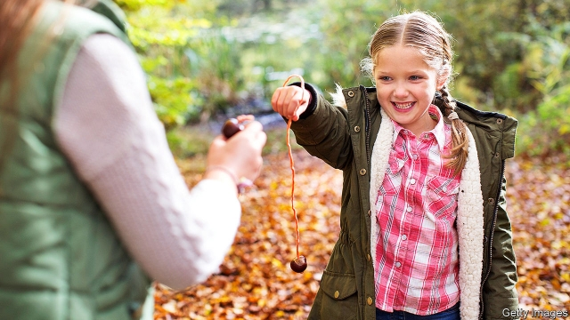

###### An unfair world

# Parenting methods are exacerbating social divisions 

##### How to help level the playing field 

 

> Jan 3rd 2019 

 

BRITISH CHILDREN used to play conkers in the autumn when the horse-chestnut trees started to drop their shiny brown nuts. They would select a suitable chestnut, drill a hole in it and thread it onto a string, then swing their conker at that of an opponent until one of them broke. But the game has fallen out of favour. Children spend less time outdoors and rarely have access to chestnut trees. Besides, many schools have banned conkers games, worried that they might cause injuries or trigger nut allergies. 

That sort of risk-averseness now pervades every aspect of childhood. Playgrounds have all the excitement designed out of them to make them safe. Many governments, particularly in litigious societies such as America, have tightened up their rules, requiring parents to supervise young children far more closely than in the past. Frank Furedi of the University of Kent, a critical commentator on modern parenting, argues that “allowing children to play unsupervised or leaving them at home alone is increasingly portrayed as a symptom of irresponsible parenting.” 

In part, such increased caution is a response to the huge wave of changes outlined in this report. Large-scale urbanisation, smaller and more fluid families, the move of women into the labour market and the digitisation of many aspects of life have inevitably changed the way that people bring up their children. There is little prospect that any of these trends will be reversed, so today’s more intensive parenting style is likely to persist. 

But the child-rearing practices now embraced by affluent parents in many parts of the rich world, particularly in America, go far beyond an adjustment to changes in external conditions. They amount to a strong bid to ensure that the advantages enjoyed by the parents’ generation are passed on to their offspring. Since success in life now turns mainly on education, such parents will do their utmost to provide their children with the schooling, the character training and the social skills that will secure access to the best universities and later the most attractive jobs. 

To some extent that has always been the case. But there are more such parents now, and they are competing with each other for what economists call “positional goods”—things that are in limited supply and that money cannot always buy, like those places at top universities. This competition starts even before the children are born. The prosperous classes will take their time to select a suitable spouse and get married, and will start a family only when they feel ready for it. 

Children from less advantaged backgrounds, by contrast, often appear before their parents are ready for them. In America 60% of births to single women under 30 are unplanned, and over 40% of children are born outside marriage. And even if those children have two resident parents who are doing their best for them, they are still handicapped by a lack of funds, knowledge and connections. The result, certainly in America, has been to widen already massive social inequalities yet further. 

What can be done about this? All the evidence suggests that children from poorer backgrounds are at a disadvantage almost as soon as they are born. By the age of five or six they are far less “school-ready” than their better-off peers, so any attempts to help them catch up have to start long before they get to school. America has had some success with various schemes involving regular home visits by nurses or social workers to low-income families with new babies. It also has long experience with programmes for young children from poor families that combine support for parents with good-quality child care. Such programmes do seem to make a difference. Without extra effort, children from low-income families in most countries are much less likely than their better-off peers to attend preschool education, even though they are more likely to benefit from it. And data from the OECD’s PISA programme suggest that children need at least two years of early (preschool) education to perform at their best when they are 15. 

So the most promising way to ensure greater equity may be to make early-years education and care far more widely available and more affordable, as it is in the Nordics. Some governments are already rethinking their educational priorities, shifting some of their spending to the early years. 

Most rich countries decided more than a century ago that free, compulsory education for all children was a worthwhile investment for society. Since then the school-leaving age has repeatedly been raised. There is now an argument for starting preschool education earlier, as some countries have already done. Before the Industrial Revolution it was the whole village that minded the children, not individual parents. In the face of crushing new inequalities, a modern version of that approach is worth trying. 

  

