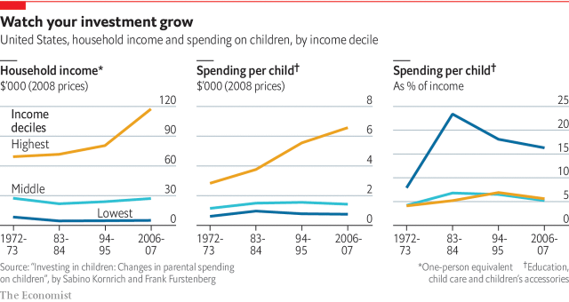

###### Parenting

# The art and science of parenting 

##### Fewer kids can be a lot more work 

> Jan 3rd 2019 

“WE ARE CREATING a miniature version of our own lives for our kid, wanting him to be productive, keeping him busy all the time.” Abigail is talking about her two-year-old son, Joshua. She has a well-paid job with an investment bank in Dallas, Texas, which she finds stressful but exciting. Now pregnant with another child, she has every intention of resuming work after the second birth. She will keep on her Mexican-American nanny, and her writer husband will help with the child care. 

But combining work with a larger family will not be easy, not just because of Abigail’s demanding job but because she and her husband, like many other prosperous parents in America, pursue a form of child-rearing that makes huge demands on their time and resources. It includes filling the child’s day with round-the-clock activities, from music and sports to sleepovers; going to great lengths to get him or her into the right schools; and strictly supervising homework. The parents may not like it, but they feel they have no choice because all their friends are doing the same thing. 

This is colloquially known as “helicopter parenting” (because the parents are always hovering), or “concerted cultivation”, a term coined by Annette Lareau, a sociologist at the University of Pennsylvania. In her book “Unequal Childhoods”, based on in-depth studies conducted in the 1990s and early 2000s, she looked at the child-rearing habits of American families from a variety of social and ethnic backgrounds and found a yawning gap. Whereas better-off, better-educated parents (black as well as white) overwhelmingly adopted this intensive method, working-class and poor families followed a different model which she calls “the accomplishment of natural growth”. They saw their role as providing shelter, food, comfort and other basic support but lacked the time, the money and the nous for such intensive management, so their kids were often left to their own devices, and the extended family played a much greater part in their children’s lives than among Ms Lareau’s middle-class subjects. 

In his book “Our Kids”, Robert Putnam, a political scientist at Harvard, used a mixture of interviews and data analysis to argue that different child-raising conventions are reinforcing a growing divide in American society. The privileged top third is pulling ever further ahead of the disadvantaged bottom third, whose families are often fractured and whose lives tend to be precarious. That shows up as a growing divergence in income, education, single- parenthood, friendship networks and other indicators. 

Upper-middle-class children are far better placed even before their parents make any special effort, simply because of the sort of homes they are born into. Educated parents tend to respond readily to their children’s endless questions, talk to them over the dinner table and take them to new and exciting places. In a famous study in the 1990s, Betty Hart and Todd Risley from the University of Kansas found that in the poorest families children heard about 600 words an hour, whereas in professional families they heard 2,100. By the time they were three, the children from the well-off homes had heard around 30m more words than the poorer ones. 

“Parenting”, in the sense that it is now understood, is a relatively new term; it first popped up in 1958, according to the Merriam-Webster dictionary, and came into widespread use only in the 1970s. Experts see it as an important factor in successful child-rearing, along with things such as genetic predisposition and external circumstances. To find out how much it mattered, Jane Waldfogel of Columbia University and Liz Washbrook of the University of Bristol separated out the effects of different parenting styles and home learning environments on the cognitive performance of three- to five-year-olds from different income groups in America and Britain. They found that they accounted for between a third and half of the income-related gap. 

Studies show that even poorer and less well-educated parents on both sides of the Atlantic (except, oddly, in France) spent far more time with their children every day in the 2000s than they did in 1965. They also spent more money on them, both in dollars and as a proportion of their income. Sabino Kornrich of Emory University and Frank Furstenberg of the University of Pennsylvania found that between 1972-73 and 2006-07 total spending per child in constant dollars increased somewhat for all income groups (see chart), but far faster for the richest 10% of parents than for the rest. Because incomes in this group had gone up rapidly, their spending as a proportion of income did not rise much. Yet by this measure the poorest 10% of parents vastly increased their spending on their children because their incomes had barely budged. 

 

America is not the only place to practise helicopter parenting. The British do it too, calling it “hothousing”; continental Europe less so, especially in the Nordic countries, where social hierarchies are flatter and parents more relaxed. But globalisation has cranked up competition for the best jobs, and academic standards in different countries have become easier to compare thanks to the OECD’s PISA scores, which measure the reading, maths and science performance of 15-year-olds. Such comparisons have highlighted the effectiveness of a kind of concerted cultivation that is ubiquitous in East Asia. It is somewhat different from the Western sort, being directed more single-mindedly towards academic success, and works particularly well in maths and science. In the PISA rankings for these subjects in 2015 Singapore tops the bill, and Japan, China (currently measured only in Beijing, Shanghai, Jiangsu and Guangdong) and South Korea are all well ahead of America. 

Such comparisons have made some Americans wonder whether they are being too soft on their kids. For all the hovering they do, they tend to let them off lightly on things like discipline and helping around the house, preferring to build up their self-esteem and keep them happy. But parents have noticed that some of the country’s recent immigrants, particularly those from East Asia, use sterner methods to great effect. In her book “Battle Hymn of the Tiger Mother”, Amy Chua, a first-generation Chinese-American married to an American academic, describes the tough love she meted out to her two daughters. She unapologetically made the girls do many hours of homework a day, pushed them into becoming musical prodigies and allowed them next to no time to have fun. Though one of them eventually rebelled, both achieved brilliant academic results and seem to have grown into accomplished adults. 

Another Chinese-American mother, Lenora Chu, and her journalist husband tried a different variant of blended cultures. Having moved to Shanghai, the couple decided to send their three-year-old son to a top-notch state-run Chinese kindergarten. Ms Chu’s book about their experience is called “Little Soldiers”, after a song often recited in the kindergarten that started: “I am a little soldier, I practise every day.” It summed up the educational philosophy prevailing there and across China: anyone can succeed at anything if they work at it hard enough, whether or not they have a talent for it. Effort is all. 

The Chinese kindergarten, Ms Chu found, had little trouble securing co-operation and compliance from the children and their parents. The authoritarian structure of the education system and powerful administrators keeps parents and students in check. In turn, the kindergarten proved responsive to parental pressure to offer some formal teaching even to these very young children, despite consistent guidance from the ministry of education that this age group should be spending most of the day playing. Even at kindergarten level, the parents are already thinking about getting the child through the gaokao, the all-important university entrance exam. As one mother explains, this is not just about the child itself. The Chinese have long been obsessed with education, and academic success for the child brings honour to the entire family. 

If life at school is not much fun for Chinese kids, it is even worse for South Korean ones. Though both countries put much store by rote learning, in South Korea this takes on extreme forms. Jang Hyung-shim, an educational psychologist at Seoul’s Hanyang University, likens children’s experience at school to military service and says it stifles their creativity. 

Song In-soo leads a group that campaigns for educational reform, the No Worry Private Education Association, which has gained a formidable reputation and chalked up a few successes, including a slight relaxation of the high-school entrance exam. He is particularly concerned about the high suicide rate among schoolchildren, partly blaming the ubiquitous hakwon, or private crammers, which he says 60% of South Korean students attend. The hakwon lessons take place outside school hours and often go on until late at night, turning the children into overworked, sleep-deprived zombies—as well as exacting a heavy financial toll on their parents. Mr Song has assembled lots of evidence against the practice. But as in China, everything hinges on the university entrance exam, so until that is tackled, nothing is likely to change. 

In a little forest growing on one of the many rocky outcrops found all over Seoul, groups of tiny children from various local nursery schools are arriving at a “forest experience centre”, one of 50 in this city of about 10m. They come once a week to explore discovery trails on the steep paths, play on various bits of equipment, listen to a guide explaining the wildlife they might see and exclaim at “bug hotels” full of insects. They seem delighted to be there. As wild places go, this is pretty tame; the paths may be steep, but all the play equipment is designed to minimise risk, and the children are carefully supervised. Even so, some parents stop their offspring from taking part in these excursions for fear that they might get hurt. In South Korea, not having fun starts early. 

