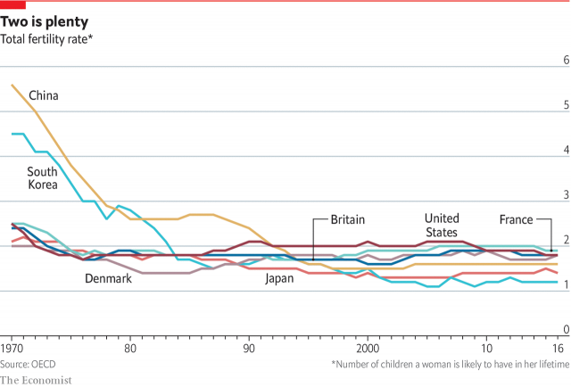
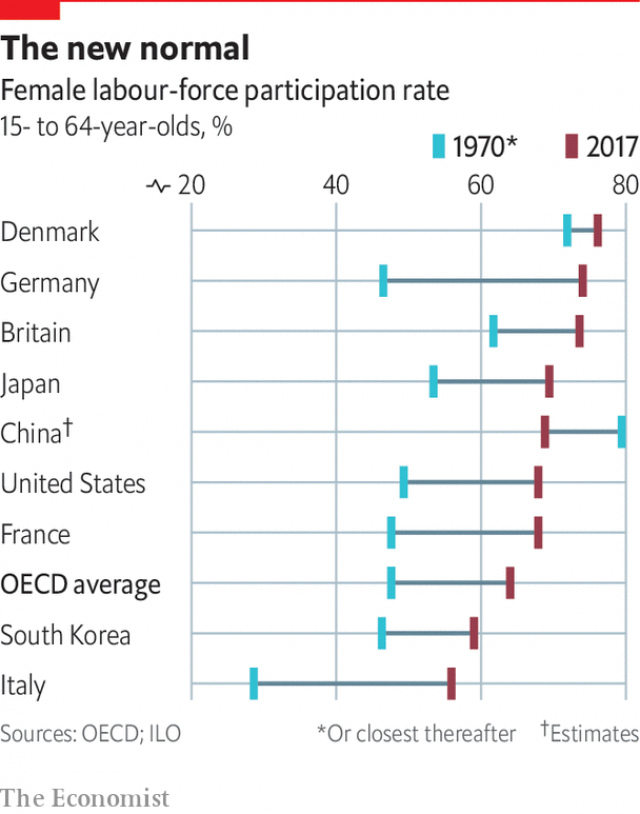

###### The family

# The continuing importance of the family 

##### Smaller, more heterogeneous, but still indispensable 

 

> Jan 3rd 2019 

 

ON A RAINY Saturday morning, the Museum of Childhood in east London reverberates with the sound of hundreds of small children enjoying themselves. Some are stacking bricks, others are playing in a sandpit as their parents look on. A large Victorian rocking horse attracts a queue of young riders. On a nearby wall a notice outlines a project on which the museum worked with a local school to find out what seven- and eight-year-olds consider important in their lives. The clear winners were the children’s families—along with Lego, a construction toy. 

The family is still the best place for a child to get the love and security it needs to grow into a well-balanced adult. Child-development experts agree that almost any family, however imperfect, is better than none at all. It does not even have to last for ever, only long enough to provide a safe and warm space for those crucial early years. That is just as well, because today’s families are very different from those of a few decades ago. 

Most obviously, they are smaller. Across the OECD, the total fertility rate (TFR)—the number of children a woman is likely to have in her lifetime—is now 1.7, against 2.7 in 1970 (see chart). Even America, which until recently used to procreate more than most of the West, is now close to the rich-country average. In South Korea the fall in the TFR has been precipitous, from 4.5 in 1970 to 1.2 now. 

 

Over the same period China’s TFR has plummeted from 5.6 to 1.6. That is often attributed to the country’s one-child policy, but the ultra-low birth rates of other countries in the region, including Japan, South Korea, Taiwan and Vietnam, suggest it would have happened anyway, if somewhat later. In 2016 the Chinese government, alarmed by the prospect of a rapid decline in the country’s working population, relaxed the rules. That brought a small uptick, but by the following year the numbers were down again. In time the policy is likely be scrapped altogether, but no one expects a baby boom. 

Asked what is holding them back from having larger families, Chinese couples often cite the cost of raising children. But the country’s increasing urbanisation has also played a part. Many of its modern cities are just as crowded, traffic-ridden, polluted and devoid of green spaces as those in the West, if not more so. They are uninviting places in which to bring up a family. 

Both in China and throughout the rich world, couples marry far later than they used to, and have their first child when they are much older. At the start of the 1990s in most OECD countries the mean age of women at first marriage was between 22 and 27, and for men two or three years older; now it is 30 for women and over 32 for men. In Sweden, the place with the oldest brides and grooms, it is 34 and 36 respectively. 

And many no longer bother to get married at all. In the past half-century marriage rates in the developed world have roughly halved, though there are big differences between countries, and not necessarily along the lines you might expect. Americans, for example, marry at twice the rate of Italians, French and Spaniards. The Chinese are keenest of all, reflecting a strong aversion to births out of wedlock, for both cultural and practical reasons. 

In most rich countries such attitudes are a thing of the past. The average proportion of children born to unmarried parents across the OECD is now around 40%, compared with 7.5% back in 1970 (though numbers in East Asia remain low). In most cases that does not mean they lead chaotic lives. Over 80% of children live in a couple household; the parents may simply have chosen not to get married, or to leave it until later. Quite a few weddings these days feature the couple’s offspring as bridesmaids or pageboys. 

 

Still, a growing share of children in OECD countries are being brought up in single-parent households, usually headed by the mother. As a rule, such households are a lot poorer and often less settled than the two-parent kind. In America they account for more than a quarter of the total, and among African-Americans even more. A new class divide is opening up in which well-educated people continue to have conventional marriages and bring up their children within them, whereas those with less education often have unplanned children who grow up in unstable families. 

Parents everywhere split up a lot more often than they used to; divorce rates are typically double those in 1970. Some of them remarry or move in with a new partner, and many children are now part of a patchwork family, perhaps with step-siblings thrown in. Others live with grandparents, other relatives or gay parents. So “home” is different from what it used to be; and with many more mothers going out to work, it may also be empty during the day. 

The push of women into the labour force started in America, the Nordics and the Antipodes in the 1960s and gradually spread to other rich countries, with Spain and the Netherlands bringing up the rear. Across the OECD, female labour-force participation has risen from 47.6% in 1970 to 64% now—though in many countries the rise has slowed or even halted as women have found out how hard it can be to combine career and family. In America a big debate was kicked off by an article in the Atlantic magazine in 2012 by Anne-Marie Slaughter, an academic and foreign-policy expert who had held down a very senior post in the State Department and was known as a feminist. Entitled “Why women still can’t have it all”, the article argued that in the face of institutional and cultural barriers, women—and indeed men—still had to make invidious choices between the demands of work and family. Women continue to be expected to play the main carer role, which helps explain why they typically spend far fewer hours than men in formal employment, but many more hours on unpaid child care and domestic tasks—even in places with enlightened men. 

One trigger for getting more women into work has been the expansion of tertiary education. In the past couple of decades more women than men have been gaining higher-level qualifications. The growth in services, too, has created many more jobs that appeal to women. And cultural norms are slowly changing. In Germany a woman who worked outside the home while her children were young used to be branded a Rabenmutter (raven mother, an undeserved slur on avian parenting styles). But younger Germans, at least, now think it is fine for mothers to have jobs. 

Governments can do a great deal to help parents reconcile work and family commitments. The most obvious way is through paid leave round the birth of a baby, though tax policy and cash support can also play a part. Entitlement to maternity leave in rich countries averages about four months, but with wide variations. America is the only wealthy nation to provide no paid maternity leave at all at federal level, though some states and many employers do. Some countries are moving towards the concept of parental leave, with a minimum period reserved for the mother and the rest divided up among the parents as they wish. 

Where fathers have been offered paternity leave, they have been slow to take it up, for fear that having more than a few days off might harm their career. But if parental leave is offered on a use-it-or-lose basis to the parent who is not the main carer, usually the father, uptake increases, as Germany has been finding after a series of recent reforms. 

Getting the father more involved has many benefits. It nudges the mother to go back to work sooner, which makes the family better off and boosts the economy. It is more equitable than to leave all the child care to the mother, and with luck may establish better habits of sharing domestic tasks. And it is good for the psychological well-being of everyone involved. Child and father form a closer relationship, and the mother has a more balanced life if she pursues a career of her own. 

Assuming she wants to carry on working, what is top of her wish list? Olivier Thévenon at the OECD studied the effect on female labour-force participation of a range of policies to promote work-life balance, including paid leave, family benefits and tax incentives, and found that one of the most effective ways to get more women to take jobs was to expand child-care provision for the under-threes. That chimes with policymakers’ growing focus on the crucial early years of a child’s life. 

