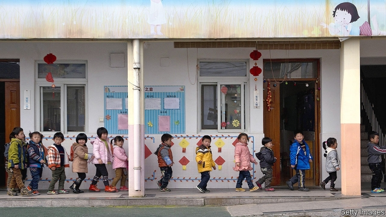
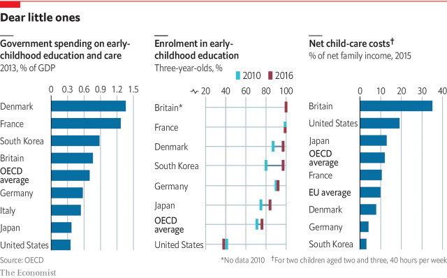

###### Early years

# The early years are getting increasing attention 

##### Catching them young 

 

> Jan 3rd 2019 

 

AT TURNER ELEMENTARY SCHOOL in south-east Washington, DC, about 15 well-turned-out five-year-olds sit on a mat in an immaculate classroom, bellowing out an uplifting song about being ready for school and listening to the teacher. Then they act out little scenes about being good citizens, sharing and helping others. They are having fun, but of a well-controlled sort. 

For many of them this may be the calmest and most enjoyable part of their day. The school is in a poor part of America’s capital and almost all its students are eligible for free or subsidised meals, which means their parents may struggle to make ends meet. The principal, Eric Bethel, says the school has made a lot of progress and achieves good academic results. It is teaching its preschool kids to read from age three. 

The little children at Turner, and many of the District of Columbia’s 114 other public schools, are lucky. In 2017 about nine out of ten four-year-olds there, and seven out of ten three-year-olds, were enrolled in publicly funded preschool, the highest rate in America, says Amanda Alexander, the interim chancellor of DC’s public-school system. The schools have no trouble recruiting staff for this age group because, unusually, preschool teachers here are paid the same as those for older age groups. 

Good preschool education helps get kids from poor families ready for school proper and do better in standardised tests, but it is expensive. In 2017 DC spent about $17,000 per child on this item, far and away the most of any American state. Average preschool spending across America in 2017 was about $5,000, a drop in real terms compared with 2002. Seven states had no programme at all. 

Early-childhood education and care is attracting a surge of interest in most rich countries. Increasingly, it is moving out of the home and into institutions, a process experts inelegantly call “defamilisation”. Across the OECD, average enrolment of three- to five-year-olds rose from 75% in 2005 to 85% in 2016. 

One reason, as already noted, is to make it easier for women to go out to work, which boosts GDP and saves the state money in family support. In some countries this has been an explicit policy objective. Britain, for example, some years ago introduced free child care for 15 hours a week, and of 30 hours a week provided the parents work, for all three- and four-year-olds, regardless of background. But a paper by the Institute for Fiscal Studies, a think-tank, found that this was likely to have only a slight impact on maternal employment. Even 30 hours a week would not be long enough to squeeze in a full-time job. 

Kate Greenaway Nursery School, run by the local authority in Islington, North London, is a confidence-inspiring place full of happy, busy children. It is open weekdays from 8am to 6pm, including holidays, so it provides effective cover for working families. As well as taking three-and-four-year-olds, it offers subsidised places for kids from six months to three years. These cost from £125 to £300 a week, depending on what parents earn. The head, Fiona Godfrey, says the places for younger children are in high demand. Good-quality private nurseries can cost even more and offer less. Child-care costs in Britain as a proportion of average incomes are among the world’s highest (see chart). 

 

In France, the ubiquitous, subsidised écoles maternelles, which take children from the age of two, have long been the envy of working mothers elsewhere in Europe; and Germany has recently increased the number of child-care places for younger children, though provision is patchy. Sabine Bermann, head of a heavily oversubscribed Kita (Kindertagesstätte, or child day-care centre) in Berlin’s rapidly gentrifying Prenzlauer Berg district, explains that parents have a legal right to a place for any child over the age of one. In Berlin they pay only for meals; some other German Länder (states) make charges ranging from modest to quite steep. But the promise rings hollow because the better Kitas have long waiting lists. 

Denmark, along with other Nordics, had the debate about institutional care for young children 30 or 40 years ago and decided to make it universal, says Charlotte Ringsmose, who teaches pedagogy at Aarhus University. Attendance at preschool centres and kindergartens among three- to six-year-olds is around 98%. Danish child-care centres focus on play rather than formal tuition. Children do not learn to read until they start school proper at six, but then catch up fast. And Danes do not shop around for early-years child care because the nearest state-run place is usually just fine. Kids from the least well-off families go free, and even those with richer parents are heavily subsidised. Perhaps not coincidentally, both fertility rates and female labour-market-participation rates in Denmark and other Scandinavian countries—which have similar arrangements—are above the European average. 

But Denmark’s universal child-care provision also has a more ideological side to it. The idea is to make sure that all children, whatever their background, are steeped in the country’s language, culture and values early enough to shape them for life. Last year the (right-wing) government controversially introduced legislation to require children living in designated poor neighbourhoods inhabited mainly by immigrants, which it calls “ghettos”, to attend day care for at least 25 hours a week from the age of one. 

Recent advances in neurology and child psychology have shown that the period from birth to age five, when the brain is at its most plastic, is the most important in a child’s development, and that interventions during that period can be much more effective than later ones. Children from prosperous, educated backgrounds start off with a huge advantage because they already get a lot of stimulation and informal learning at home. But institutional early education and care, if done right, can help level the playing field for those from less privileged backgrounds. 

The doyen of this school of thought is James Heckman of the University of Chicago, who has long argued that government investment in early childhood in institutional care pays off both for individuals and for society at large. He calculates the return on investment in high-quality birth-to-five education at between 7% and 13%. In evidence he cites two long-term studies of children from poor homes that began decades ago, the Perry Preschool Project in Michigan and the Abecedarian Project in North Carolina, which suggest that offering extra support for such children pays off not just in academic results but also in social and economic outcomes: better health, less poverty, less crime. 

As a follow-up, Mr Heckman and colleagues evaluated a raft of other American early-childhood education programmes. These included Head Start, a long-standing federal preschool programme designed to get poorer kids ready for school, which had been criticised by other scholars because the academic improvements it achieved seemed to fade over time. But Mr Heckman’s team reckoned that taking part in the programme did help the children in other ways, fostering social and emotional skills that turned out to be important in later life. 

Isabel Sawhill and Quentin Karpilow at the Brookings Institution, a think-tank, studied a representative group of American children, tracking their progress from the earliest years through school and beyond. They, too, found that well-targeted interventions—such as providing advice for parents and extra support for struggling children—improved the chances of disadvantaged kids becoming middle class when they grow up. Getting in early was crucial, and the best results were achieved by intervening several times from early childhood to early adulthood. The resulting boost to the incomes of those children in later life was about ten times greater than the cost of the programmes. 

On the other side of the world, in a suburb of Shanghai, the children on one of the campuses of the Fortune kindergarten are just finishing lunch. The menu alternates daily between Chinese and Western; today it is Chinese food, which seems popular. Later they will take a walk outside and listen to stories, followed by a nap, and then end their school day with games or free play. 

Fortune is considered one of the best kindergartens in Shanghai. It is a private establishment with around 3,000 places for children aged from 18 months to six years, scattered among various campuses across the city. Competition to get in is fierce. Local parents are subsidised by the government, but for others, fees for the most expensive package can run to 15,000 yuan ($2,200, £1,700) a month. That buys you bilingual, bicultural teaching in Mandarin and English and even includes philosophy classes for five- to six-year-olds, explains Stephen Walshe, Fortune’s Irish co-principal. 

Most important, though, it offers a head start in a highly competitive system leading from kindergarten to primary, middle and senior school and eventually on to university. Better-off mothers often stop work for a while to make sure their child reaches that vital first rung on the educational ladder. For ambitious Chinese parents, formal learning cannot start soon enough. 

