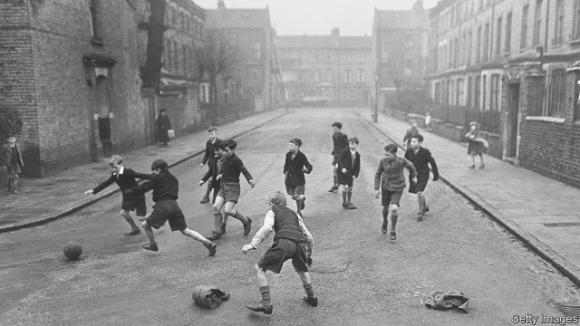

###### Childhood

# Why children’s lives have changed radically in just a few decades 

##### Childhood has changed out of all recognition, says Barbara Beck. What does that mean for children, parents and society at large? 

 

> Jan 3rd 2019 

 

“WHEN I WAS a kid, we were out and about all the time, playing with our friends, in and out of each other’s houses, sandwich in pocket, making our own entertainment. Our parents hardly saw us from morning to night. We didn’t have much stuff, but we came and went as we liked and had lots of adventures.” This is roughly what you will hear if you ask anyone over 30 about their childhood in a rich country. The adventures were usually of a homely kind, more Winnie the Pooh than Star Wars, but the freedom and the companionship were real. 

Today such children will spend most of their time indoors, often with adults rather than with siblings or friends, be supervised more closely, be driven everywhere rather than walk or cycle, take part in many more organised activities and, probably for several hours every day, engage with a screen of some kind. All this is done with the best of intentions. Parents want to protect their offspring from traffic, crime and other hazards in what they see as a more dangerous world, and to give them every opportunity to flourish. 

And indeed in many ways children are better off than they were a generation or two ago. Child mortality rates even in rich countries are still dropping. Fewer kids suffer neglect or go hungry. They generally get more attention and support from their parents, and many governments are offering extra help to very young children from disadvantaged backgrounds. As adolescents, fewer become delinquents, take up smoking and drinking or become teenage parents. And more of them finish secondary school and go on to higher education. 

The children themselves seem fairly happy with their lot. In a survey across the OECD in 2015, 15-year-olds were asked to rate their satisfaction with their life on a scale from zero to ten. The average score was 7.3, with Finnish kids the sunniest, at nearly 7.9, and Turkish ones the gloomiest, at 6.1. Boys were happier than girls, and children from affluent families scored higher than the rest. 

That is not surprising. Prosperous parents these days, especially in America, invest an unprecedented amount of time and money in their children to ensure that they will do at least as well as the parents themselves have done, and preferably better. Those endless rounds of extra tutoring, music lessons, sports sessions and educational visits, together with lively discussions at home about every subject under the sun, have proved highly effective at securing the good grades and social graces that will open the doors to top universities and well-paid jobs. 

Working-class parents in America, for their part, lack the wherewithal to engage in such intensive parenting. As a result, social divisions from one generation to the next are set to widen. Not so long ago the “American dream” held out the prospect that everyone, however humble their background, could succeed if they tried hard enough. But a recent report by the World Bank showed that intergenerational social mobility (the chance that the next generation will end up in a different social class from the previous one) in the land of dreams is now among the lowest in all rich countries. And that is before many of the social effects of the new parenting gap have had time to show up yet. 

This special report will explain what has led to these momentous changes in childhood in America and other rich countries, as well as in middle-income China. They range from broad social and demographic trends such as urbanisation, changes in family structure and the large-scale move of women into the labour force in recent decades to a shifting emphasis in policy on the early years and the march of digital technology. 

Start with the physical environment in which children are growing up. In rich countries the overwhelming majority now lead urban lives. Almost 80% of people live in cities, which have many advantages, including better opportunities for work, education, culture and leisure. But these often come at a cost: expensive housing, overcrowding, lack of green space, heavy traffic, high air pollution and a sense of living among strangers rather than in a close-knit community. This has caused a perception of growing danger, even though crime in Western countries in the past few decades has declined, so statistically the average child is actually safer. 

Even more important, the domestic environment for most children has changed profoundly. Families have become smaller, and women bear children far later than they did only a couple of generations ago. In the vast majority of rich countries the average number of children a woman will have is now well below the replacement level of 2.1. Households with just one child have become commonplace in Europe and the more prosperous parts of Asia, including China. That means each child has more time, money and energy invested in it, but misses out on the hustle and bustle of a larger household. 

Families have also become far more fluid. Rates of marriage have declined steeply, and divorce has become widespread. Many couples in America and Europe now cohabit rather than marry, and a large and growing proportion of children are born out of wedlock. Far more of them, too, are being brought up by lone parents, overwhelmingly mothers, or end up in patchwork families created by new sets of relationships. Again, this happens far more often at the bottom of the social scale than at the top. 

At the same time the number of women going out to work has risen steeply, though in recent years the trend has slowed. The post-second-world-war model of the nuclear family with a breadwinner husband, a homemaker wife and several children has become atypical. In America the share of women of working age in the labour force has risen from 42% in 1960 to 68% in 2017. To a greater or lesser extent the same has happened in other rich countries. Mothers now mostly return to work within a year or so of giving birth, not five or ten years later. In the absence of a handy grandmother, the child, even at a young age, will probably be looked after outside the home during the working week. 

The first few years of a child’s life are now receiving more attention as new evidence has emerged about its vital importance in the development of the brain. James Heckman, a Nobel prize-winning American economist, has suggested that early investment in a range of measures from high-quality child care to support programmes for parents offers excellent returns, far better than remedial interventions later in life. 

Governments in many countries have started to increase the number of public child-care and kindergarten places to supplement private provision, both to encourage more women to take paid jobs and to promote the development of young children from less privileged backgrounds. This report will look at the wide variety of early-years care on offer in different countries (ranging from plentiful and relatively cheap in the Nordics to scarce and often eye-wateringly expensive in the Anglo-Saxon countries, with most of the rest of Europe somewhere in between), and try to assess what difference it makes. In East Asia this is the first rung of a fiercely competitive educational ladder. 

The report will also consider the effect on children of an array of screen-based devices, from televisions to smartphones, offering a feast of passive entertainment, interactive computer games and the opportunity to connect with peers remotely. Not long ago children used to rile their parents by declaring they were bored, but now “being bored is something that never has to be tolerated for a moment”, writes Sherry Turkle of MIT, an expert on digital culture. In rich countries the vast majority of 15-year-olds have their own smartphone and spend several hours a day online. There are growing concerns that overuse might lead to addiction and mental illness, and that spending too much time sitting still in front of a screen will stop them from exercising and make them fat. The digital world also harbours new risks, including cyberbullying and sexting. 

But the first thing this report will explore is the new face of the institution still central to any child’s life: the family. 

