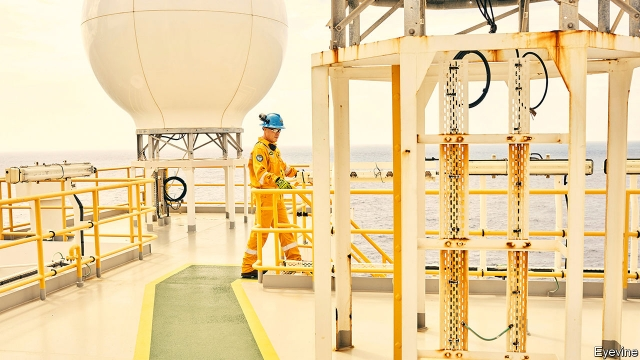

###### 2020 division

# Oil riches raise the political stakes in Guyana 

##### As the government loses a no-confidence vote, Venezuela eyes a sea grab 

 

> Jan 3rd 2019 

 

THIS YEAR was shaping up to be a hopeful one for Guyana, South America’s second-poorest country (after Bolivia). By early next year, oil should start flowing from vast offshore reserves discovered by a consortium led by ExxonMobil, an American company. By 2025 it hopes to be extracting 750,000 barrels a day. That would be worth $15bn a year at current prices, quadruple Guyana’s current GDP. The government will get a windfall that could transform the fortunes of Guyana’s 750,000 people. 

Now politics has provided a plot twist. On December 22nd the government of President David Granger lost a vote of no confidence when a legislator from his coalition rebelled. Under the constitution, presidential and legislative elections must be held within three months. So far, no date has been set. 

The petro-cash raises the stakes. Whichever party is in government when it comes has a good chance of keeping power. Mr Granger’s People’s National Congress, a mainly Afro-Guyanese party, hopes to be in office on the normal election date in August 2020. Its main rival is the People’s Progressive Party (PPP), which is dominated by Guyanese of Indian origin, whose forebears came as indentured workers on the country’s sugar plantations. It governed for nearly 23 years until 2015. It hopes to return to power before the oil bonanza. In local-government elections in November it won 61% of the vote. 

The no-confidence vote was a soap opera. Charrandas Persaud, the Indo-Guyanese backbencher who wiped out the government’s one-seat majority by switching sides, gave no warning. If he had, the leader of the governing coalition could have sacked him first. Mr Persaud has gone to Canada, where he remains. 

The national security minister accused him of accepting a bribe, without presenting evidence. After parliament reconvenes on January 3rd the government may hold another confidence vote with a new deputy in place of Mr Persaud. The PPP leader, Bharrat Jagdeo, who was Guyana’s president from 1999 to 2011, says parliament can only meet to organise an election. 

This leaves South America’s newest petro-power in limbo. The next elections, whenever they happen, could be as bitter as any in Guyana’s history. The PPP doubts the neutrality of the head of the election commission, James Patterson. The government did not choose him from a list of names proposed by the opposition in 2017, as is customary. Mr Jagdeo, who cannot run himself, is calling for international observers to monitor the elections. 

Venezuela, a socialist dictatorship with a collapsing economy, is taking advantage of this disarray to reassert an old claim to Guyana’s oil-rich waters and to two-thirds of its territory. Guyana has referred the case to the International Court of Justice in The Hague. On December 22nd a Venezuelan navy vessel menacingly “approached” a seismic survey ship working for ExxonMobil in Guyanese waters. The United States, Britain and the Caribbean Community criticised Venezuela’s action. If there is one thing Guyanese agree on, it is that the failing state next door must not seize its future oil wealth. 

