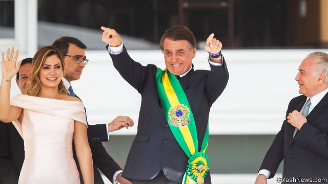

###### Out with the old

# What to make of Brazil’s new firebrand president, Jair Bolsonaro 

##### Voters long for an economic revival. Foreign investors are wary 

 

> Jan 3rd 2019 

 

“THE CAPTAIN has arrived,” chanted thousands of Brazilians on January 1st as Jair Bolsonaro ascended the white marble ramp that leads to the Planalto, the presidential palace in Brasília. Freshly inaugurated, the country’s 38th president looked out over the crowd of flag-waving supporters, soldiers on horseback and besuited statesmen and spoke with the fiery tone that characterised his unlikely ascent. He vowed to rid Brazil of socialism, political correctness and “ideology that defends bandits”. Unfurling a flag, he declared that it would “never be red, unless our blood is needed to keep it yellow and green”. “Mito” (“Legend”), the crowd chanted. 

No past president has revelled as Mr Bolsonaro has in the enemies he has made and the offence he has caused. The former army captain praises Brazil’s old military dictatorship and has insulted gay people, blacks and women. Until recently, his detractors were almost as numerous as his adorers. And yet Brazilians are strikingly optimistic as he takes office. Three-quarters say the incoming government is on the right course, according to Ibope, a pollster. Although the economy is recovering slowly from its worst-ever recession in 2014-16, a poll by Datafolha found that the share of Brazilians who are optimistic about the economy has jumped from 23% in August last year to 65% in December. 

That is because they see Mr Bolsonaro, who in seven terms as a gadfly in congress never advanced beyond its “lower clergy”, as a potentially transformational leader. They look to him to overcome corruption, crime and economic disappointment. In fashioning his government since he won the presidential election on October 28th Mr Bolsonaro has shown some signs that he intends to fulfil that expectation. Some of his plans could change Brazil for the better; others could cause immense damage. The main uncertainties are what the balance will be between the good and the bad, and whether he has the skills and the strength to enact his agenda. 

Unlike his predecessors, Mr Bolsonaro has not given ministerial jobs to political grandees in order to win their support for his programme. That delights Brazilians, who voted for Mr Bolsonaro largely because they are disgusted with conventional politicians. Instead, he has assembled a cabinet composed of technocrats, ideologues and military men. Much will depend on how they interact with each other, and with congress. That is hard to predict. 

The case for optimism rests mainly on two “superministers”. Paulo Guedes, a former banker with an economics degree from the University of Chicago, will be the economy tsar, leading a ministry that will absorb the ministries of finance, planning and industry. Mr Guedes’s support for deregulation, privatisation and, above all, reform of Brazil’s unaffordable pension system could provide a tonic that the economy has long needed. 

The new justice minister, Sérgio Moro, is supposed to deal with the two other maladies Mr Bolsonaro has identified: corruption and crime. As the judge leading the Lava Jato (Car Wash) investigations into political corruption over the past four years, Mr Moro became a popular hero. He was responsible for the jailing of Luiz Inácio Lula da Silva, a former president from the left-wing Workers’ Party, who has come to represent everything Mr Bolsonaro and his supporters despise. Lula’s allies say that Mr Moro’s shift from the courtroom to Mr Bolsonaro’s cabinet confirms their suspicions that Lava Jato is a politically motivated witch hunt. But most Brazilians cheered: they expect Mr Moro to take the fight against graft to the heart of government. 

He will also be in charge of some of the more brutish policies the president has advocated, including gutting Brazil’s gun-control law, making it easier for ordinary citizens to bear arms. 

Mr Bolsonaro has stocked his administration with former generals. These include the vice-president, Hamilton Mourão, and the national security adviser, Augusto Heleno. Mr Bolsonaro’s critics feared that he would militarise politics (Mr Mourão has come close to justifying intervention by the army to keep order in Brazil). But the generals strive to seem pragmatic and democratic. “You can erase from the map any kind of [undemocratic] action by Bolsonaro,” Mr Mourão said in an interview with The Economist.  

The outlook of the government’s ideologues may be closest to that of Mr Bolsonaro. They include his three sons, the most influential of whom is Eduardo, a congressman from São Paulo who has courted the Trump administration (he met Donald Trump’s son-in-law, Jared Kushner, at the White House in November). He reportedly urged his father to name as foreign minister Ernesto Araújo, a hitherto-obscure diplomat who regards action against climate change as a globalist plot and advocates a Christian alliance among Brazil, the United States and Russia.  

His soulmates include the education minister, Ricardo Vélez Rodríguez, who wants to fight the supposed influence in schools of left-wingers and gay-rights advocates. Ricardo Salles, the environment minister, calls climate change a “secondary issue” and opposes many of the penalties levied for environmental damage. 

With incompatible points of view, Mr Bolsonaro’s team of rivals have already begun to argue with one another. Whereas the president is keen to move Brazil’s embassy in Israel from Tel Aviv to Jerusalem (as Mr Trump has done), the agriculture minister, Tereza Cristina, worries that Muslim countries will punish Brazil by buying less of its beef. 

Mr Bolsonaro and the foreign minister are suspicious of China—he has accused the country of wanting to “buy Brazil”. But Mr Mourão wants a good relationship with China, Brazil’s biggest trading partner. Fernando Henrique Cardoso, a former Brazilian president, thinks the pragmatists will prevail in such disputes. “Money talks,” he says. But if Mr Araújo’s neo-crusading policies win out, “we’ll have to pray.”   

The odds may be worse for Mr Guedes’s reform plans. In part, that is because Mr Bolsonaro seems ambivalent about them. In the past he has shown no appetite for telling voters that their benefits might be cut. For example, he said that a proposal by the outgoing president, Michel Temer, to set minimum pension ages of 65 for men and 62 for women was too harsh. (Currently, both men and women retire on average in their mid-fifties.) A timid reform would not stabilise public debt, which at 77% of GDP is already too high, and prevent pensions from crowding out more productive spending by government. 

Getting Mr Bolsonaro’s agenda through congress, where his Social Liberal Party holds less than a tenth of the seats, may be harder than overcoming the government’s internal divisions. That is especially true of pension reforms, which require constitutional amendments. Mr Bolsonaro has made that job more difficult by handling congress differently from the way his predecessors did. Unwilling to engage in the grubby exchange of pork and patronage for political support, he has tried to marginalise political parties and their leaders. He prefers dealing with congressional caucuses, such as those representing the so-called bullet, beef and Bible (gun, ranching and religion) interests. He hopes to assemble case-by-case coalitions in congress to pass laws. Congressmen will bow to popular pressure, he believes. “Once we have the support of the public, congress will follow,” says Mr Mourão. 

But there is little popular enthusiasm for reforms. Unlike the political parties, the caucuses on which Mr Bolsonaro is counting for legislative support have no money and do not whip congressmen in legislative votes. Ricardo Sennes, a political analyst, thinks the odds of passing a pension reform are just 50%. The recent strength of Brazilian financial markets reflects local optimism about economic reform; foreign investors have been wary. 

Perhaps realising that governing will be harder than he thought, Mr Bolsonaro has lately opened channels with congress’s leaders. In an inauguration-day speech to congress, more measured in tone than his Planalto stemwinder, he called for a “national pact” between society and the three branches of government to restore growth and family values and to fight crime and corruption. He has wisely said he will not take sides when the lower house and senate choose their presidents; they play a crucial role in negotiating between parties and the presidency. Parties have been “demonised” because of corruption, says Marta Suplicy, a senator from the centrist Brazilian Democratic Movement whose term ended in December, “but that doesn’t mean they should be marginalised”. 

Mr Bolsonaro’s hopes of being a transformational president depend on his ability to couple pragmatism and economic reform. As important will be fighting corruption and crime in ways that reinforce the rule of law rather than undermining it. Achieving those changes will require wisdom and a talent for political management. Little in Mr Bolsonaro’s past suggests that he possesses either quality.  

