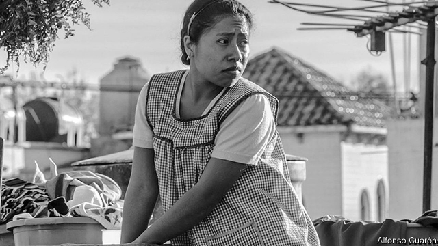

###### Bello

# “Roma” reflects on Mexico’s past, and its present 

##### A film captures the plight of the muchacha 

 

> Jan 3rd 2019 

 

IT FIRST CAUGHT attention because it is a film made for Netflix whose Hollywood-based director, Alfonso Cuarón, insisted that it be shown in cinemas. But if “Roma” was the movie sensation of this Christmas holiday, it is because it is a superb film, the best to come out of Latin America for years. It is a nostalgic look at Mr Cuarón’s childhood in Mexico City, rendered more profound by its examination of his country’s deep-rooted inequalities. All this is wrapped up in a drama that attains epic intensity. It is also ideal background viewing for the “Fourth Transformation” promised by Andrés Manuel López Obrador, Mexico’s new president. 

That Mr Cuarón shot a film set in 1970-71 in black and white gives it a sharper sense of history. It tells the story of his family and is set largely in a big modernist house in Colonia Roma, a comfortable middle-class neighbourhood in gentle decline (but recently re-gentrified). “Roma” evokes a vanished Mexico City, of the whistle of the knife-grinder on his bicycle and the glamour of vast cinemas. 

What lifts the film to another plane is that its protagonist is the family’s muchacha (“girl”), as Mexicans call a live-in nanny and maid. Cleo is a young Mixtec (southern indigenous) woman from a village in Oaxaca. The role has made a star of Yalitza Aparicio (pictured), a kindergarten teacher and novice actress. 

Mr Cuarón’s film is thus a Mexican “Upstairs, Downstairs”, shorn of sentimentality. When the family spend New Year’s Eve at the country estate of friends, as midnight approaches Cleo is ushered down a stairway to a basement to join the carousing servants. In the Roma house two cast-iron outside stairways lead upwards, but offer no social ascent. One leads to the poky bedroom Cleo shares with her friend, the cook (the only person with whom she speaks Mixtec). The other climbs to the azotea, the flat roof where the muchachas do the washing. 

Cleo is made pregnant and then jilted by Fermín, a cynical young tough, just when Sofia, her employer, and her four children are abandoned by her philandering husband, a doctor. “We women are alone, we are always alone,” Sofia tells Cleo. But Cleo is the more alone. While Sofia has gossiping friends, her maid must rely on her employers for help. 

Though often overlooked in Latin American novels and films, the live-in muchacha was until very recently a fixture of middle-class households, part of the family but not on equal terms, omnipresent but often ignored. Some muchachas, like Cleo, were well treated (Mr Cuarón remains close to his nanny, on whom the character is based). Even so, Cleo starts work before the family rise and finishes after they have gone to bed. She cannot lift her eyes above her station, the film suggests. In the long opening sequence, she is washing the patio floor; at the new year’s party, a drunken dancer knocks her cup of pulque (rot-gut) to the stone floor; in a traumatic scene, her waters break in a furniture store. 

“Roma” subtly highlights the ambiguity of the muchacha’s role just when it is evolving. Young Latin American women are reluctant to work as live-in maids, partly because they have better alternatives. The cleaner who commutes to work is becoming more common. In December Mexico’s supreme court ruled that maids enjoy full labour rights. 

The film also captures Mexico’s chaotic modernisation. That neither parent is capable of parking the family’s finned Ford Galaxy, its bonnet as wide as a mariachi’s sombrero, in the tight patio without scraping its sides seems like an allegory of a country whose political system no longer contained its developing economy and evolving social structure. 

An undercurrent of violence courses through the film. The authoritarian system of the Institutional Revolutionary Party (PRI) is represented by President Luis Echeverría, a free-spending populist who took office in 1970. There was a dark side to his rule. The film features what became known as the “Corpus Christi” massacre of June 1971, in which paramilitaries linked to the regime killed unarmed student demonstrators. 

Cleo is triply subordinated, by race, class and sex. More than any Mexican president since the 1930s Mr López Obrador represents such people, in his determination to make Mexico more equal and to help its poorer, Indian south. But he is also an admirer of Mr Echeverría and of the PRI in its earlier incarnation, before it embraced democracy and the market. As well as recalling the past, Mr Cuarón’s film speaks to the present. 

