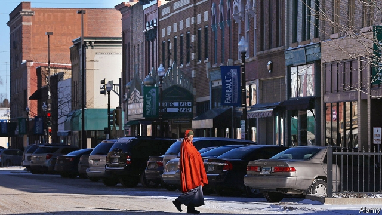

###### A tale of two cafés

# How a small city is responding to a huge influx of Somali-Americans 

##### Dark-skinned Muslims discover the limits of Minnesota nice 

 

> Jan 3rd 2019 

 

YOUNG MEN take sips of sweetened tea from plastic cups. Their hangout is the Somali Grocery and Restaurant, a scruffy, brightly lit spot a few steps from the Mississippi river in central Minnesota. The men, while eyeing a televised football game, discuss the difficulty of finding well-paid jobs. A biochemistry graduate, Abdiweli Barre, says career-building is tricky in St Cloud, a city of barely 70,000. 

It might be easier an hour away in Minneapolis, a global hub for the east-African diaspora. Ilhan Omar, a woman from Minneapolis, just became the first Somali-American elected to Congress. But these tea-drinkers and a growing number of Somalis prefer smaller-town living. They say St Cloud is safe and, on balance, congenial. That is despite its notoriety after a 2016 incident when a Somali refugee stabbed and injured ten people in a mall (he was shot dead). The café was once pelted with eggs; insults and bottles have been thrown at women wearing hijabs in the street. 

The tea-drinkers complain of racism among police and employers, and they laugh at others’ misconceptions—“people who believe we don’t pay tax, that we drive free cars and live in free houses,” chuckles Mr Barre, the graduate. But he suggests that among locals “80% are good people” and he knows discrimination exists elsewhere. In late November a gunman in Eden Prairie, a similar-sized city also in Minnesota, was arrested for threatening a group of Somali teens, whom he accused of buying burgers with welfare money. 

Big cities draw many migrants and refugees, but it is in smaller places like St Cloud (historically of German and Nordic stock) that especially dramatic demographic change occurs. An immigration lawyer estimates the metro area with 200,000 inhabitants is home to 10,000 people of Somali descent—from almost none two decades ago. A pioneer was Abdul Kadir Mohamed, who is wrapped tight in a grey duffle coat, hat and scarf as he steps into the café. He says he arrived as a refugee in 1991: “there were six Somalis when I came, and no discrimination, no hostility.” 

He calls that “the beginning of the Somalian time.” “Today we have so many people,” he says, a note of wonder in his voice. Some settled as refugees directly from east Africa but many moved from within America, drawn to jobs in meatpacking sites or with manufacturers such as Electrolux. America’s (legal) immigration rules, which look favourably on family members of migrants, swelled the population further. A few Somalis now spill out to tiny agricultural towns, such as nearby Coldspring (population 4,000), in truly rural areas. 

Concern about this pattern runs through a recent book by Reihan Salam, an author of Bangladeshi-descent. He argues that historically high rates of low-skilled immigration have resulted in the creation of ethnic enclaves and helped to worsen economic inequality, by keeping down wages. Together that threatens to make an ever more “dangerously divided society” split between groups of “irreconcilable strangers”. He argues the remedy is to choke off low-skilled immigration. Only if fewer outsiders arrive will those already here integrate. The alternative, he suggests, is a permanent, non-white underclass. 

On average Somalis in St Cloud are indeed poorer and worse-educated than other Minnesotans. They are also self-starters. The city is home to dozens of small firms, including money-transfer businesses, and clothes shops at a Somali strip mall. Custom is brisk at the Mogadishu Meat and Grocery, beside a low-rise brick mosque crowded with women in bright headscarves. That suggests dynamism, but also a community apart from the mainstream. Haji Yussuf, who owns a communications firm, says mingling happens slowly, partly because of Somalis’ strong cultural pride—“just like for Jews and Italians.” 

Yet a backlash is also evident. To see it visit Culver’s, a café five minutes from the first. It is a neon-lit, fast-food chain with jolly staff. All the patrons on a recent day are white. In a corner booth, his black tea in a china mug, is John Palmer, a retired academic from St Cloud University. He calls Culvers his “campaign office”, brandishes a red, “Make St Cloud Great Again” cap and says the city is in near-terminal decline. 

Mr Palmer is a fan of the president’s, for slashing refugee resettlement. He says that Somalis will not assimilate unlike an earlier, smaller group of Christian Hmong refugees and complains that Somali women dress in a way that “certainly causes fear”. He also calls low-income newcomers a burden, even if many have jobs. A rise in non-English speakers strains public schools, he says, sending better-off taxpayers away. “That qualifies me as an Islamophobe and a hater, apparently,” he adds. 

He organises, as part of a group called “C-Cubed”, for “concerned community citizens”. He blames new ghettos for violent crime (violent crime is falling). In running for election to the city council (he lost narrowly) he says he dared not canvas near Somali-dominated housing. He promoted a ballot initiative (it failed) that demanded the council somehow ban settlement of any more refugees. 

Others are more extreme. Some churches have hosted firebrand anti-Muslim, anti-refugee speakers. Natalie Ringsmuth of Unite Cloud, a charity, says they appeal to lower-income, anxious, white residents. One man erected a sign of a pig on his lawn, then screamed at a neighbouring Muslim family. Ms Ringsmuth calls the city “ground zero” for online, alt-right extremists. But like the tea-drinkers in the Somali café, she is phlegmatic. She expects strangers to reconcile, given time. 

