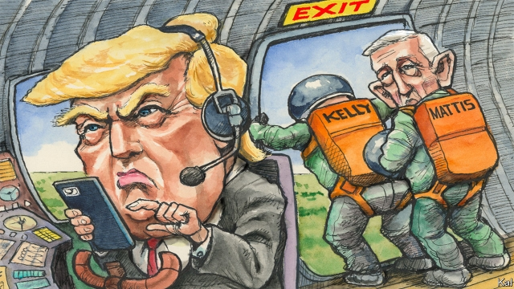

###### Lexington

# Jim Mattis and John Kelly had little influence on the president 

##### They were, however, safeguards against calamity 

 

> Jan 3rd 2019 

 

SHORTLY AFTER his inauguration, Donald Trump paused during an awkward address to congressmen and pointed to Jim Mattis and John Kelly, two of the five retired or current generals who served in his administration early on. “I see my generals,” he said proudly. “These are central casting. If I’m doing a movie, I’d pick you general, General Mattis.” That shallow idea of military leadership was said to owe much to George C. Scott’s lead performance in the 1970 film “Patton”, a Trump favourite. Mr Mattis, the incoming defence secretary, was in reality better known for his intellectualism than his craggy looks—or for the moniker “Mad Dog Mattis” that the president loved and he hated. Yet Mr Trump’s bigger misjudgment was to assume that the generals—the last of whom, Mr Mattis, departed his administration this week—would serve as ruthless executors of his will. 

That mistaken apprehension (signalled by the gleeful possessive: “my generals”) was one of several reasons why he hired them. Others smacked of desperation. Mr Trump didn’t know much about foreign and security policy, most Republican foreign-policy experts had denounced him as a charlatan, and he cannot forgive a slight. Senior military officers, who tend to refrain from commenting on politics, looked like a convenient alternative. They also fitted with Mr Trump’s hazy understanding of his new job. As commander-in-chief, he expected to issue orders with the Olympian majesty of a Hollywood general. By surrounding himself with real-life ones he assumed he would have a disciplined team of experts in carrying orders out. That the generals’ tough-guy cachet would glorify his imagined own was an additional delight. 

It did not work out that way, mainly because Mr Trump’s notion of presidential power was as realistic as his idea of generalship. “Poor Ike—it won’t be a bit like the army,” mused Harry Truman on his incoming successor, Dwight Eisenhower. “He’ll sit here, and he’ll say, ‘Do this! Do that!’ and nothing will happen.” His point was that American politicians—including commanders-in-chief—have less power than responsibility. To effect change, even popular, competent ones must work with the grain of the law and establishment opinion, and around congressional and other interests. Mr Trump, having little understanding of legal boundaries, or attention span, or interest in building consensus, or long-term view of almost anything, was always liable to be even more constrained. 

An excited focus on Mr Mattis and the rest’s high-minded efforts to foil Mr Trump has tended to obscure this reality. Certainly, in another illustration of how little Mr Trump understood whom he had hired, the generals’ first loyalty was not to him, but to the national interest and institutions they had served for decades. They therefore advised him against impulsive moves, such as withdrawing from the Paris climate deal, the Iran nuclear deal, and the Syrian and Afghan conflicts, which went against those interests. Yet they appear to have won few of those arguments, as Mr Mattis signalled by resigning in protest last month. 

At times, to be sure, the generals came close to openly defying the president. Mr Mattis’s slow-walking of his demands for a ban on transgender soldiers and a North Korea-style military parade were examples of that. Yet they were rare. The generals mostly stymied Mr Trump only to the extent that any halfway responsible cabinet secretary would have done: by treating his tweets lightly, reassuring worried underlings that they had their backs, and informing the president of the limits of his authority. “Why can’t we do it this way?” the president often harrumphed at Mr Kelly, straining on his legal and constitutional leash. Yet he never ordered the then White House chief of staff to crack on and break the law. 

Set against the consternation excited by the generals’ departure, this record seems moderately reassuring. Mr Trump has made many bad moves in security and other policy against the generals’ advice. That he has nonetheless done less damage than he has threatened—by failing to go to war with North Korea or reinstitute torture, for example—is probably not mostly down to them either. He appears to dislike war. He has for the most part followed legal advice. He appears too ill-disciplined to pursue a complicated policy for long—including his signature ones, like the national security strategy drawn up by Lieutenant-General H.R. McMaster, as national security adviser, which makes a reasonable fist of turning America First into a coherent world-view. There is no strong evidence Mr Trump has read it or that he means to pursue the great-power rivalry with China that is its central promise. The biggest check on Trumpian disruption, good or bad, is Mr Trump. 

The generals’ absence may therefore have less tangible effect than many fear. Mr McMaster and Mr Kelly had both become peripheral figures by the time they were moved on. The former White House chief had also become uniquely disliked by both the president and the media. And Mr Mattis, exhausted by his efforts to reassure allies and shield colleagues from Mr Trump, has left relatively little mark on his department. Having been chosen by Mr Trump against his advice, the likely next chairman of the Joint Chiefs of Staff, General Mark Milley, might even have more sway with the president on military matters than Mr Mattis had. 

Even so, the generals will be missed. Their presence meant that, if the worst happened—and under Mr Trump that is always possible—America would have strong, reliable public servants close to the helm. The same cannot be said for John Bolton and Mike Pompeo, Mr Trump’s remaining national security chiefs. In addition, the presence of Mr Mattis especially was a reminder that moral leadership is still prized in America—and that had concrete effects. When the former defence secretary urged American allies to “bear with us”, at this uncertain time for America’s traditional alliances, they listened. There is no one left in the administration who could provide the same reassurance. 

