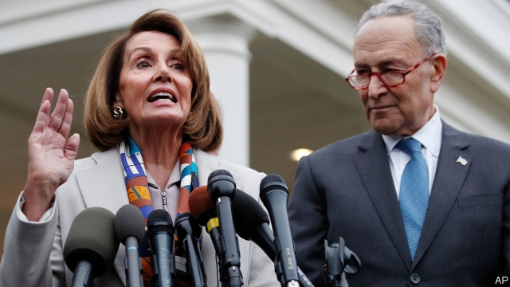

###### When Donny met Nancy

# The era of divided government in Washington begins, inauspiciously 

##### Will the president be able to see the wood for the subpoenas? 

 

> Jan 5th 2019 

 

SINCE AMERICA’S government partially shut down on December 22nd, roughly 800,000 federal employees have been furloughed or compelled to work without pay. Not since 2013 has a government shutdown lasted this long. None has spanned a shift in partisan control of Congress, as this one has: Republicans held both legislative chambers when Congress adjourned in December; when it convened on January 3rd, Democrats, two months after their mid-term victory, regained control of the House of Representatives for the first time in eight years. This messy opening to a new era of divided government matters not just because federal workers are going unpaid and agencies unstaffed. It also signals an end to the congressional supineness that defined Donald Trump’s first two years in office. 

Behind the shutdown is Mr Trump’s insistence on $5bn for a wall on the southern border (the one that Mexico was supposed to pay for). David Cicilline, a congressman from Rhode Island who heads the Democratic Party’s messaging arm, says there is “zero” chance that Mr Trump will get that much money. Late last year Senate Democrats offered $1.6bn for border security, and even that much set House Democrats snarling. “There is no disagreement that we need to secure our border,” says Mr Cicilline, “[but] we have a responsibility to appropriate funds in a cost-effective way.” A wall, he argues, “is a 19th-century solution to a 21st-century problem.” 

For a time, Mr Trump seemed to agree. Shortly before the shutdown he began referring to a “beautiful…Steel Slat Barrier”. John Kelly, his outgoing chief of staff, said that “we left a solid concrete wall early on in the administration.” In early December Mr Trump backed off on his demand for his $5bn, suggesting he would approve a short-term continuing resolution without wall funding to keep government open. Then right-wing talk-show hosts attacked him for backing down, and he reversed course, shutting down the government and reiterating his demand for “an all concrete Wall”. 

Each side believes the other will pay a greater political price. Republicans have a structural advantage: they are suspicious of government, while Democrats have styled themselves the party of good governance. But Democrats point to Mr Trump saying, during a televised meeting in December with Nancy Pelosi and Chuck Schumer, Democratic leaders in the House and Senate, “I will shut down the government if I don’t get my wall.” They may also suspect that however loyal congressional Republicans appear in public, privately they are weary of Mr Trump’s intemperance and unpredictability, and may pressure him as the shutdown drags on. 

Some argue that what Mr Trump really wants is not the wall, but the fight over the wall. After all, if he really wanted his $5bn he could negotiate a deal with Democrats to get it—perhaps by agreeing to provide DREAMers (undocumented immigrants brought to America as children) a path to citizenship. But his base prizes his pugnacity above any realistically attainable concrete achievement, and he sees attacking Democrats as weak on crime and immigration as a better strategy than compromise. 

“We have the issue, Border Security,” he crowed on Twitter, two days after Christmas. He believes, not without reason, that his hawkish views on immigration won him the presidency in 2016, and remain his strongest suit. But that theory was tested in 2018, when Republican congressional candidates around the country ended their campaigns by stoking fears of, in Mr Trump’s words, “death and destruction caused by people who shouldn’t be here.” Leaving aside the fact that immigrants commit crimes at lower rates than the native-born, that tactic failed. Republicans lost more seats in last year’s mid-terms than in any election since Watergate. Now Ms Pelosi is once again House Speaker, and Democrats are committee chairmen with subpoena power. 

How they will use that power will quickly become clear. They have spent months preparing. Matt Bennett of Third Way, a centrist Democratic think-tank, believes the committees will “fire subpoenas like machine guns...There will be full-blown investigations by the middle of January.” 

Elijah Cummings, the incoming chair of the House Oversight Committee, has already requested information about, among other things, the use of personal email for government work and payments to the Trump Organisation. Jerry Nadler, who will chair the House Judiciary Committee, plans to hold hearings on the administration’s family-separation policy and Russian interference in 2016. Adam Schiff, who will head the House Intelligence Committee, wants to investigate Mr Trump’s business interests. Richard Neal, who will run the House Ways and Means Committee, plans to compel the release of Mr Trump’s tax returns. 

Mr Trump’s approval ratings remain stuck around 40%; unlike most presidents, he has barely tried to expand his appeal. Meanwhile, Robert Mueller’s investigation is grinding inexorably forward. The president cannot afford to lose his cheerleaders’ support now, which may explain his refusal to negotiate over the wall. 

But that need not mean permanent gridlock. One can imagine Democrats agreeing to modestly increase border-security funding beyond $1.6bn—enough to let Mr Trump save face, claim victory and reopen government. Beyond that, the parties could spend the next two years battling over immigration while finding common ground where they can—on infrastructure, for instance, or prescription-drug pricing. 

For Mr Trump, personal relationships can supersede partisan policy disagreements. He seems genuinely to respect Ms Pelosi’s toughness and accomplishment. He also appears fond of the cut-and-thrust with Mr Schumer, a fellow outer-borough New Yorker. But his personalisation of politics cuts the other way too. Bill Clinton was able to shrug off Republican efforts to impeach him as just business, while keeping focused on policy goals. Mr Trump, a famous counter-puncher, has shown no such ability to compartmentalise. 

